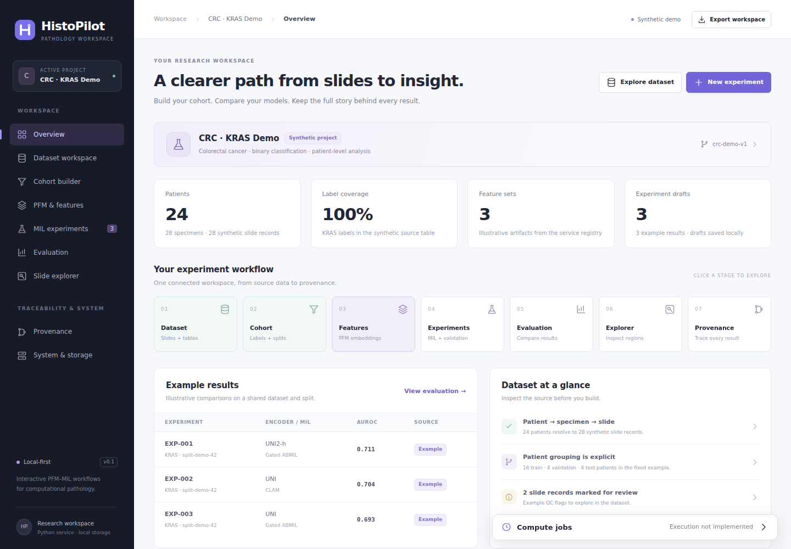
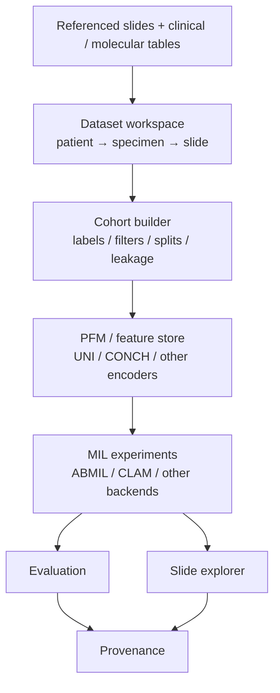
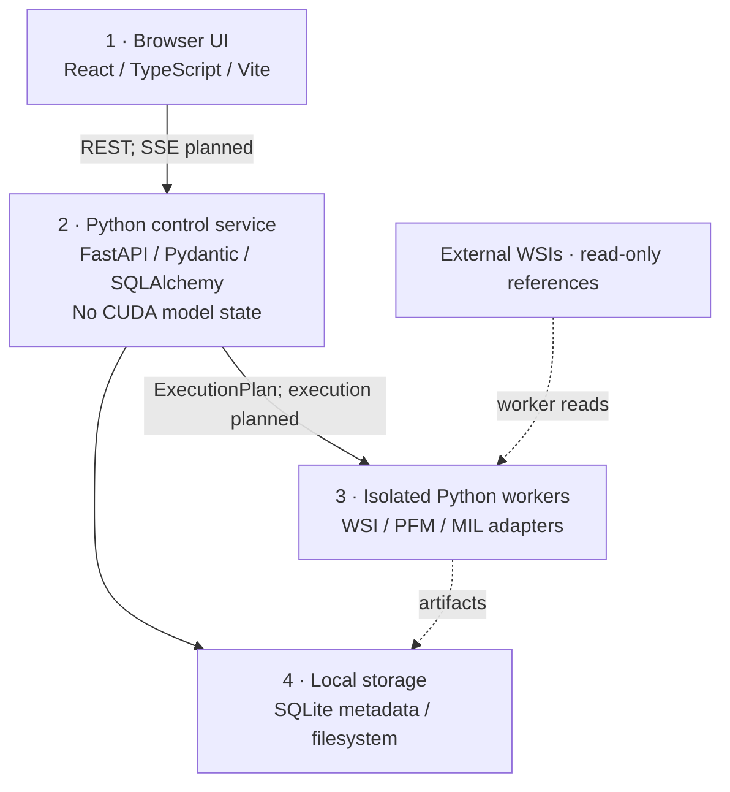

# HistoPilot

**Interactive PFM–MIL Workflows for Computational Pathology**

HistoPilot is a **local-first, self-hosted web application** for constructing, auditing, comparing, and interpreting pathology foundation model (PFM) and multiple instance learning (MIL) experiments. The browser is the interface; a local Python service owns projects and scientific configuration; isolated workers will execute WSI/PFM/MIL jobs; large artifacts stay on the local filesystem.

This repository provides saved experiment workspaces and an interactive **synthetic demo**. Local projects support dataset import, frozen protocols, existing feature attachment, TRIDENT extraction, full feature validation, and optional portable feature packs through isolated workers. Training, real evaluation, and WSI tiles remain to be connected; MIL job submission fails explicitly until its backend exists.



## Run locally

Requirements for source development: **Python 3.11+**, **uv**, **Node.js 24**, and **npm**. From the repository root:

```bash
uv sync --locked
```

Start the Python service in one terminal:

```bash
uv run histopilot serve --dev --no-browser
```

Start Vite in a second terminal:

```bash
cd web
npm ci
npm run dev
```

Open **http://127.0.0.1:5173**. Vite proxies `/api` to the local service at **127.0.0.1:8787**. The start page offers **Start a new experiment** and **Load an existing experiment**. Saved experiment setup and demo cohorts/drafts survive refresh and service restarts. Selection, sorting, and viewer controls remain browser UI state.

A built Python wheel includes the compiled React application. After installing that wheel, an end user runs only:

```bash
histopilot serve
```

Then open **http://127.0.0.1:8787**. Node.js is needed to develop/build the UI, not to run the packaged application. See [deployment and development](docs/deployment.md) for wheel building, configuration, and SSH forwarding.

## Workspace and data access

The default application workspace is `~/.histopilot/workspace`; configuration is read from `~/.histopilot/config.toml`. Use an explicit workspace and grant directory access when needed:

```bash
histopilot serve --workspace /path/to/histopilot-workspace \
  --data-root /mnt/pathology/crc --no-browser
```

Creating an experiment requires a name and an exact storage folder. Choose a new folder whose parent exists, or an existing empty folder, within the application workspace or a configured data root. Optional data, slide, and feature folders must be under configured data roots. Task, target column, positive label, seed, and folds can be chosen now or later in **MIL experiments**. The chosen folder's `histopilot-project.json` owns this setup.

The folder picker browses the **Python service's filesystem**, including when the browser is on another computer. Storage browsing includes the application workspace; source browsing includes only explicitly configured data roots, with none allowed by default. Source selection records a read-only path reference without uploading, copying, modifying, or importing its contents. Load a saved experiment from the recent list or its folder. Its `?experiment=<id>#overview` URL restores the selected experiment on refresh; the sidebar experiment button returns to the start page. See [example configuration](examples/config.toml) and the [workspace layout](docs/workspace.md).

To create a destination in any folder picker, browse to its existing parent, click **New folder**, enter a child name, and click **Create folder**. The picker opens the new empty folder; choose **Use this folder** to select it. For example, open `/mnt/wsl/oceanpath-hot/features` and create `blca`. Creation requires write permission within a configured root and never replaces an existing file or folder.

If **Choose data folder** or **Choose slide folder** has no available locations, the service was started without source roots. Stop that service with **Ctrl+C** in its terminal and restart it with the containing directory allowed. For the Bladder files on this workstation, run from the repository root:

```bash
uv run histopilot serve --data-root /mnt/d --data-root /mnt/wsl/oceanpath-hot --no-browser
```

Add `--dev` if using Vite on port 5173. Refresh the browser, reopen the picker, and choose `/mnt/d/YC.Liu/manifests/BLCA` for data or `/mnt/d/YC.Liu/slides/blca` for slides. Repeat `--data-root` to allow additional directories. The service prints its configured roots at startup. Experiment storage can also be selected within its workspace even when no source roots are configured.

To keep source access across restarts, add or update the following setting in `~/.histopilot/config.toml` (merge it into an existing `[storage]` section rather than adding that section twice):

```toml
[storage]
data_roots = ["/mnt/d", "/mnt/wsl/oceanpath-hot"]
```

Then restart with `uv run histopilot serve --no-browser`. Explicit `--data-root` arguments override the configured list.

The service binds to loopback by default and rejects non-loopback bindings until authenticated server deployment is implemented. For a remote workstation, use SSH or VS Code port forwarding. This is currently a single-user local service.

## Personal version tags

After reviewing a dataset or cohort/protocol, choose **Name & freeze version**. For features, review coverage, choose optional packs, then choose **Name & freeze bundle**. The final save dialog asks for a required **Version tag** and an optional **Commit note**, then freezes the version and saves its name together. If a tag is already taken, the dialog keeps your entries so you can choose another name; the draft remains editable. You can also tag or rename existing saved versions from their details. Tags such as `curated-v2` or `encoder-baseline` appear in selectors, feature tables, extraction input references, and the MIL experiment planning view. A saved cohort currently includes its target and split protocol, so these share one tag.

Tags are unique among versions of the same kind within a project, ignoring case. They can contain up to 80 characters; notes can contain up to 2,000. Clearing both fields removes the tag and note. Concurrent edits are detected so another tab cannot silently overwrite your changes. Tags and notes live in the project folder, separate from scientific content: renaming a tag preserves the version ID, frozen data, memberships, feature bindings, and existing references. Untagged versions retain a descriptive fallback and a short ID.

Freezing identical content reuses the existing scientific version. If it already has a different tag or note, open that version to edit its label; creating a distinct scientific version requires a change to the data or settings. Interrupted saves recover the original tag together with the version. Retrying a completed save preserves any later label edits. After updating HistoPilot, restart the local server and reload the browser so the interface and save API use the same version; an older running server is detected before a tag or freeze request is sent.

## TRIDENT PFM extraction

In **PFM & features**, choose **Extract with TRIDENT**, select a frozen dataset with linked slide files, and preview a dedicated output folder. The stage selector runs segmentation, patch coordinates, feature extraction, or the full pipeline. **Advanced Options** exposes every other setting in TRIDENT's batch CLI: segmentation and artifact removal, tissue thresholds, patch overlap and image dumping, readers, custom MPP metadata/CSV selection, cache, GPU selection, workers/batches, checkpoint paths, and slide encoders. Source and output directories are derived from the dataset and selected output folder. Options are checked against the installed TRIDENT parser before submission.

TRIDENT stays in its own environment. Configure its interpreter and checkout on the service process:

```bash
export HISTOPILOT_TRIDENT_PYTHON=/path/to/trident-environment/bin/python
export HISTOPILOT_TRIDENT_ROOT=/path/to/TRIDENT
uv run histopilot serve --data-root /mnt/d --data-root /mnt/wsl/oceanpath-hot --no-browser
```

The common `~/miniconda3/envs/trident` environment and an ignored `.local/TRIDENT` checkout are detected automatically. Install TRIDENT using its [official instructions](https://github.com/mahmoodlab/TRIDENT). Checkpoint access and model dependencies are checked inside the worker; gated models require access and authentication in that environment, or a supported local checkpoint. Runtime discovery never imports Torch into the control service.

Jobs run in named tmux sessions (`histopilot-pfm-<run-id>`) and survive browser/service disconnections. The job panel shows pipeline stages, progress, the current slide, elapsed time, and an estimated time remaining for the current stage when TRIDENT reports it. Cached batches and parallel workers show their local progress explicitly; processed slide counts can include skips and errors, and output validation determines success. The dashboard also reads existing jobs' logs, so workers do not need restarting. Raw log output, job identifiers, and `tmux attach -t <session>` remain available under **Troubleshooting**. Each project's `extractions/<run-id>/` stores the exact command, selected-slide CSV, input stamps, settings, process/result records, and `worker.log`. A successful process exit is followed by native artifact validation; missing/corrupt outputs or unfinished locks fail the run. Cancelled/failed jobs retain their outputs for inspection and a compatible resume. Cache settings name a parent directory: HistoPilot passes a unique disposable child to TRIDENT. A restart can reconnect to live jobs; tmux cannot survive a workstation reboot.

Outputs preserve TRIDENT's native structure, including the Bladder layout:

```text
output/
  contours/                    contours_geojson/             thumbnails/
  _config_segmentation.json    _logs_segmentation.txt
  20x_256px_0px_overlap/
    patches/<slide>_patches.h5
    features_uni_v1/<slide>.h5
    visualization/
    _config_coords.json        _config_feats_uni_v1.json
```

Use **Attach existing features** with `/mnt/d/YC.Liu/features/blca`, its geometry folder, or its precise `features_uni_v1` directory. Auto-detection keeps encoders separate and preserves coordinate attributes and nearby TRIDENT configuration provenance. Both embedded feature coordinates and separate `patches/*_patches.h5` are supported. Header/coverage validation does not scan every tensor value. Slide encoders write native `slide_features_<encoder>` artifacts; current MIL feature binding accepts patch embeddings.

## Prepare and freeze feature bundles

**PFM & features** has two sections: **Prepare a bundle** and **Frozen bundles**. Preparation starts from an inspected feature source, an existing feature folder, or extraction with a PFM. Review coverage, choose optional packing, then name and freeze the complete bundle. Extraction settings, command, runtime and validation evidence follow the source into its bundle. Manually attached folders retain their available HDF5 attributes and TRIDENT configuration evidence.

Each source offers three choices: **Features only — skip packing**, **Features + existing pack**, or **Features + new pack**. Features only validates all tensor contents without copying them. Existing pack lets you include previously verified packs or verify another folder. New pack starts with the destination, then reviews precision, estimated size and available space before building and verifying. Precision conversion is under Advanced; preserving source precision is the default. Include the completed pack in the bundle when ready. A bundle may include zero, one, or multiple verified packs. Partial feature coverage remains visible and is not repaired by packing. Current jobs stay visible; older jobs and provenance are available in collapsible details.

If you already have a pack, select its folder beside the saved feature version. The interface includes example HistoPilot and OceanPath folder structures. The first review compares exact slide IDs, per-slide and total patch counts, dimensions, dtype, and expected dense payload lengths. Source HDF5 files and a packed folder usually have different total sizes because their metadata and coordinate storage differ. Matching sizes/counts do not prove matching features: an isolated verification job reads and compares every feature value and coordinate before the pack becomes selectable. Mismatches show warnings and prevent using an incompatible pack. HistoPilot's manifest and checksum files must both be present; incomplete verification metadata is rejected. Genuine four-file OceanPath packs remain supported through full content comparison. Verification references the existing folder without modifying or copying it, and permits relocated source folders.

Freezing records an immutable feature source and exact pack identities, paths, precision and validation evidence. It references the source and pack folders in place; it does not copy them into an archive. Changing included packs requires another bundle. Renaming a bundle changes only its display label. Freeze rechecks source and pack freshness immediately before publication; changed or missing inputs appear as warnings and block MIL planning. Older job receipts without freshness evidence need a one-time verification. Current external-pack attachment requires matching feature dtype; explicit float16 conversion remains available when creating a new pack.

**MIL experiments** owns loading policy. Choose a frozen target/split protocol and feature bundle, then choose **Auto**, original per-slide files, or a bundled memory-mapped pack. Auto uses original files for a features-only bundle and a sole pack that preserves precision; multiple packs or precision changes require an explicit choice. Planning checks dataset, feature source, eligible slide coverage and current bundle evidence. Save this choice as a MIL draft without changing the bundle. Older protocols that already pin a pack retain that binding and require a matching choice or a new protocol revision. Training and RAM/GPU preloading are not implemented yet; memory mapping does not load the entire pack into RAM.

The default preserves float16 or float32 source precision. Explicit float16 conversion rounds higher precision values; overflow fails instead of clipping. Packs require consistent feature dimensions/dtype, nonempty finite tensors, and matching nonnegative integer coordinates representable as int32. Native validation accepts int64 coordinates without imposing the packed int32 limit. The original files stay in place. Packing preserves tensor data and recorded metadata, rather than creating a byte-for-byte archive of the HDF5 containers.

Jobs run on CPU in `histopilot-pack-<run-id>` tmux sessions. Progress, cancellation, error details and saved artifacts appear below the selected version. Each project's `packing/<run-id>/` retains the immutable plan, worker log, progress and completion receipt; the interface reconnects after service/browser restarts. Failed or cancelled jobs can be reviewed and retried as new jobs. A pack is published only after validation and checksum readback, into a new or empty folder. Completed packs cannot be overwritten or used as another pack's output parent. Default destinations are inside the project's `feature-packs/` folder.

```text
feature-pack/
  features.bin      # Contiguous little-endian float16 or float32 patch rows
  coords.bin        # Corresponding little-endian int32 coordinate pairs
  index.parquet     # Exact slide IDs, row offsets and patch counts
  meta.json         # OceanPath schema-v1 tensor layout
  manifest.json     # HistoPilot identity, source evidence and validation
  checksums.json    # SHA-256 payload and manifest checksums
```

The pack remains independently verifiable after relocation or loss of the source folder. Historical pack contents remain valid when live sources change; validation of the live feature binding becomes stale and requires a new inspection/version. Tensor validation does not authenticate the model checkpoint or establish complete encoder provenance, and it does not enable MIL execution.

The CLI submits the same reviewed job requests as the browser. Use the project and feature version IDs from the saved version details:

```bash
histopilot pack-features FEATURE_VERSION_ID --project PROJECT_ID --validate-only
histopilot pack-features FEATURE_VERSION_ID --project PROJECT_ID --preview
histopilot pack-features FEATURE_VERSION_ID --project PROJECT_ID --output /allowed/new-pack
histopilot pack-features FEATURE_VERSION_ID --project PROJECT_ID --existing-pack /allowed/existing-pack
histopilot feature-jobs --project PROJECT_ID
histopilot feature-jobs --project PROJECT_ID --job PACKING_JOB_ID --cancel
histopilot verify-feature-pack /path/to/relocated-pack
```

Submission needs the running local service and tmux; add `--url http://127.0.0.1:PORT` for a different service port. Standalone verification needs neither. OceanPath's native schema-v1 reader can consume the arrays on little-endian hosts. Its legacy live-directory fingerprint is different from HistoPilot's content identity in `meta.json`; use `verify-feature-pack` for integrity verification and open the OceanPath reader without its optional live-source comparison.

For reproducible loader measurements, run `scripts/benchmark_feature_loading.py --help` using OceanPath's Python environment. The benchmark refuses unmatched tensors or non-float32 inputs, compares identical loader settings and row selections, and records warm-cache and file-cache-eviction timings separately. Packing accelerates data loading; it is optional and does not imply the same speedup for a complete training run.

## Explore the application

| View | Current behavior |
| --- | --- |
| Start | Create a folder-backed experiment, load saved setup, or explicitly open the CRC KRAS demo |
| Overview | Selected experiment context; new experiments begin with an empty dataset |
| Dataset workspace | CSV/XLSX source and patient-crosswalk mapping, attribute dictionary, reconciliation, frozen versions and exploration |
| Target & split | Suggested target settings, explicit training/test selections, and five patient-grouped [CV/held-out strategies](docs/split-strategies.md) with sampled or fixed early-stop validation |
| PFM & features | Extract or attach features, validate contents, and freeze features alone or with verified packs as named bundles |
| MIL experiments | Select a frozen protocol and feature bundle, review original-file or packed loading, and save experiment drafts |
| Evaluation | Clearly labeled illustrative metrics and comparisons |
| Slide explorer | Synthetic tissue and attention interactions; real tile serving is planned |
| Provenance | Example lineage and JSON export |

System information and a global MIL jobs tray expose the local service context. Extraction and packing jobs appear in **PFM & features**. The registry lists planned backend choices; an entry does not mean a model, checkpoint, or GPU is available. The MIL job list remains empty until training execution is implemented.

The explicit **CRC KRAS demo** (`synthetic-v1`) contains **24 fictional patients, 28 specimens, and 28 slides**. Its data and illustrative results appear only when that demo is selected. All scores, tissue illustrations, and attention values are invented. Changing a draft does not retrain a model or alter existing example results. Exported example provenance uses placeholder artifact references, while experiment specifications have a shared validated GUI/CLI schema.

The start page calls the overall saved workspace an **experiment**; the API stores it under `/projects`. The existing `/experiments` endpoints describe individual model-run drafts within the synthetic workflow.

## Workflow



**No orphan results.** Every future metric, prediction, and attention region must resolve to its run, experiment, dataset version, cohort, split, features, checkpoints, seed/fold, and code/environment record. Patch coordinates must resolve to slide, specimen, patient, and ground-truth source. Feature tensor and pack verification are implemented; training-result verification remains future work.

## Architecture



Five architectural rules govern implementation:

1. **FastAPI never owns CUDA models.** GPU work runs in isolated workers.
2. **Original WSIs are referenced, never silently copied or mutated.**
3. **Every scientific object is versioned and every result has complete lineage.**
4. **GUI and CLI use the same experiment manifest and API contract.**
5. **TRIDENT, CLAM, TorchMIL, SLURM, and other backends are adapters; none defines HistoPilot's core domain.**

The domain remains independent of the UI, ORM, and compute frameworks. SQLite with WAL stores application metadata. DuckDB/Parquet analytics and HDF5 features are planned storage adapters. Level-0 WSI pixels are the canonical scientific coordinate system. See [ARCHITECTURE.md](ARCHITECTURE.md) for contracts, state ownership, and implementation boundaries.

```text
HistoPilot/
├── histopilot/
│   ├── api/             # Local REST API and validated request schemas
│   ├── domain/          # Dataset, cohort, split, feature, experiment/run/result records
│   ├── application/     # Application boundaries and future scientific services
│   ├── ports/           # Compute, WSI, and execution contracts
│   ├── adapters/        # Optional backend integration points
│   ├── storage/         # SQLite metadata and local storage boundaries
│   ├── workers/         # Isolated execution entrypoint; compute remains unimplemented
│   ├── resources/       # Packaged synthetic workspace seed
│   └── static/          # Built React assets included in the wheel
├── web/                 # React + TypeScript + Vite source
├── tests/
├── examples/            # Configuration and synthetic CRC/KRAS examples
├── docs/                # Deployment, workspace, OceanPath, and implementation roadmap
├── pyproject.toml
└── uv.lock
```

## Implemented and planned

| Implemented foundation | Planned |
| --- | --- |
| React/Tailwind UI, FastAPI REST API and explicit CSV/XLSX identifier mapping | Full slide metadata/pixel validation |
| Start/create/load, Dataset mapping/freeze, generic targets and grouped split UI | Complete feature-content/provenance preflight and execution |
| Folder-local drafts, immutable datasets/protocols/feature bindings and interruption recovery | Resumable workers for large imports and full feature validation |
| SQLite WAL persistence for synthetic cohorts, drafts, registry, and source references | Analytical cohort queries with DuckDB/Parquet and complete scientific audits |
| Loopback Host/Origin checks, local session token, bounded root-restricted directory browsing | Authenticated multiuser/server deployment |
| TRIDENT tmux workers, cancellation, resume checks and persistent logs | MIL workers, GPU scheduling and SSE progress |
| System/package diagnostics without loading CUDA models | Isolated NVML/GPU and backend capability probing |
| TRIDENT extraction and native feature/coordinate import with provenance | Native Mean/ABMIL, CLAM/TorchMIL, OpenSlide tiles |
| Vite build packaged as Python static assets | Full Plotly, OpenSeadragon, and TanStack Table integration |

Selected implementation pieces may come from **OceanPath**. No OceanPath code, dependencies, weights, or data are bundled. The [integration plan](docs/oceanpath.md) maps inspected source modules to isolated adapters and records the observed license status.

Follow the [roadmap](docs/roadmap.md) and [Bladder priority review](docs/bladder-priority-review.md) to complete one real path: source-table mapping → frozen dataset → verified patient mapping and split → validated existing UNI features → one baseline → held-out predictions and provenance. New extraction and model expansion follow that path.

The [P0 project/import and target/split design](docs/p0-project-import-target-split-design.md) records the implemented initial experiment start flow and earlier generic contracts. Upcoming designs use Bladder as the reference; the priority review updates scope and sequencing using the actual local manifests, slides, features, and split artifacts.

## License

A project license has not been selected. Third-party backends and model checkpoints retain their own licensing and access requirements.

The [P0.1/P0.2 implementation notes](docs/p0-import-protocol-implementation.md) describe the current UI, split semantics, tested Bladder path and remaining boundaries.
