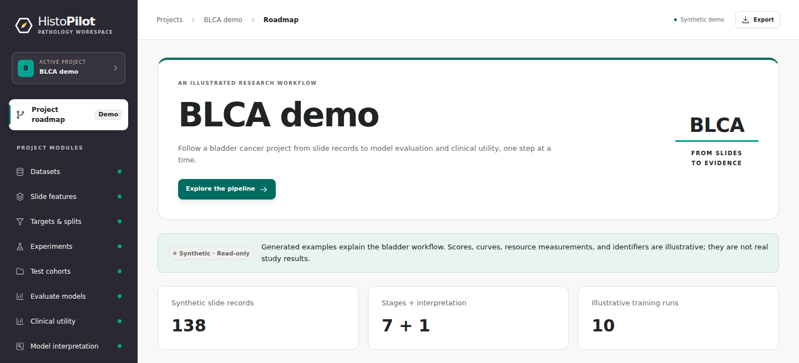
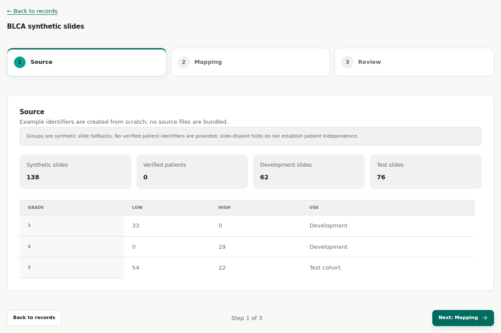
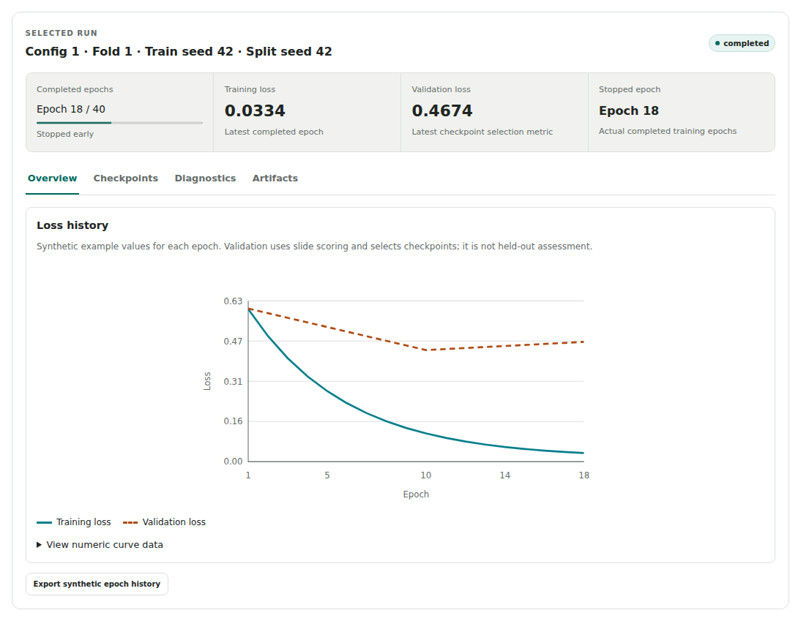
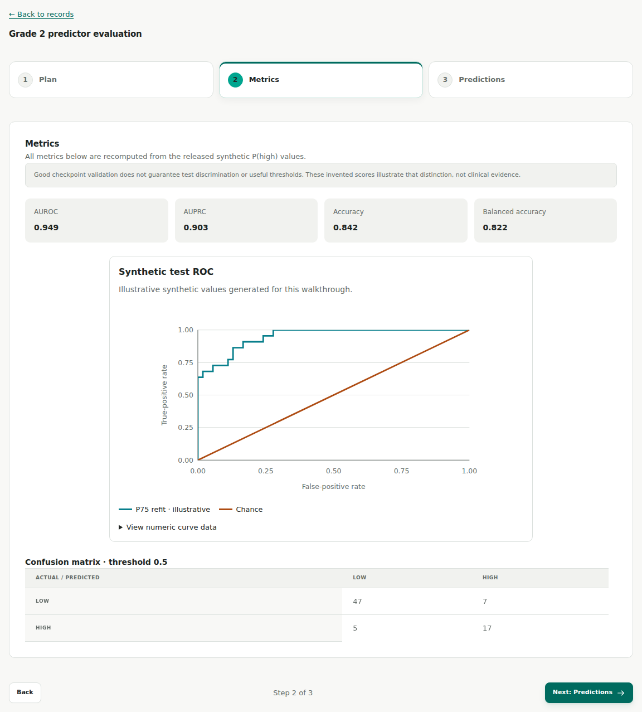
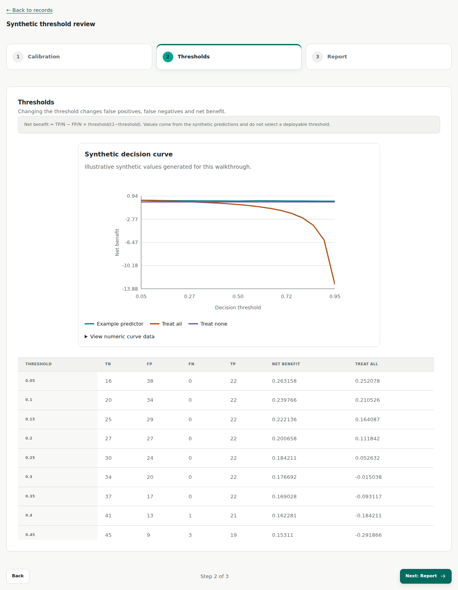

<p align="center">
  
</p>

<h1 align="center">HistoPilot</h1>
<p align="center"><strong>From pathology slides to model evidence.</strong></p>
<p align="center">
  <a href="#get-started">Get started</a> ·
  <a href="#your-first-project">Your first project</a> ·
  <a href="docs/BLCA_DEMO.md">BLCA walkthrough</a> ·
  <a href="#guides">Guides</a>
</p>

A local research workspace for computational pathology. Prepare slide data and foundation-model features, train multiple instance learning (MIL) models, and explore their predictions. Your data and compute stay on your infrastructure.



## Get started

**Requirements:** Python 3.11+, [uv](https://docs.astral.sh/uv/), Node.js 24, and npm.

One-time setup:

```bash
git clone https://github.com/Lyce24/HistoPilot.git
cd HistoPilot
uv sync --locked
npm --prefix web ci
npm --prefix web run build
uv run python scripts/bundle_web.py
```

Start HistoPilot:

```bash
bash serve.sh
```

Open **http://127.0.0.1:8787** → **Open BLCA demo**. No research data, weights, or GPU are needed to explore it.

Run `bash serve.sh` for each subsequent start; stop with **Ctrl+C**. Use `bash serve.sh --help` for options. After an update, repeat the setup commands from `uv sync` onward, then restart manually. See [deployment](docs/deployment.md) for Vite development, packaged installation, and SSH forwarding.

## Your first project

Allow the folders containing your metadata, slides, and features when starting:

```bash
bash serve.sh --data-root /path/to/research-data
```

Choose **Start a new project** and select a dedicated new or empty project folder. The folder picker browses the machine running HistoPilot; source files are referenced in place.

1. **Prepare:** import a CSV/XLSX dataset, attach or extract features, and freeze targets and development splits.
2. **Train:** create an experiment, choose models and batches, review the plan, and follow runs and predictors.
3. **Evaluate:** define a separate test cohort, inspect predictions and errors, then explore clinical utility and compatible slide attention.

Models include ABMIL, nnMIL, mean/max pooling, slide-embedding probes, and clinical/image comparisons. Real extraction and training require their compute environments; clinical comparisons require verified patient identities. Follow the [workflow guide](docs/WORKFLOW_GUIDE.md) for setup and input requirements.

## A look inside

The **BLCA demo** follows 138 synthetic slides: 62 for development and 76 for testing. All displayed records, scores, and curves are illustrative. It includes no real slide images or attention maps; slide counts do not establish independent patients.

| Prepare data | Follow training |
| :---: | :---: |
| [](docs/assets/blca/dataset.png) | [](docs/assets/blca/training.png) |

| Evaluate predictions | Explore clinical utility |
| :---: | :---: |
| [](docs/assets/blca/evaluation.png) | [](docs/assets/blca/clinical-utility.png) |

Click an image to enlarge it. See the [full BLCA walkthrough](docs/BLCA_DEMO.md) for feature validation, targets, and predictor details.

## Guides

- [Workflow](docs/WORKFLOW_GUIDE.md) — data, features, training, and recovery.
- [Deployment](docs/deployment.md) — installation, configuration, and remote access.
- [Experiments](docs/EXPERIMENT_LIFECYCLE.md) · [Evaluation](docs/MODEL_DEVELOPMENT.md) · [Clinical insights](docs/CLINICAL_INSIGHTS.md).

<sub>No project license has been selected. Third-party models and backends retain their own licenses.</sub>
