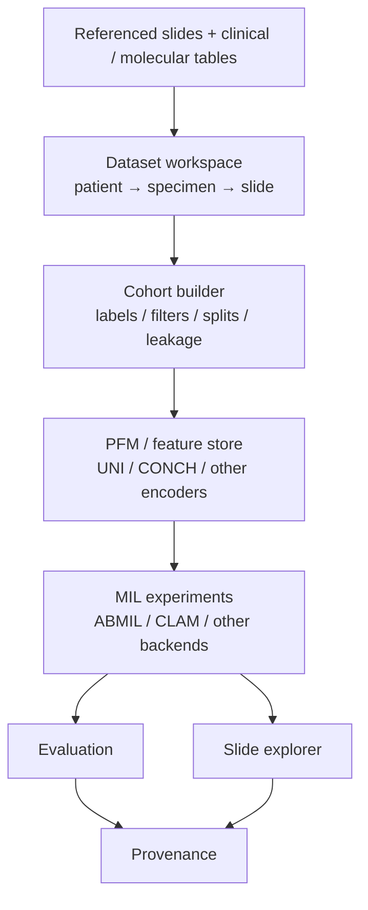
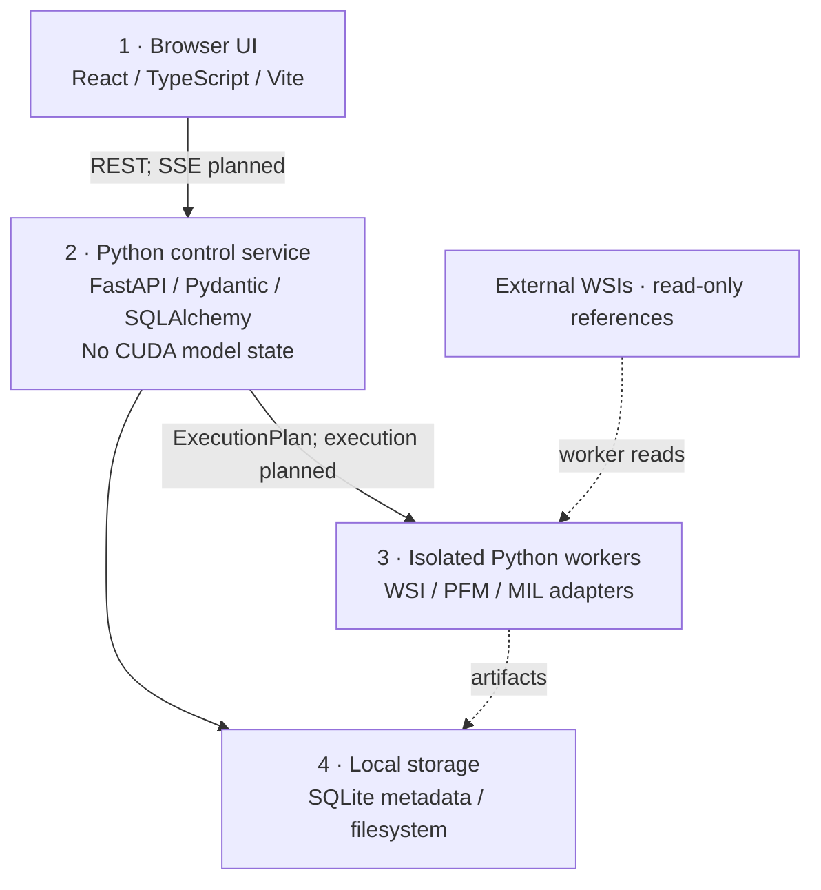

# HistoPilot

**Interactive PFM–MIL Workflows for Computational Pathology**

HistoPilot is a **local-first, self-hosted web application** for constructing, auditing, comparing, and interpreting pathology foundation model (PFM) and multiple instance learning (MIL) experiments. The browser is the interface; a local Python service owns projects and scientific configuration; isolated workers will execute WSI/PFM/MIL jobs; large artifacts stay on the local filesystem.

This repository provides saved experiment workspaces and an interactive **synthetic demo**. Start a new experiment in a chosen server folder, or load an existing experiment, then continue to Overview, Dataset, and the rest of the workspace. Optional source paths and initial configuration are saved in that folder; SQLite tracks recent experiments and demo cohorts/drafts. Dataset ingestion, feature extraction, training, real evaluation, WSI tiles, and a job supervisor are still to be implemented. Job submission fails explicitly instead of simulating successful training.


## Run locally

Requirements for source development: **Python 3.11+**, **uv**, **Node.js 24**, and **npm**. From the repository root:

```bash
uv sync --locked
```

Start the Python service in one terminal:

```bash
uv run histopilot serve --dev --no-browser
```

Start Vite in a second terminal:

```bash
cd web
npm ci
npm run dev
```

Open **http://127.0.0.1:5173**. Vite proxies `/api` to the local service at **127.0.0.1:8787**. The start page offers **Start a new experiment** and **Load an existing experiment**. Saved experiment setup and demo cohorts/drafts survive refresh and service restarts. Selection, sorting, and viewer controls remain browser UI state.

A built Python wheel includes the compiled React application. After installing that wheel, an end user runs only:

```bash
histopilot serve
```

Then open **http://127.0.0.1:8787**. Node.js is needed to develop/build the UI, not to run the packaged application. See [deployment and development](docs/deployment.md) for wheel building, configuration, and SSH forwarding.

## Workspace and data access

The default application workspace is `~/.histopilot/workspace`; configuration is read from `~/.histopilot/config.toml`. Use an explicit workspace and grant directory access when needed:

```bash
histopilot serve --workspace /path/to/histopilot-workspace \
  --data-root /mnt/pathology/crc --no-browser
```

Creating an experiment requires a name and an exact storage folder. Choose a new folder whose parent exists, or an existing empty folder, within the application workspace or a configured data root. Optional data, slide, and feature folders must be under configured data roots. Task, target column, positive label, seed, and folds can be chosen now or later in **MIL experiments**. The chosen folder's `histopilot-project.json` owns this setup.

The folder picker browses the **Python service's filesystem**, including when the browser is on another computer. Storage browsing includes the application workspace; source browsing includes only explicitly configured data roots, with none allowed by default. Source selection records a read-only path reference without uploading, copying, modifying, or importing its contents. Load a saved experiment from the recent list or its folder. Its `?experiment=<id>#overview` URL restores the selected experiment on refresh; the sidebar experiment button returns to the start page. See [example configuration](examples/config.toml) and the [workspace layout](docs/workspace.md).

If **Choose data folder** or **Choose slide folder** has no available locations, the service was started without source roots. Stop that service with **Ctrl+C** in its terminal and restart it with the containing directory allowed. For the Bladder files on this workstation, run from the repository root:

```bash
uv run histopilot serve --data-root /mnt/d/YC.Liu --no-browser
```

Add `--dev` if using Vite on port 5173. Refresh the browser, reopen the picker, and choose `/mnt/d/YC.Liu/manifests/BLCA` for data or `/mnt/d/YC.Liu/slides/blca` for slides. Repeat `--data-root` to allow additional directories. The service prints its configured roots at startup. Experiment storage can also be selected within its workspace even when no source roots are configured.

To keep source access across restarts, add or update the following setting in `~/.histopilot/config.toml` (merge it into an existing `[storage]` section rather than adding that section twice):

```toml
[storage]
data_roots = ["/mnt/d/YC.Liu"]
```

Then restart with `uv run histopilot serve --no-browser`. Explicit `--data-root` arguments override the configured list.

The service binds to loopback by default and rejects non-loopback bindings until authenticated server deployment is implemented. For a remote workstation, use SSH or VS Code port forwarding. This is currently a single-user local service.

## Explore the application

| View | Current behavior |
| --- | --- |
| Start | Create a folder-backed experiment, load saved setup, or explicitly open the CRC KRAS demo |
| Overview | Selected experiment context; new experiments begin with an empty dataset |
| Dataset workspace | CSV/XLSX source and patient-crosswalk mapping, attribute dictionary, reconciliation, frozen versions and exploration |
| Target & split | Suggested target settings, explicit training/test selections, and five patient-grouped [CV/held-out strategies](docs/split-strategies.md) with sampled or fixed early-stop validation |
| PFM & features | Attach existing HDF5 features, inspect headers/coverage and pin a feature binding |
| MIL experiments | Save and freeze target/split protocols with fold counts, seeds, constraints and exact memberships |
| Evaluation | Clearly labeled illustrative metrics and comparisons |
| Slide explorer | Synthetic tissue and attention interactions; real tile serving is planned |
| Provenance | Example lineage and JSON export |

System information and a global jobs tray expose the local service context. The registry lists planned backend choices; an entry does not mean a model, checkpoint, or GPU is available. The job list is empty until execution is implemented.

The explicit **CRC KRAS demo** (`synthetic-v1`) contains **24 fictional patients, 28 specimens, and 28 slides**. Its data and illustrative results appear only when that demo is selected. All scores, tissue illustrations, and attention values are invented. Changing a draft does not retrain a model or alter existing example results. Exported example provenance uses placeholder artifact references, while experiment specifications have a shared validated GUI/CLI schema.

The start page calls the overall saved workspace an **experiment**; the API stores it under `/projects`. The existing `/experiments` endpoints describe individual model-run drafts within the synthetic workflow.

## Workflow



**No orphan results.** Every future metric, prediction, and attention region must resolve to its run, experiment, dataset version, cohort, split, features, checkpoints, seed/fold, and code/environment record. Patch coordinates must resolve to slide, specimen, patient, and ground-truth source. Real artifact verification remains future work.

## Architecture



Five architectural rules govern implementation:

1. **FastAPI never owns CUDA models.** GPU work runs in isolated workers.
2. **Original WSIs are referenced, never silently copied or mutated.**
3. **Every scientific object is versioned and every result has complete lineage.**
4. **GUI and CLI use the same experiment manifest and API contract.**
5. **TRIDENT, CLAM, TorchMIL, SLURM, and other backends are adapters; none defines HistoPilot's core domain.**

The domain remains independent of the UI, ORM, and compute frameworks. SQLite with WAL stores application metadata. DuckDB/Parquet analytics and HDF5 features are planned storage adapters. Level-0 WSI pixels are the canonical scientific coordinate system. See [ARCHITECTURE.md](ARCHITECTURE.md) for contracts, state ownership, and implementation boundaries.

```text
HistoPilot/
├── histopilot/
│   ├── api/             # Local REST API and validated request schemas
│   ├── domain/          # Dataset, cohort, split, feature, experiment/run/result records
│   ├── application/     # Application boundaries and future scientific services
│   ├── ports/           # Compute, WSI, and execution contracts
│   ├── adapters/        # Optional backend integration points
│   ├── storage/         # SQLite metadata and local storage boundaries
│   ├── workers/         # Isolated execution entrypoint; compute remains unimplemented
│   ├── resources/       # Packaged synthetic workspace seed
│   └── static/          # Built React assets included in the wheel
├── web/                 # React + TypeScript + Vite source
├── tests/
├── examples/            # Configuration and synthetic CRC/KRAS examples
├── docs/                # Deployment, workspace, OceanPath, and implementation roadmap
├── pyproject.toml
└── uv.lock
```

## Implemented and planned

| Implemented foundation | Planned |
| --- | --- |
| React/Tailwind UI, FastAPI REST API and explicit CSV/XLSX identifier mapping | Full slide metadata/pixel validation |
| Start/create/load, Dataset mapping/freeze, generic targets and grouped split UI | Complete feature-content/provenance preflight and execution |
| Folder-local drafts, immutable datasets/protocols/feature bindings and interruption recovery | Resumable workers for large imports and full feature validation |
| SQLite WAL persistence for synthetic cohorts, drafts, registry, and source references | Analytical cohort queries with DuckDB/Parquet and complete scientific audits |
| Loopback Host/Origin checks, local session token, bounded root-restricted directory browsing | Authenticated multiuser/server deployment |
| Canonical experiment specification and isolated execution contracts | Worker supervision, GPU scheduling, cancellation/resume, SSE progress |
| System/package diagnostics without loading CUDA models | Isolated NVML/GPU and backend capability probing |
| Synthetic feature/result/attention display and provenance export | TRIDENT extraction, native Mean/ABMIL, CLAM/TorchMIL, OpenSlide tiles |
| Vite build packaged as Python static assets | Full Plotly, OpenSeadragon, and TanStack Table integration |

Selected implementation pieces may come from **OceanPath**. No OceanPath code, dependencies, weights, or data are bundled. The [integration plan](docs/oceanpath.md) maps inspected source modules to isolated adapters and records the observed license status.

Follow the [roadmap](docs/roadmap.md) and [Bladder priority review](docs/bladder-priority-review.md) to complete one real path: source-table mapping → frozen dataset → verified patient mapping and split → validated existing UNI features → one baseline → held-out predictions and provenance. New extraction and model expansion follow that path.

The [P0 project/import and target/split design](docs/p0-project-import-target-split-design.md) records the implemented initial experiment start flow and earlier generic contracts. Upcoming designs use Bladder as the reference; the priority review updates scope and sequencing using the actual local manifests, slides, features, and split artifacts.

## License

A project license has not been selected. Third-party backends and model checkpoints retain their own licensing and access requirements.

The [P0.1/P0.2 implementation notes](docs/p0-import-protocol-implementation.md) describe the current UI, split semantics, tested Bladder path and remaining boundaries.
