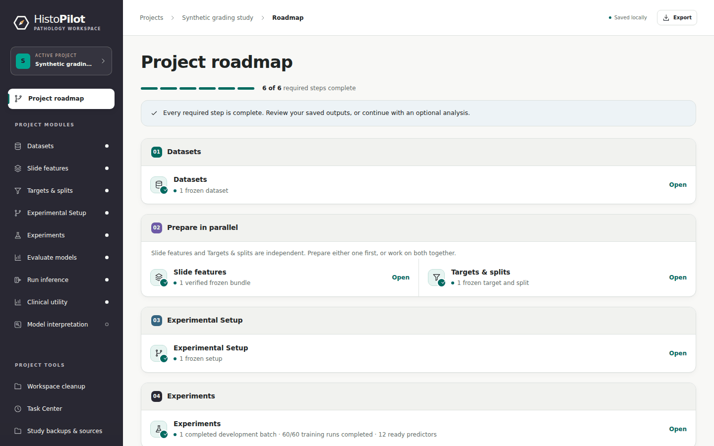
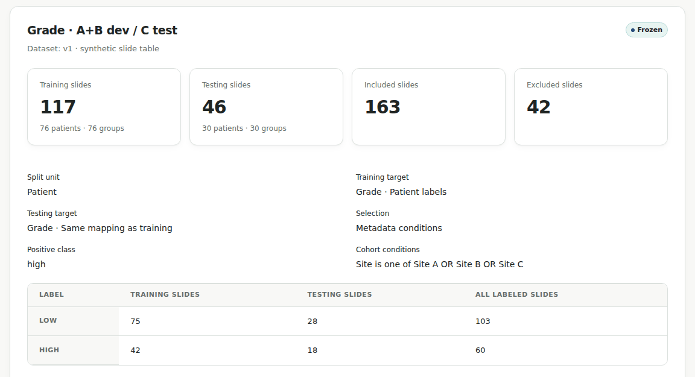
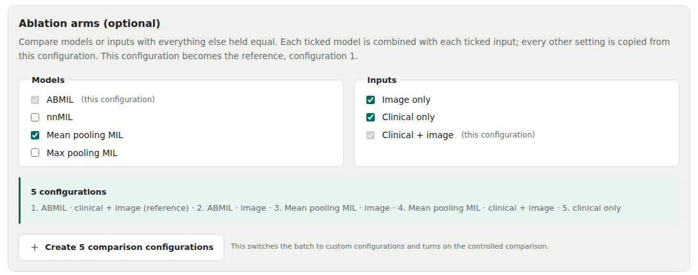
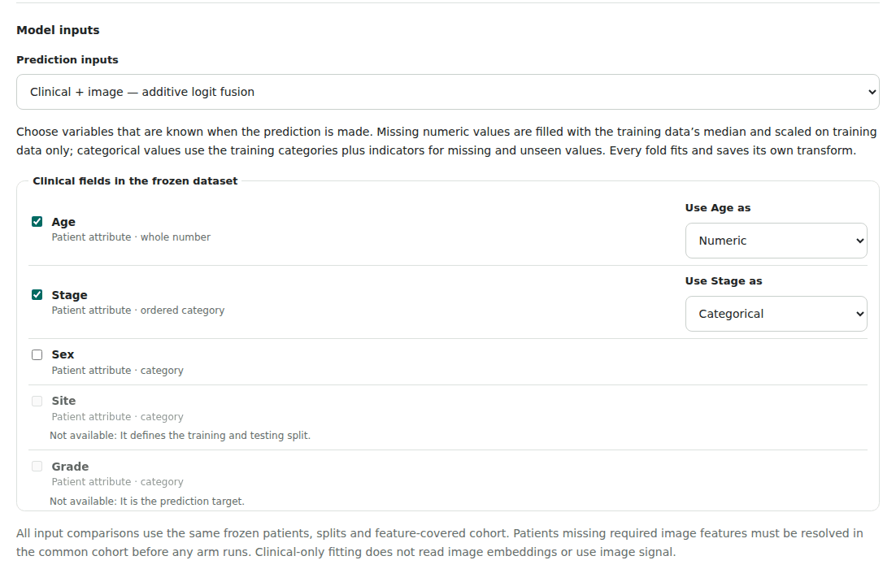
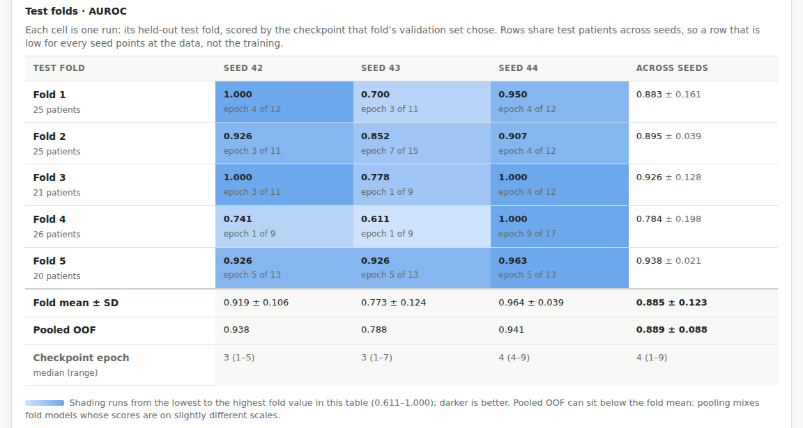
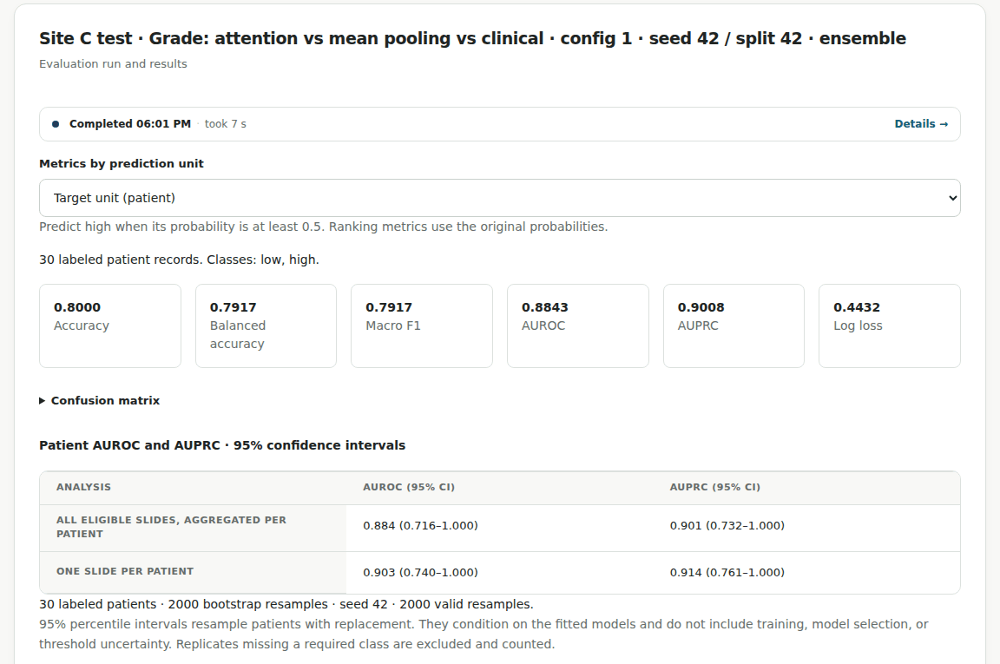
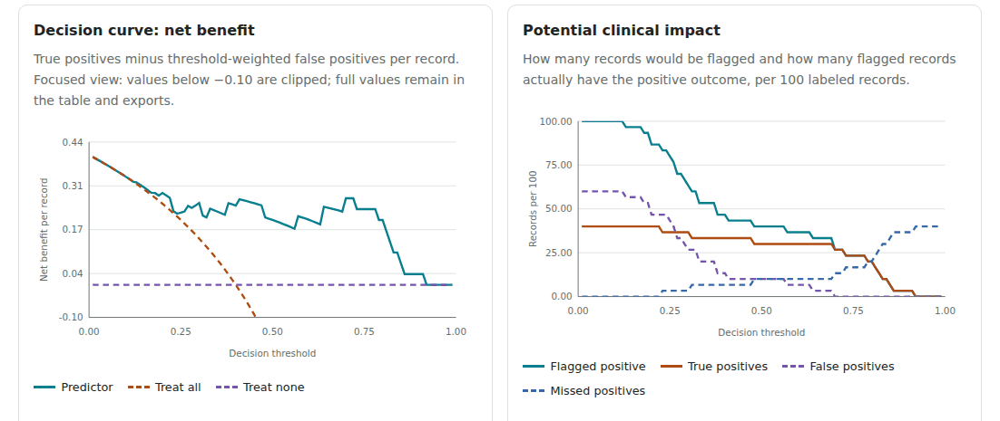
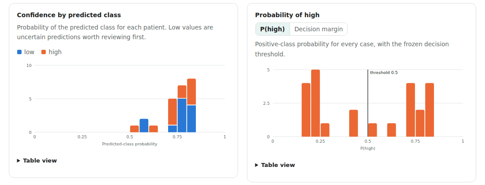
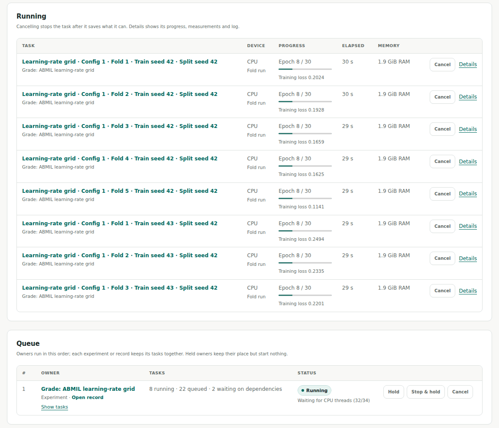

<p align="center">
  
</p>

<h1 align="center">HistoPilot</h1>
<p align="center"><strong>From pathology slides to model evidence.</strong></p>
<p align="center">
  <a href="#get-started">Get started</a> ·
  <a href="#three-ways-to-work">Three ways to work</a> ·
  <a href="#the-workflow">The workflow</a> ·
  <a href="#controlled-comparisons">Controlled comparisons</a> ·
  <a href="#the-task-center">Task Center</a> ·
  <a href="#documentation">Documentation</a>
</p>

HistoPilot is a local research workspace for computational pathology. It takes you from a slide table to evaluated models:
1. Import slide and patient metadata.
2. Extract or attach foundation-model patch features.
3. Fix your training and testing sets.
4. Train multiple instance learning (MIL) models with cross-validation.
5. Compare designs with controlled ablations.
6. Apply the resulting predictors to labeled and unlabeled cohorts, and interpret them.

It runs as a single-user service on your own workstation. Slides, features and results stay on that machine. Source files are read in place, never uploaded or copied.



<sub>Every screenshot on this page comes from the current interface running on a fully synthetic study. That study has 205 generated slides across four sites, with no real patients, images or results. Its numbers illustrate the software, not a finding.</sub>

## Get started

**Requirements:**
- Linux or WSL
- Python 3.11+ and [uv](https://docs.astral.sh/uv/)
- Node.js 22.12+ with npm
- tmux

Training and feature extraction also need an NVIDIA GPU in practice. The BLCA demo needs no GPU.

```bash
git clone https://github.com/Lyce24/HistoPilot.git
cd HistoPilot
uv sync --locked                    # the service
npm --prefix web ci                 # the browser UI's build tools
UV_PROJECT_ENVIRONMENT=.venv-training uv sync --locked --extra training   # training, predictor runs, attention
```

Add `--extra imaging` to the first `uv sync` to view SVS, TIFF and other OpenSlide slides in the browser. Feature extraction uses a separate TRIDENT checkout; see [TRIDENT feature extraction](docs/deployment.md#trident-feature-extraction).

Start the service in a terminal and allow the folders that hold your data:

```bash
bash serve.sh --data-root /path/to/research-data
```

Open `http://127.0.0.1:8787`. Choose **Start a new project** and pick an empty folder. Or choose **Open BLCA demo** for a read-only [synthetic walkthrough](docs/blca-demo.md) that needs no data or GPU. The folder pickers browse the machine running HistoPilot, not the computer running the browser.

`serve.sh` rebuilds the browser UI whenever `web/` has changed, then starts the service in the foreground. Stop it with **Ctrl+C**. After pulling an update:
1. Rerun the setup commands if the dependencies changed.
2. Start `bash serve.sh` again.

The Task Center runner restarts itself on the new code. Running tasks are adopted, not stopped. `bash serve.sh --help` lists the options, such as `--port`, `--workspace` and `--no-build`.

## Three ways to work

The browser, the command line and AI agents all use the same local API. Each sees the same records, and each previews a change before a person confirms it.

- **The browser**, at `http://127.0.0.1:8787`, covers every stage, starting from the project roadmap.
- **The command line**, `histopilot <noun> <verb>` (`uv run histopilot` from the checkout), reads projects, results and runs; prepares datasets, experiments and Apply models runs from spec files; and operates the Task Center. Add `--json` for scripts. See [Command line](docs/cli.md).

  ```bash
  histopilot project roadmap                                 # where the project stands
  histopilot experiment results EXP                          # seed-averaged results with intervals
  histopilot apply template --experiment EXP -o apply.yaml   # what Apply models would propose
  ```

- **AI agents**, such as Claude Code with the bundled `histopilot` skill or a chat app through MCP, read and prepare work with a scoped token, on projects you have shared with AI. A person approves every change. See [AI agents](docs/agents.md).

## The workflow

The **Project roadmap** groups the modules into five steps. Each step ends by **freezing** an immutable version, and freezing never starts compute.

| Step | Module | You produce |
| --- | --- | --- |
| 01 | **Datasets** | A frozen dataset: slide and patient records from a CSV/XLSX table, linked to slide files |
| 02 | **Slide features** · **Targets & splits** | A validated feature bundle (TRIDENT extraction or existing HDF5 features). Separately, a frozen target with fixed training and testing sets. |
| 03 | **Experiments** | A frozen design (inputs, cross-validation folds, model recipes, controlled comparisons and predictor choices), then trained folds, cross-validated results, and ensemble, refit or seed-ensemble predictors |
| 04 | **Apply models** | Predictor runs on cohorts. Labels, frozen with a cohort or added later as reference standards, add metrics with confidence intervals, subgroups, agreement and clinical utility; without labels a run gets label-free predictions |
| 05 | **Model interpretation** | Attention maps and top patches on the slides |

The training and testing sets are fixed from dataset records alone, before any features or models exist. Splits are made by slide or by patient. By patient, all of a patient's slides stay on one side of every split. The testing set becomes a reserved labeled cohort in Apply models. Folds are drawn only from the training set.

<p align="center">
  
</p>

Models include ABMIL, nnMIL, mean- and max-pooling MIL, and linear and MLP probes on slide embeddings. A recipe can read the image, a set of clinical variables, or both.

## Controlled comparisons

HistoPilot is built to ablate design decisions, not just to train one model. Start from one configuration and tick the models and inputs to compare under **Ablation arms**. HistoPilot then creates one configuration per arm:
- Every other setting is copied from your configuration.
- Every arm trains on the same frozen folds and training seeds.
- Your configuration becomes the reference.

<p align="center">
  
</p>

The batch review blocks a comparison whose arms differ in anything other than the model and its inputs. For example, a learning rate, epoch budget or bag size that differs between arms would mix the ablated factor with an optimisation choice.

Clinical variables come from the frozen dataset. The prediction target, the testing target and any field that defines the split are refused, with the reason shown. Every fold learns its own missing-value filling, scaling and categories.

<p align="center">
  
</p>

**Results** reports every arm against the reference. Each difference comes with a paired 95% interval, computed from the same patient resamples for both arms, and a Holm-adjusted p-value for the planned contrasts.

<p align="center">
  
</p>

Every result also breaks down by training seed and test fold, so you can see how far one run can move. The results page shows out-of-fold (OOF) values as the mean ± SD across seeds, with a patient bootstrap interval and a seed ensemble. It also flags seed and fold variation, very early checkpoints and partial results. OOF results guide development. To get an independent estimate for the configuration you choose, use **Apply this configuration**: it applies the configuration's seed ensemble to the reserved testing set.

<p align="center">
  
</p>

## Apply models

**Apply models** runs ready predictors on a cohort, one run per predictor. No run reads a label while it predicts. What a run reports depends on its cohort:
- **Labeled cohort.** The service scores the predictions against the cohort's frozen labels. **Performance** gives metrics for the target unit with bootstrap confidence intervals, performance by subgroup and **clinical utility**: calibration, precision–recall and operating characteristics, and decision curves.
- **Unlabeled cohort.** The run reports predictions only, with no metrics.

Every run also has **Predictions**, **Cases** and **Compare** views. They show confidence and margin histograms, a threshold sweep, agreement between fold models and breakdowns by any frozen attribute. Case review ranks cases by confidence, margin or ensemble disagreement, and Compare pairs two runs on the same cohort case by case. Slides from patients used in development are flagged throughout and left out of every metric.

| A scored run | Its clinical utility |
| :---: | :---: |
| [](docs/assets/app/evaluation.png) | [](docs/assets/app/clinical-utility.png) |

<p align="center">
  
</p>

## The Task Center

All compute runs through one queue per machine, shared by every project: training folds, refits, predictor runs on cohorts, attention maps, feature extraction, packing and study archives.
- **Admission:** a task starts when a GPU slot, GPU memory, RAM and CPU threads are free.
- **Controls:** each experiment keeps its tasks together, and can be held, stopped, reordered, cancelled or retried.
- **Recovery:** cancelled or interrupted work resumes from its last completed epoch.
- **Reproducibility:** follow-up work on a submitted experiment runs from an archived copy of the code it started with.

<p align="center">
  
</p>

From a terminal, `histopilot tasks list`, `tasks show`, `tasks log --follow` and `tasks wait` follow the queue, and `histopilot runner status` reports the runner; see [Command line](docs/cli.md#the-task-center).

## Development

```bash
uv sync --locked --extra training --extra imaging     # a development environment with Torch
uv run pytest -n auto --dist worksteal -m "not slow"  # fast tier, about 3 minutes
uv run pytest -n auto --dist worksteal                # full suite
uv run ruff check .
npm --prefix web test && npm --prefix web run build
```

See [contributing](CONTRIBUTING.md) for the test helpers, and for the rules that keep stored projects, queued tasks and archived code loadable across releases.

## Documentation

| Guide | For |
| --- | --- |
| [User guide](docs/user-guide.md) | Running a study end to end, stage by stage |
| [Methods](docs/methods.md) | How splits, cross-validation, comparisons, metrics, intervals and predictors are defined |
| [Deployment](docs/deployment.md) | Installation, runtime environments, configuration and remote access |
| [Task Center](docs/task-center.md) | How compute is queued, admitted, cancelled and recovered |
| [BLCA demo](docs/blca-demo.md) | The read-only synthetic walkthrough |
| [Architecture](docs/architecture.md) | Runtime, storage, execution model and code map |
| [Command line](docs/cli.md) | The `histopilot` CLI, stage by stage |
| [AI agents](docs/agents.md) | Letting an AI agent read and prepare work: exposure levels, tokens, approvals and isolation |
| [CLI contract](docs/cli-contract.md) | What scripts and agents can rely on: output, exit codes, confirmation and spec files |
| [API](docs/api.md), [error codes](docs/error-codes.md) | The local HTTP API and every error code it returns |
| [Contributing](CONTRIBUTING.md) | Development environments, tests and conventions |

<sub>No project license has been selected. Third-party models and backends retain their own licenses.</sub>
