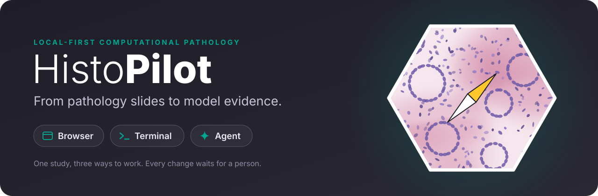
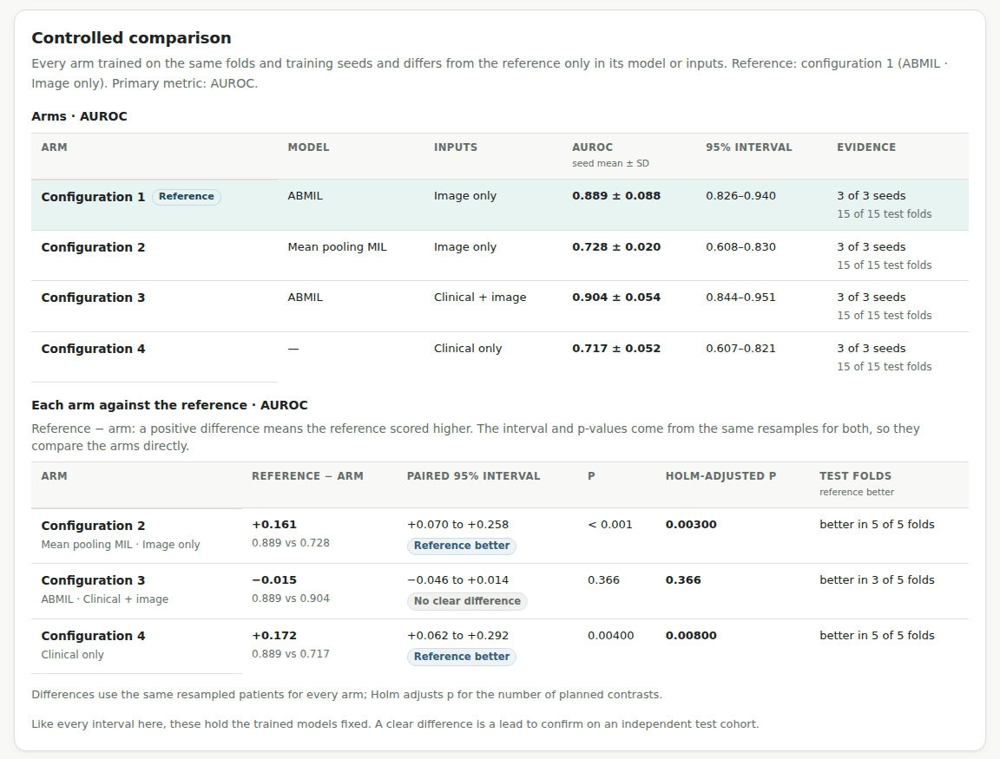
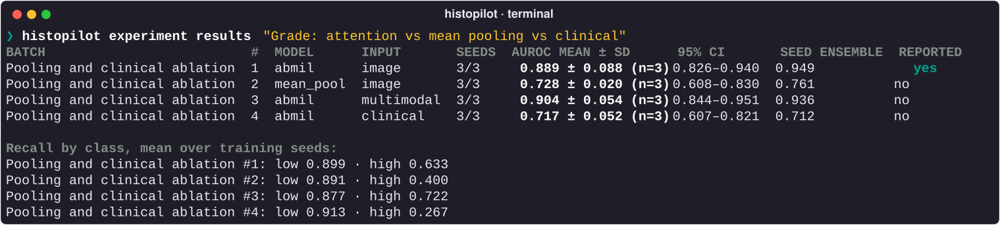
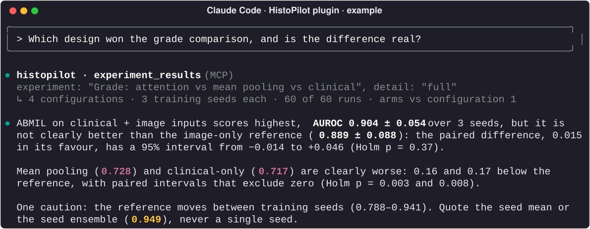
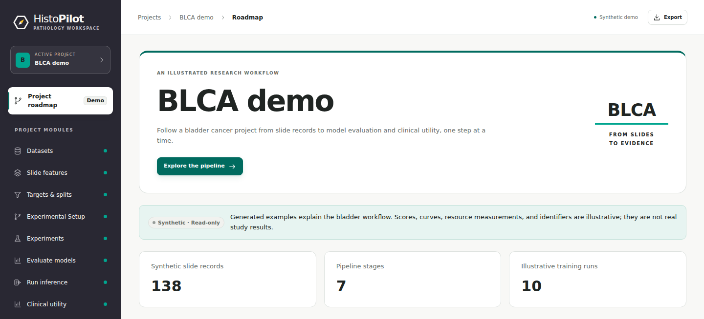
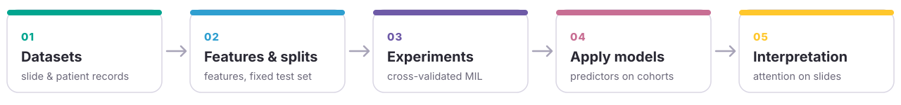
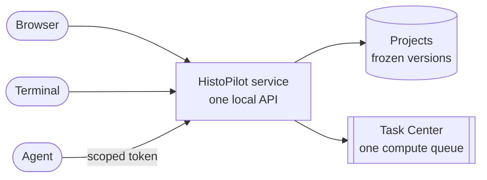

<p align="center">
  
</p>

<p align="center">
  
  
  
  
  
</p>

<p align="center">
  <a href="#quick-start"><b>Quick start</b></a> ·
  <a href="#one-question-three-cockpits"><b>Three cockpits</b></a> ·
  <a href="#fly-it-your-way"><b>Browser · Terminal · Agent</b></a> ·
  <a href="#how-it-fits-together"><b>Concepts</b></a> ·
  <a href="#documentation"><b>Docs</b></a>
</p>

HistoPilot is a research workspace for computational pathology. It takes a slide table to cross-validated, compared and applied multiple instance learning (MIL) models, and it keeps every step frozen, versioned and reproducible. It runs on your own workstation, and you can drive it three ways: from the **browser**, from the **terminal**, or by asking an **AI agent**.

## One question, three cockpits

*"Which design won the comparison, and is the difference real?"* Here is one synthetic study answering in each cockpit. The numbers agree because all three read the same local API.

**Browser**: *Experiments → Results → Controlled comparison*



**Terminal**: `histopilot experiment results`



**Agent**: Claude Code with the HistoPilot plugin



<sub>The terminal view is the CLI's own output for this study; the agent exchange is an example written from the same numbers.</sub>

## Quick start

```bash
git clone https://github.com/Lyce24/HistoPilot.git && cd HistoPilot
uv sync --locked && npm --prefix web ci                                   # service, CLI and UI
UV_PROJECT_ENVIRONMENT=.venv-training uv sync --locked --extra training   # model training
bash serve.sh --data-root /path/to/your/data
```

Open `http://127.0.0.1:8787` and pick **Open BLCA demo**: a read-only tour of a synthetic study that needs no data and no GPU. When you're ready, choose **Start a new project**.

<details>
<summary><b>Requirements and options</b></summary>

- Linux or WSL, Python 3.11+ with [uv](https://docs.astral.sh/uv/), Node.js 22.12+ and tmux.
- An NVIDIA GPU for training and feature extraction in practice.
- `--extra imaging` on the first `uv sync` adds slide viewing (SVS, TIFF and other OpenSlide formats).
- Feature extraction runs [TRIDENT](docs/deployment.md#trident-feature-extraction) from its own checkout.
- `bash serve.sh --help` lists the options, such as `--port` and `--workspace`.

</details>

## Fly it your way

<table>
<tr>
<th width="33%">Browser</th>
<th width="33%">Terminal</th>
<th width="33%">Agent</th>
</tr>
<tr>
<td valign="top">Every stage, from the project roadmap to attention maps on the slides. Forms, charts and viewers.</td>
<td valign="top"><code>histopilot &lt;noun&gt; &lt;verb&gt;</code> for scripts, spec files under version control, and SSH sessions.</td>
<td valign="top">Ask in plain language. It reads results and failures, and prepares work for you to approve.</td>
</tr>
<tr>
<td valign="top"><code>http://127.0.0.1:8787</code></td>
<td valign="top"><code>uv run histopilot --help</code></td>
<td valign="top"><code>/plugin install histopilot@histopilot</code></td>
</tr>
</table>

### Browser

The roadmap shows where a project stands and opens each stage in turn. Each stage ends by freezing a version you can come back to.



### Terminal

Run the CLI from the checkout as `uv run histopilot`. It talks to the service at `http://127.0.0.1:8787`; set `HISTOPILOT_URL` to reach another port.

| I want to… | Run |
| --- | --- |
| pick a project | `histopilot project list`, then `histopilot use PROJECT_ID` |
| see where it stands | `histopilot project roadmap` |
| read cross-validated results | `histopilot experiment results NAME` |
| design an experiment as a file | `histopilot experiment template -o design.yaml` |
| train it | `histopilot experiment create --from design.yaml`, then `experiment freeze EXP` and `experiment start EXP --wait` |
| apply its predictors to a cohort | `histopilot apply template --experiment EXP -o apply.yaml`, then `apply run --from apply.yaml` |
| watch the queue | `histopilot tasks list`, `histopilot tasks log TASK --follow` |
| script any of it | add `--json`: one envelope per command, with stable exit codes |

Every command that changes something shows its preview and asks first. `--dry-run` stops at the preview.

### Agent

**1. Share a project with AI, and make a token for it.**

```bash
histopilot use PROJECT_ID
histopilot project exposure --set metadata     # patient and slide IDs become pseudonyms
histopilot token create --name "Claude Code"   # read and preview, for this project only
```

**2. Install the plugin in Claude Code.** It asks for the service URL and the token. Other MCP apps run `histopilot agent serve`; see [AI agents](docs/agents.md#connecting-an-agent).

```text
/plugin marketplace add Lyce24/HistoPilot
/plugin install histopilot@histopilot
```

**3. Ask.** For example:

- *"Where does my project stand, and what should I do next?"*
- *"Summarize my experiments. Which configuration should I report?"*
- *"Why did the last training task fail?"*
- *"Prepare an experiment comparing ABMIL with mean pooling on the same folds."*
- *"Do the two models agree on the external cohort?"*

> [!IMPORTANT]
> An agent never changes a study by itself. It prepares a change and hands you the command. With a `--scope commit` token it files a request instead, which you approve with `histopilot confirm approve ID`. Whatever an agent reads goes to its AI provider, so read [AI agents](docs/agents.md) before you share real data.

## How it fits together




```mermaid
flowchart LR
    browser(["Browser"]) --> service
    terminal(["Terminal"]) --> service
    agent(["Agent"]) -- "scoped token" --> service
    service["HistoPilot service<br/>one local API"] --> projects[("Projects<br/>frozen versions")]
    service --> queue[["Task Center<br/>one compute queue"]]
```

- **Local first.** Slides are read in place, never uploaded or copied. Features, models and results stay on your machine.
- **Frozen and versioned.** Each step ends in an immutable record. Freezing never starts compute, and a change makes a new version.
- **Preview, then confirm.** The browser, the CLI and the agent all show a change before a person confirms it.
- **One queue.** Training, feature extraction, predictor runs and attention maps share one queue per machine. Work can be held, cancelled and resumed.
- **Models.** ABMIL, nnMIL, mean- and max-pooling MIL, and linear and MLP probes on slide embeddings, reading the image, clinical variables or both.

## Documentation

| Guide | For |
| --- | --- |
| [User guide](docs/user-guide.md) | Running a study, stage by stage |
| [Command line](docs/cli.md) | Every `histopilot` command |
| [AI agents](docs/agents.md) | Exposure levels, tokens, approvals and safe setups |
| [Methods](docs/methods.md) | Splits, cross-validation, comparisons, metrics and intervals |
| [Deployment](docs/deployment.md) | Installation, configuration, feature extraction and remote access |
| [BLCA demo](docs/blca-demo.md) | The synthetic walkthrough |
| [Architecture](docs/architecture.md) · [Task Center](docs/task-center.md) · [API](docs/api.md) | How it works inside |
| [Contributing](CONTRIBUTING.md) | Development setup and tests |

<sub>Every screenshot and number on this page comes from synthetic data. No project license has been selected; third-party models and backends keep their own licenses.</sub>
