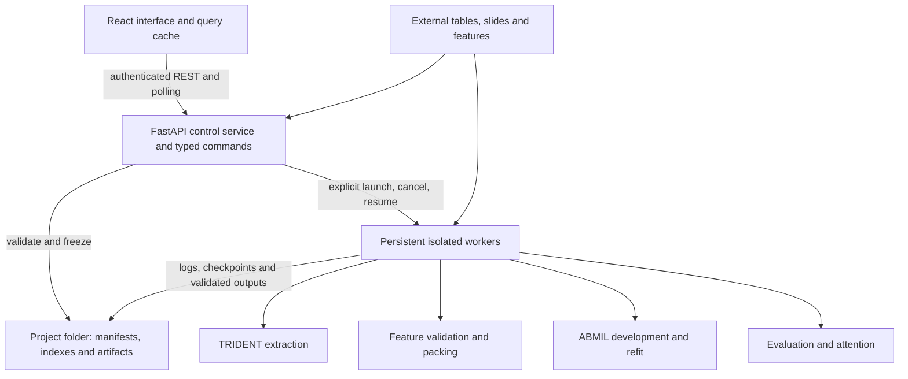

# HistoPilot architecture

Current implementation, reviewed 2026-09-12 on `HistoPilot-dev`. See the [development verdict](DEV_REVIEW.md) for changes, verification and remaining limitations. The [original prototype architecture](archive/ARCHITECTURE-prototype.md) is historical; its implementation status no longer describes the application.

## Runtime and ownership

HistoPilot is a single-user, local-first research application. React owns navigation and unsaved editor state. FastAPI owns project commands, validation and scientific records. Isolated workers implement extraction, tensor validation/packing, native ABMIL development, refitting, evaluation and attention. Original pathology files remain external filesystem references.

The service does not initialize Torch/CUDA models. Runtime checks needing ML imports execute in a separate interpreter. Source archives pin code for training and generic compute jobs, while runtime checks enforce the saved dependency contract. TRIDENT has its own runtime and native output layout.

The supported deployment is loopback access, optionally through port forwarding. Host, Origin and Fetch Metadata checks plus a process-local session token protect browser access. Configured filesystem roots bound source access. These controls do not implement shared-lab authentication or authorization.

## Scientific workflow

| Stage | Input and persisted output | Boundary |
| --- | --- | --- |
| Datasets | Inspected CSV/XLSX, patient mapping, dictionary and slide inventory → immutable dataset | Registering a folder alone does not import data. Fallback groups remain distinguishable from verified IDs. |
| Targets & splits | Dataset, target, eligibility and patient grouping → protocol with frozen memberships | Split seeds define memberships. Training seeds do not redraw them. ABMIL execution currently requires supported development k-fold. |
| Slide features | Dataset and attached/extracted patch embeddings → validated inventory and frozen bundle | Bundles reference sources and optional verified packs; validation level and freshness matter. |
| Experiments | Protocol, bundle, loading policy, recipe, resources, seeds and per-batch predictor choices → frozen batches and optional ensemble/refit predictors | Whole-experiment submission freezes inputs, batches and Skip/Refit/Ensemble/Both choices. A persistent coordinator builds verified outputs and trains refits using each source batch’s chosen epoch percentile. Planning, Running and Finished stages enforce configuration locks; see [experiment lifecycle](EXPERIMENT_LIFECYCLE.md). Native ABMIL is image-only; spreadsheet covariates are blocked during input review. |
| Test cohorts | Independently selected rows and features → frozen inference cohort | Target, classes, mean patient aggregation, representation, coverage and known development overlap are checked. |
| Evaluate models | Selected experiments’ predictors and a test cohort → predictions, metrics and paired ensemble/refit comparisons | Unlabeled inference is possible; outcome metrics use labeled records. |
| Clinical utility | Verified evaluation predictions → descriptive report and exports | Identity provenance constrains patient grouping and independence intervals. Threshold overrides remain descriptive. |
| Model interpretation | Predictor, compatible features, coordinates and slide source → attention artifacts and bounded views | Attention visualizes model weights; it does not establish clinical causation. |

The synthetic demo is separate and explicitly labeled. Its illustrative metrics are never fallback results for a failed local request.

## Persistence and concurrency

The project folder owns `histopilot-project.json` and scientific storage. The application-wide SQLite database provides project discovery and the synthetic workspace. Scientific storage uses content identities, staged publication, journals, guarded transactions and directory synchronization. Managed paths reject symlinks and unsafe aliases. POSIX locks coordinate writers across processes; revision checks reject stale mutations.

Names, tags, notes and lifecycle visibility are separate from immutable scientific contents. Archive and Trash preserve files and references. Dependency reviews and active-job checks guard cleanup; record removal does not reclaim bulk disk space. See [workspace cleanup](WORKSPACE_CLEANUP.md).

HDF5 holds native patch features/coordinates. Optional verified packs use memory-mapped arrays, a Parquet index, and JSON provenance/checksums. Dataset/result tables are saved artifacts outside the small transactional indexes. Whole-pack RAM/GPU preloading and DuckDB analytics are not implemented.

## Worker state and recovery

1. Review resolves inputs and evidence. Freeze rechecks the reviewed revision and evidence before publication.
2. Launch checks lifecycle eligibility, runtime/resources and request identity, and writes job-specific plans before worker submission.
3. Workers own process records, logs, progress and checkpoints. Scheduling coordinates CPU, memory and GPU reservations. Cancellation is pending until execution stops.
4. Lost acknowledgements require reconciliation with session/process/worker evidence. A control-service timeout must not overwrite an accepted worker's outcome.
5. Optional progress corruption returns a warning while retaining status and cancellation. Required plan/state/result evidence stays strict. Exit zero alone does not authenticate artifacts.
6. Result publication checks outputs. Resume reuses compatible code, inputs and checkpoints; it does not change the scientific experiment.

Experiment predictor coordination uses a persisted plan/state under `experiment-predictors/<hashed-experiment-id>/`, a pinned source archive and a dedicated tmux worker. The submitted per-batch policy map creates one output per requested method and complete configuration/training-seed/split-seed group. It waits for the source batch to finish, publishes ensembles and serializes refits within the experiment. Polling remains observational; explicit submit/resume commands start the coordinator. Legacy submissions without the policy never dispatch automatic predictor work.

Execution families still use different state vocabularies. Normalizing read models and strengthening descendant-process ownership are follow-up work. tmux survives browser, SSH and service disconnection, not host shutdown; checkpoint and log durability remain essential.

## Browser recovery and capabilities

TanStack Query owns cached server state. Queries are scoped by project/scientific identity. Reviewed mutation retries reuse operation IDs where supported. The transport shares session renewal, preserves structured errors and cancellation, and does not automatically replay mutations after network failure. Render boundaries retain a recovery path when a module fails.

Job summaries distinguish incomplete loading, stale status, activity and completion. Numeric controls preserve editing text and reject invalid values before save/review/freeze. System information separates implemented workflows from installed runtime readiness. Legacy health `executionEnabled: false` and generic `/jobs` refer to the reserved generic/demo executor; authenticated project routes implement real execution.

Unsaved editor input can still be lost on navigation or reload. Many workflow views are imported eagerly, leaving a large entry bundle. These limits are detailed in the [development verdict](DEV_REVIEW.md).

## Code map

| Location | Responsibility |
| --- | --- |
| `histopilot/api/`, `schemas/` | Local HTTP boundary and typed commands |
| `histopilot/application/` | Scientific review/publication, experiments, execution and lifecycle |
| `histopilot/storage/` | Durable records, integrity, locks, native/packed data and root confinement |
| `histopilot/workers/`, `training/` | Persistent execution, archives, scheduling, fitting, inference and attention |
| `histopilot/adapters/`, `models/`, `datasets/`, `viewer/` | Runtime integrations, ABMIL, bag loading and slide/coordinate views |
| `web/src/api/`, `lib/`, `store/` | HTTP contracts, workflow helpers and browser selection |
| `web/src/pages/`, `components/` | Editors, registries, viewers, controls and recovery |
| `tests/`, `web/src/**/*.test.*`, `web/verification/` | Backend regressions, UI tests and offline interaction fixtures |
