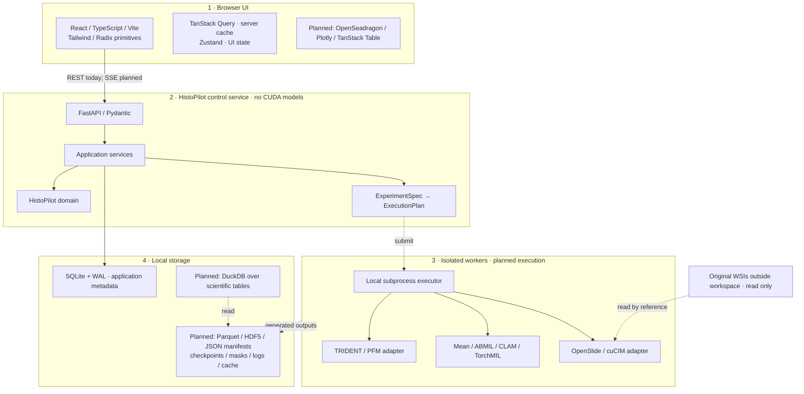
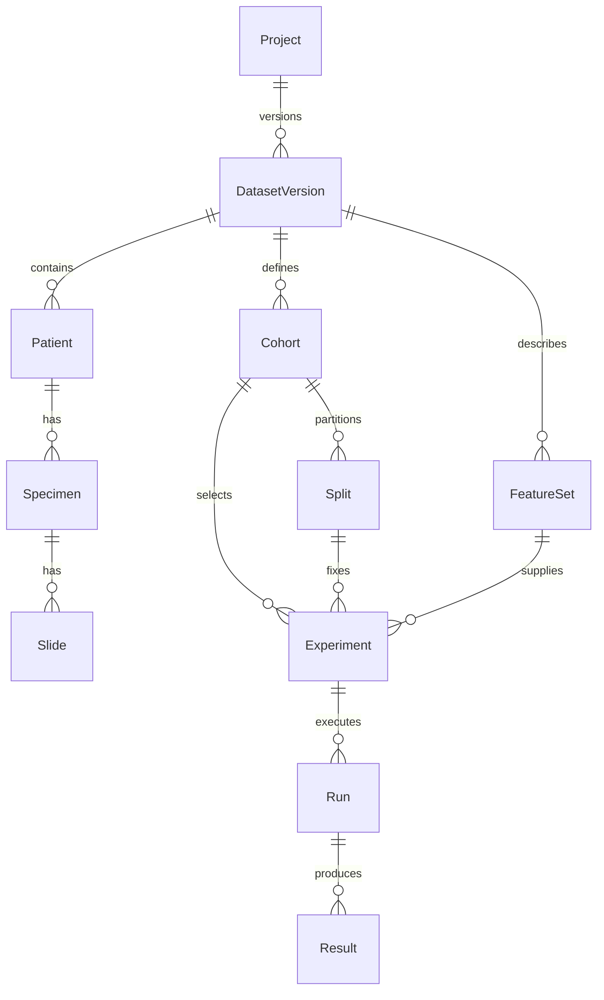

# Architecture

> **Scope of this document:** the sections below describe the initial prototype architecture and include historical implementation status. The current local application also implements scientific datasets/protocols/features, isolated native ABMIL training, checkpointed recovery, predictor ensembles/refits, test inference, and lifecycle cleanup. The empty generic/demo jobs API is not the native execution path. See [README.md](../README.md), [MODEL_DEVELOPMENT.md](MODEL_DEVELOPMENT.md), [WORKSPACE_CLEANUP.md](WORKSPACE_CLEANUP.md), and the [v2 integration review](V2_INTEGRATION_REVIEW.md) for the implemented workflows and current limitations.

HistoPilot is a local-first, self-hosted web application. A browser UI controls a local Python service; the service owns scientific state and schedules future isolated Python workers; original WSIs stay external and generated artifacts stay on local storage.

The current implementation connects the UI to persisted **synthetic** cohorts and experiment drafts. It establishes real API, database, configuration, and packaging boundaries while leaving image ingestion, GPU execution, full audits, scientific artifact storage, and real evaluation unimplemented.

## Five architectural rules

1. **FastAPI never owns CUDA models.** GPU work happens in isolated workers.
2. **Original WSIs are referenced, never silently copied or mutated.**
3. **Every scientific object is versioned and every result has complete lineage.**
4. **GUI and CLI use the same manifest/API contract.**
5. **TRIDENT, CLAM, TorchMIL, SLURM, and other backends are adapters; none defines HistoPilot's core domain.**

These rules constrain future work. The skeleton enforces the local API and persistence boundaries, but it does not claim that placeholder artifact references satisfy production lineage requirements.

## Four runtime layers



The service process must not import PyTorch/TRIDENT to initialize models or discover GPUs. Current diagnostics inspect installed-package metadata without loading CUDA. Isolated NVML and backend probes are future capabilities. The worker boundary keeps device state, native-library failures, and model dependencies outside the web service.

## State ownership

| Browser owns | Python service owns |
| --- | --- |
| Current tab, selected slide/result | Dataset identity and version |
| Table sorting and text search | Cohort predicates and canonical membership |
| Viewer zoom, overlay opacity, selected region | Frozen splits and feature identity |
| Dialog visibility and unsaved form input | Model registry, validated experiment specifications, saved drafts |
| Cached responses through TanStack Query | Job state, artifact registry, provenance |

A cohort save sends its filter definition to the API. The server validates categorical fields against the synthetic dataset, derives membership, assigns a content-based ID, and persists the snapshot. Experiment drafts pin a saved cohort snapshot and validated server registry selections. Reloading the browser reloads these scientific records from SQLite. Browser-local sorting or zoom does not change them.

The API does not accept a replacement browser workspace as scientific truth. Its export route returns stored workspace data; the client renders responses and submits bounded commands. A packaged synthetic seed in `histopilot/resources/demo_workspace.json` supplies the demo, including model descriptions. The frontend has no separate authoritative model registry.

## Domain and schema boundaries



The domain records in [`histopilot/domain/`](../histopilot/domain/) contain stable IDs and artifact references, not ORM sessions, browser state, image arrays, or GPU tensors. `DatasetVersion` records sources, a content hash, and optional parent version. `FeatureSet` records encoder/checkpoint identity, covered slides, feature/coordinate locations, extraction configuration, and geometry. `Experiment` fixes cohort/split/features/MIL intent; `Run` identifies one seed/fold execution; `Result` links a run to predictions, ground truth, metrics, and optional attention.

`Block`, `TissueMask`, and `PatchSet` are planned extensions between specimen, slide, and feature artifacts. They must preserve the patient identity path. The initial hierarchy does not implement those entities yet.

Frozen Python dataclasses express the domain shape but do not validate foreign keys or artifact contents. Pydantic validates public command/specification schemas. SQLite currently stores metadata records for the synthetic workspace, cohorts, drafts, registry, and source references; it is not yet a complete normalized ORM implementation of every domain entity.

## One GUI/CLI experiment contract

Both the experiment API and CLI use `histopilot.contracts.experiment.ExperimentSpec`. The [JSON Schema](../examples/experiment.schema.json) and [example experiment specification](../examples/crc_kras/experiment-spec.json) describe the same versioned contract.

```text
GUI command / CLI JSON or YAML
              ↓
       ExperimentSpec
              ↓
      validate and resolve
              ↓
       ExecutionPlan
              ↓
       JobExecutor
         ├─ local subprocess, first
         ├─ SLURM, future
         └─ container / cloud, future
```

`histopilot run ... --validate-only` validates a specification. Calling `run` without that flag reports that execution is unavailable. Likewise, the reserved job-submission API returns HTTP 501. Schema validity is not a claim that real features, labels, weights, or compatible compute are available.

Keep an experiment specification distinct from the synthetic provenance example in `examples/crc_kras/manifest.json`. That older illustrative record intentionally uses `demo://` artifact references and invented metrics; it is not a training input or a verifiable run.

## Ports and workers

The existing PFM, MIL, WSI, and job ports remain independent of external backends. They exchange domain records and artifact references. The `ExecutionPlan` dataclass records executable/arguments, manifest URI, working directory, log destination, and GPU IDs. Future adapters will validate, plan, execute, and inspect outputs behind that boundary; add captured environment and expected-artifact metadata as real execution is implemented.

The intended worker lifecycle is:

1. The service validates an `ExperimentSpec`, resolves immutable input records, and writes a run manifest.
2. A supervisor persists the job and launches a fresh Python subprocess with an explicit argument list and device assignment.
3. Only the worker imports PyTorch, TRIDENT, model code, and compute-specific native libraries.
4. The worker writes logs/progress and artifacts into run-specific paths; the supervisor records actual process state.
5. Outputs are inspected, checksummed, and atomically published before the run can be declared successful.

Job states reserve queued/validating/starting/running/succeeded and failure, cancellation, interrupted, and orphaned outcomes. The current empty jobs API and execution entrypoint do not implement this lifecycle. GPU scheduling, process reconciliation, cancellation, resume, heartbeats, and SSE events remain planned. A browser disconnect must not become a cancellation command when execution is implemented.

Use REST for commands and reads; add SSE for status, logs, and telemetry when there is an actual worker event stream. WebSockets are reserved for a future need for bidirectional streaming.

## Storage responsibilities

| Storage | Role | Current status |
| --- | --- | --- |
| SQLite + WAL | Small transactional application records | Implemented for the local synthetic workspace and saved commands |
| DuckDB | Analytical queries over versioned scientific tables | Planned |
| Parquet | Patient/specimen/slide metadata, predictions, histories | Planned |
| HDF5 | First feature/coordinate storage adapter | Planned |
| JSON / YAML | Versioned specs, manifests, and provenance | Specification/export foundation; real artifact manifests planned |
| Filesystem | Checkpoints, masks, thumbnails, logs, cache | Workspace organization established; scientific artifacts planned |
| External WSI directories | Original pathology images | Restricted path references only; ingestion/reading unimplemented |

A future content-addressed feature ID should hash canonical dataset, preprocessing, encoder, and checkpoint identity. Changing an input creates a new artifact identity rather than silently reusing incompatible files. Store arrays separately from application metadata, retain patch-coordinate alignment, and avoid introducing a new feature binary format for the first adapter.

SQLite is a local application database, not the bulk scientific query engine. The current schema version identifies the initial metadata layout; it is not a full migration framework. See [workspace layout](workspace.md) for current and planned on-disk paths and the [API reference](api.md) for the implemented command surface.

## WSI and coordinate contract

Original WSIs stay outside the workspace and are effectively read-only. Folder selection references a server directory; there is no WSI browser upload, automatic copy, or image mutation API.

**Level-0 WSI pixel coordinates are canonical.** Future patches, attention records, ROIs, and annotations should preserve `slide_id`, `x_level0`, `y_level0`, `width_level0`, `height_level0`, source level/MPP, requested MPP, and patch size. Viewer-normalized coordinates are derived display state.

The WSI port's region origin uses level-0 pixels while width/height use the requested pyramid level. An OpenSeadragon tile source will translate tile requests through a reader service; cuCIM may later provide a separate optional implementation. Real tile routes/readers are not available in this foundation.

Represent attention as geometry plus values linked to a run and feature set. A future Canvas/WebGL overlay can change opacity and thresholds without regenerating a giant image. The current explorer is a labeled synthetic illustration.

## Local service boundary

The supported deployment is one user, one service process, and a local workspace. The CLI holds an advisory workspace service lock; SQLite enables WAL and initializes schema version 1. Full migrations, project discovery, and interrupted-job reconciliation remain future work.

The API checks loopback Host/port and Origin, rejects cross-site fetches, and requires a random local-session token for protected routes. No wildcard CORS is enabled. Only explicitly configured filesystem roots can be listed or registered; resolved paths and symlinks must remain within those roots, and listings are bounded. These are local browser/API protections, not a multiuser authentication system.

Non-loopback binding is rejected. Use SSH forwarding for a remote workstation. A future exposed lab deployment requires authentication, authorization, HTTPS, and a documented service/storage/executor setup; OIDC, PostgreSQL, and SLURM are possible adapters, not current capabilities.

## Scientific invariants still to implement

Before any expensive job is supported, preflight must verify patient separation across partitions, unambiguous source labels, frozen memberships, complete slide and feature coverage, compatible extraction dimensions/configuration, accessible checkpoint artifacts, and available resources. Label aggregation and held-out evaluation policies must be explicit.

Every result must resolve this graph:

```text
Result ── Run ── Experiment ── Cohort ── DatasetVersion
           │          │           │           │
           │          ├── Split   labels       source tables
           │          └── FeatureSet ── PFM checkpoint + extraction settings
           │                  └── features + level-0 coordinates ── Slide
           │                                                        └── Specimen ── Patient
           └── MIL checkpoint + seed/fold + code + environment + logs
```

The [OceanPath plan](oceanpath.md) identifies concrete reuse candidates. The [roadmap](roadmap.md) orders implementation around one complete and verifiable real experiment.
