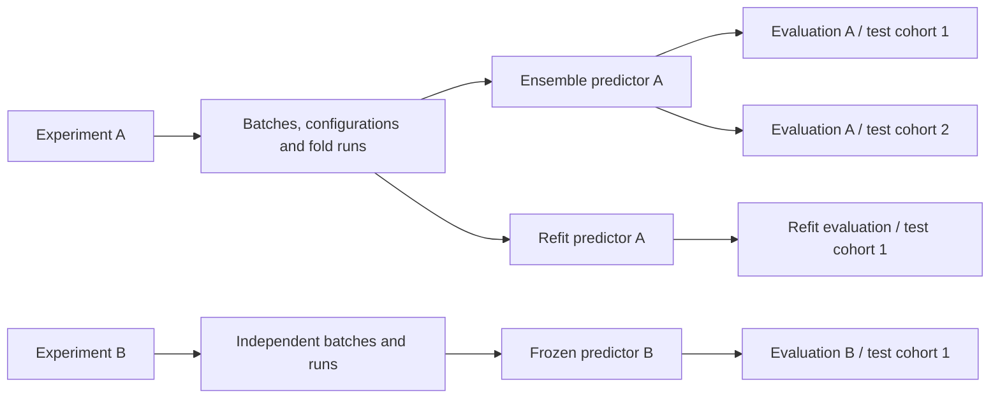

# Experiments, predictors and evaluations

The current Experiments UI and submission rules are described in [experiment lifecycle](EXPERIMENT_LIFECYCLE.md). This document describes ownership across the broader application; the Experiments workspace includes predictor planning, automatic creation and ready outputs alongside development runs and results.

The workflow continues into **04 Clinical insights**: completed evaluations feed **Clinical utility**, and refit or ensemble predictors feed **Model interpretation**. Reports preserve evaluation lineage; attention studies can use the same lineage or arbitrary compatible slides. See [Clinical insights](CLINICAL_INSIGHTS.md) for statistics, coordinate alignment, full-bag attention, viewing dependencies and exports.

Experiments is a registry of persistent experiments. Creating an experiment saves a name, notes, tags and stable identity before any training inputs are required. Open the experiment to manage Inputs, Batches, Runs and Results through Planning, Running and Finished stages.

The interface draws on W&B’s [workspace tables](https://docs.wandb.ai/models/track/workspaces), [search and filters](https://docs.wandb.ai/models/runs/filter-runs), and [baseline comparisons](https://docs.wandb.ai/models/runs/compare-runs). HistoPilot uses these interaction patterns with its local scientific records; it does not require a W&B account or upload data to W&B.

## Ownership and workflow

| Record | Ownership and meaning |
| --- | --- |
| Experiment | One persistent model-development record, with optional inputs and multiple batches. Identified by ID, never by its display name. |
| Batch | One immutable plan owned by one experiment. Expands configurations × training seeds × saved split plans into runs. |
| Run | One configuration, training seed and split plan. Keeps its original execution, checkpoints and metrics. |
| Predictor | An immutable ensemble or refit model from one experiment, batch, configuration, training seed and split seed. |
| Evaluation | One predictor paired with one saved test cohort and its inference settings. A predictor can have multiple evaluation records. |
| Evaluation batch | One reviewed test cohort and predictor snapshot, with independently tracked evaluation records and jobs. |

Predictor identity is unique per `(experimentId, batchId, candidateId, trainingSeed, splitSeed, method)`, including archived and trashed records. One experiment can therefore produce separate ensemble and refit predictors for every configuration and seed group. Reuse an existing active predictor or restore its archived/trashed record; selecting another seed or configuration does not require another experiment. Existing predictors without a method are treated as ensembles.

## Names and actions

| Stage | Module | What users do |
| --- | --- | --- |
| 01 Prepare | Datasets | Import slide/patient metadata and save dataset versions. |
| 01 Prepare | Targets & splits | Select development data, define labels, and create development folds. No external test data. |
| 01 Prepare | Slide features | Register or extract features, check coverage, and create verified bundles. |
| 02 Develop | Experiments | Plan inputs, batches and Skip/Refit/Ensemble/Both outputs; submit once, track folds/refits, then review results and ready predictors. |
| 03 Evaluate | Test cohorts | Select test records and inference settings, without training splits. |
| 03 Evaluate | Evaluate models | Evaluate selected or all compatible predictors on a reviewed test cohort, then inspect/export each result. |

Predictor creation is part of Experiments. The roadmap connects Experiments directly to Evaluate models. Legacy predictor hash routes remain recognized: scoped links open the source experiment, and historical refit jobs retain a hidden recovery view. Raw record IDs remain in saved inputs, URLs, tooltips and exports; lists show compact IDs and wrap long text inside table cells.

## Experiment workspace

- Start with the table of experiments. Search name, ID, notes or tags; filter by execution status; sort by update time, creation time or name.
- Active, Archived, Trash and All records views retain the history of created, planned, queued, running, partial, finished, failed, interrupted and cancelled work. “Scheduled (queued)” means an actual queued execution, not a calendar scheduler.
- Select two to four experiments to compare, choose a baseline and a saved batch within each, then inspect all values or differences only. Comparison includes data/protocol/features, loading, target/split definitions, every recipe field, seeds and resource settings. Different datasets or split plans stay visible; scores from different cohorts must not be interpreted as controlled comparisons.
- Open an experiment for its own inputs and batches. There is no global “latest batch” fallback. If multiple batches exist, select one explicitly.
- Batch display names can be reused across experiments. Submission generates distinct publication identities for each owner and plan; existing frozen tags remain unchanged. Current training capability is supplied by the service, independently of capability flags stored in older immutable plans.
- Inputs, saved batch recipes and predictor choices are editable only during Planning. Submission locks all three before workers launch. Already frozen batches retain their original experiment revision, exact input IDs/hashes, recipes, resources and split memberships. Renaming an experiment cannot move its runs or change its frozen scientific settings.
- Historical unowned batch plans and saved input drafts appear as read-only legacy records without rewriting their manifests or worker archives. During creation, selecting an experiment as a template copies its inputs, recipes and predictor choices into an editable new plan; historical runs stay with their original record.

Registry responses use compact summaries. Full snapshots and per-run progress are loaded for opened experiments and selected comparisons, rather than transmitted for every record on each table refresh.

## Predictor building

Both methods start with **k-fold ABMIL** results: one complete set of folds for a configuration, training seed and split seed. Before publication or refit planning, the service checks ownership, fold memberships, original batch/run plans, target and feature provenance, checkpoint receipts, and stopped process identities. Checkpoint hashes are streamed without importing Torch into the control server.

- **Fold ensemble:** publish the existing best fold checkpoints. Inference averages their per-class probabilities. Checkpoints are loaded one at a time to limit peak VRAM.
- **Refit on all development data:** save a reviewed plan, train one fresh model, then publish its completed checkpoint. The selected recipe and seed carry over. Every development slide is included exactly once in the training dataset; validation, assessment and external test loaders are absent during refit.

Choose Skip, Refit, Ensemble or Both in the experiment before submission. Both creates one ensemble and one refit for every configuration/training-seed/split-seed group across all batches. Refits train and publish automatically after the complete source batch finishes; a durable coordinator persists the reviewed request and stable operation receipts before dispatch. Refits run sequentially within each experiment using the batch resource policy and shared admission leases. A failed coordinator can resume without rebuilding completed predictors. Historical experiments lacking a submitted policy retain explicit refit recovery controls and never start automatic jobs.

### Refit epoch budget

Choose median (P50), P75, P90, maximum (P100), or a custom percentile from 1 through 100. This selects a percentile of the folds’ **best-checkpoint epochs**, not a percentage of the training data. Epochs are one-based. The service uses a linearly interpolated quantile and rounds up; for best epochs `[2, 3, 5, 8]`, P50 gives 4 epochs and P75 gives 6. The preview displays the original fold epochs and final budget.

Legacy runs can recover the exact best epoch from a complete validation history matching the checkpoint-selection metric. Missing evidence blocks refit; the stopped epoch count is never substituted. Refit trains for the fixed budget with no early stopping. Cosine schedules use that budget, and warmup is bounded to fit it. The source recipe remains recorded.

A saved refit plan inherits the batch resource policy, restricted to one model and at most one GPU. The experiment coordinator launches and publishes automatically; cancelling or resuming the experiment’s predictor work preserves the frozen policy. Resume preserves data, recipe, resources, runtime versions and pinned worker code. Incomplete epochs replay from the last complete checkpoint. Publication requires the final checkpoint, matching receipt and stopped worker process group.

Publication uses the lifecycle lock, fresh evidence and preview hash. Identical retries return the original record. Published predictors prevent launch/resume of their source batch so its checkpoint evidence remains unchanged. Both methods retain their experiment and input history through archive/restore.

## Evaluation management

Choose an ensemble or refit predictor and a compatible test cohort, review the inputs, save the plan, then select **Run evaluation**. Test cohorts are prepared in 03 Evaluate with no new splits. Each predictor can have multiple evaluation records, including evaluations on the same test cohort for comparing the refit and ensemble.

For a cohort-wide comparison, select a test cohort and **all shown predictors** or an explicit subset. Source experiment, method and search filters organize the available ready predictors. Review lists each compatible predictor and each blocked reason before **Run all compatible predictors**. The submitted request fixes the reviewed predictor IDs; predictors created afterward are excluded. Changes to reviewed inputs require another review. Each request creates distinct evaluation records, while an identical retry continues partial submission without duplicating jobs. Batch history keeps each predictor's experiment, configuration and seeds alongside its own job and result.

Cancel an evaluation batch to prevent remaining submissions and request cancellation of its active jobs. Completed results stay intact, and cancellation remains pending while workers stop. Retry failed or interrupted evaluations through their individual controls; replaying a batch submission does not automatically restart a failed compute attempt.

The review verifies the exact development protocol, target encoding and feature references; test feature/pack coverage; development overlap; encoder/dimension/dtype and available extraction provenance; supported aggregation; and checkpoint hashes. Workers recheck source evidence before and after inference.

Inference uses whole bags and preserves slide order and the frozen class order. Unlabeled slides receive predictions. Metrics use labeled records only, respect the configured prediction unit and binary decision threshold, and report unavailable metrics when required classes are missing. Results include slide and patient predictions, metrics, confusion matrices and checksummed CSV/JSON exports. Failed or cancelled runs do not appear as completed results. Resume reuses verified completed ensemble members and recomputes the interrupted member.

Refit and evaluation workers run as durable tmux jobs in the isolated training environment. They share CPU/RAM/GPU reservations with batch training and expose queued/running/completed/failed/cancelled/interrupted states. The control server does not load models. The user continues to start the HistoPilot server themselves; application server startup is never managed with tmux.

## Archive, delete and recovery

Experiment and batch actions reuse [Workspace cleanup](WORKSPACE_CLEANUP.md), including explicit dependency selection, acknowledgement, stale-review detection, audit receipts and exact retries. Predictors and evaluations link directly to their selected cleanup record.

Archive removes a record from ordinary working lists and preserves historical references. Archived experiments are read-only until restored, including new training launches/resumes. Delete moves records into recoverable Trash; it does not remove source files, features, checkpoints or logs. Retained batches protect their experiment; predictors protect their exact experiment/batch/configuration/seed inputs; evaluations protect their predictor and test cohort. Evaluation batches retain references to their member evaluations and selected inputs. Archived dependents still protect their inputs. Active training, refit and evaluation jobs must stop before cleanup; terminal receipts do not override live process-group evidence. A saved refit plan is a dependency of its published predictor. Cancelling through Workspace cleanup dispatches to the owning worker or evaluation batch and preserves a retry receipt.

Existing scientific SQLite schema v4 and worker archives remain compatible. There is no automatic migration of live experiments or training results, and no real project data is changed during development verification.

## Verification

The change is validated with frontend/API contract tests, cleanup dependency tests, tiny synthetic CPU refit and inference runs, and interruption/resume regressions. The refit regression compares resumed checkpoint tensors with uninterrupted training. Offline browser checks use actual React components and synthetic service responses; no live workspace records or HistoPilot server are changed.

See the [bulk predictor verification report](verification/2026-09-11-bulk-predictors/verification.md) for the multi-seed build and all-predictor evaluation checks. See the [predictor methods verification report](verification/2026-09-11-predictor-methods/verification.md) for final checks and screenshots.
