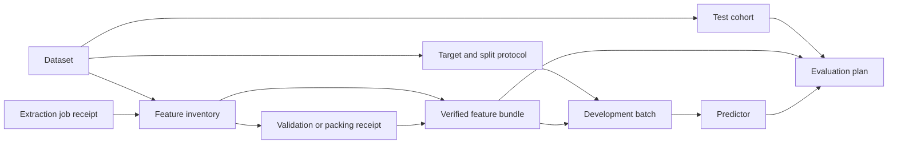

# Workspace cleanup and lifecycle rules

Implemented 2026-09-11. The goal is to let users organize a messy workspace while preserving reproducibility and the ability to recover. Cleanup operates on project-owned record IDs, never browser-provided filesystem paths.

## Three distinct actions

| Action | Behavior | Recovery and files |
| --- | --- | --- |
| Cancel job | Requests the existing extraction, packing, training, refit or evaluation worker to stop. Evaluation-batch cancellation also blocks pending submissions. Cancellation remains pending until workers stop. | Completed work, logs and available checkpoints are retained. Resume remains an explicit action through the owning record's controls. |
| Archive | Moves records out of ordinary lists and input pickers. Existing saved references continue to resolve. | Restore to Active at any time. No scientific snapshot, identifier or file changes. |
| Delete / Move to Trash | Hides records and blocks new use through direct IDs. Retained dependents must be included explicitly or preserved. | Restore to Active with any required inputs. Scientific metadata and all files remain available for recovery. |

There is no automatic cascade, purge timer, folder removal or physical disk reclamation. Original CSV/XLSX files, slide images, attached features and packs, generated features, validation receipts, checkpoint files and logs are not unlinked. Permanent artifact removal would need a separate owned-file inventory and an exact deletion review; record lifecycle never grants that authority.

Supported records include whole projects, import and experiment drafts, imported dataset versions, development target/split protocols, feature inventories, verified feature bundles, development batches, predictor/refit records, test cohorts, individual evaluations, evaluation batches, and extraction/packing/validation jobs. Individual folds belong to their frozen development batch: cancelling or hiding a fold must not silently alter the planned OOF coverage.

## Dependency rules

The cleanup inventory builds a graph from exact local record IDs in saved manifests, nested payloads, validation receipts and job plans. It scans both mapping keys and values. Human-readable IDs and dependencies are shown before confirmation.

Examples:

- A dataset cannot enter Trash while a retained protocol, feature inventory, revision or draft needs it.
- A protocol or feature bundle cannot enter Trash while a retained batch, evaluation or legacy bound test cohort needs it. New independent test cohorts protect their selected datasets and do not depend on model or feature preparation.
- Predictor identity includes experiment, batch, configuration, training seed, split seed and method. Archived or trashed records still reserve that identity; **Both** reuses active records or requires explicit restoration rather than replacing them.
- An evaluation protects its predictor and test cohort. An evaluation batch retains its member evaluation IDs and selected input references; deleting a member may require including the retained batch in the review. Archiving the batch does not change its members' individual visibility.
- Archived consumers protect their inputs just as active consumers do.
- A feature bundle can depend on a full-validation job receipt even when the bundle has **zero packs**. That receipt is protected.
- Pack artifact IDs resolve to their verification receipts. An explicitly saved job ID protects that exact receipt. A bare artifact reference can use another retained receipt for the same artifact ID; cleanup conservatively protects its retained receipt owners.
- Mutable selections are presentation defaults, not immutable scientific dependencies. Removing a receipt clears it from usable defaults while keeping historical evidence in place.
- Inputs needed only by already trashed records may also enter Trash. Restoring those records requires restoring their trashed inputs, either first or in the same reviewed selection.
- Unknown or unreadable job/process evidence blocks cleanup; failure to inspect a process is not evidence that it stopped.

The service returns the required records rather than automatically adding them. **Include required records and review again** expands the selection explicitly. The next review states every affected record. A user may instead archive the unwanted consumer and retain its inputs, or leave the shared input intact.

## Whole projects

Projects have the same Active / Archived / Trash organization on the start page. **Manage cleanup** opens their cleanup inventory, including for projects in Trash.

Whole-project archive or trash is a separate selection. It changes the container's visibility and retains each child record's individual state. Active jobs anywhere in the project block this action. A trashed project rejects new publications, edits and launches; its cleanup inventory remains readable for recovery. Restore the project before managing individual children. Restoring it does not silently restore children that were individually archived or trashed.

The project descriptor and scientific database remain in the original folder. Opening that folder again preserves its lifecycle state rather than resurrecting it. An unavailable or unmounted project cannot be safely inspected for cleanup.

## Review, concurrency and retries

1. The client selects record IDs and an action.
2. The service reads current lifecycle state, dependencies and job status under the project lifecycle lock.
3. The preview includes blockers, required records, the exact selection and a review hash.
4. Confirmation takes the same lock and recomputes the preview. A changed dependency, draft version, record label, lifecycle revision or job state requires a fresh review.
5. An atomic, durable replacement commits lifecycle states and the audit receipt together. Partial selection changes are not committed.

New scientific publications, draft edits and job launches share the lifecycle lock, acquired before existing scientific or job writer locks. This closes the review → new dependent → deletion and cleanup → concurrent launch races. Cancellation uses that gate too, while workers continue using their original output paths and process locks.

An operation ID belongs to one exact request. Retrying it returns the historical receipt without applying it again, even if another later action restored the record. Reusing the ID with different intent is rejected. If a confirmation response is lost, the UI offers a retry of the identical reviewed request and operation ID. A stale or rejected review cannot be reused as approval.

## Job stopping

Queued, starting, running and cancelling jobs protect themselves and the inputs they use. Cancellation is an explicit action, never an implicit consequence of deleting a record. No cleanup action launches or resumes computation.

Cleanup checks live process identities using PID, boot ID and process start ticks. This avoids mistaking a reused PID for the original worker. A terminal result file alone is insufficient: a scheduler or child can still be draining. Those jobs remain protected, and cancellation can still reach their matching live processes. Unreadable process evidence fails closed. Existing worker cancellation semantics retain checkpoints and completed artifacts.

## Persistence and compatibility

`histopilot-lifecycle.json` stores lifecycle states, monotonically increasing revisions, operation receipts and audit entries. The sidecar uses atomic replacement and filesystem synchronization; it rejects unsafe aliases and malformed metadata. `.histopilot-lifecycle.lock` coordinates threads and processes and is not deleted during cleanup.

Scientific SQLite schema v4, immutable manifests, content hashes, version tags, publication receipts and archived worker source are preserved. This avoids changing the schema expected by existing pinned workers. A missing sidecar in an older project means its records start Active. Backups and folder transfers should preserve the whole project, including the sidecar and scientific database.

Normal lists omit archived and trashed records. Archived direct references remain usable for existing workflows. Trashed direct references reject new use; the cleanup inventory has a deliberate raw-read path for recovery. Republishing the same frozen content never silently restores a hidden record.

Archiving inputs does not lock users out of retained protocols, feature records, batches or test-cohort setups. Their existing editors and results remain accessible, including during a failed input-list refresh. This grants access to saved work only: new publications and launches still perform their normal input validation, and the roadmap does not infer readiness or completion from an archived input.

## Verification scope

Tests cover dependency protection, dataset revisions, nested validation receipts, shared artifact aliases, archived consumers, explicit multi-record Trash/restore, active and terminal-but-live jobs, cancellation audit, stale draft/review conflicts, operation replay after restore, project isolation, browser-session authorization, reopening trashed projects, atomic rollback, and thread/process coordination.

Browser verification uses an offline harness with actual React components and fixture responses. It checks selection/review/confirmation, blockers, explicit dependency inclusion, cancellation polling, lost-response retry and responsive layout. No real workspace records or files were cleaned up as part of development, and no HistoPilot server was started.

Final validation: **64 new backend cleanup tests** and **236 frontend tests** passed, alongside existing storage, project and training regression checks. TypeScript, Ruff, whitespace checks and the production build passed. See the [offline browser verification report](verification/2026-09-11-workspace-cleanup/verification.md) for interaction checks and limitations.

Refit training plans (`predictor-refit`), evaluation records (`model-evaluation`) and evaluation batches (`evaluation-batch`) participate in the same dependency graph. Launched jobs appear in cleanup with cancellation controls; their inputs remain protected until the full worker process group stops. A pending evaluation batch must be submitted or cancelled before cleanup; standalone unlaunched plans can be archived or trashed. Compute files in `compute-jobs/`, evaluation-batch receipts in `evaluation-batches/`, and predictor-build retry receipts in `predictor-builds/` are protected from feature extraction/packing destinations and remain on disk after record deletion. Predictor-build retries preserve each successful item; cancelled evaluation batches never submit remaining items on replay.
