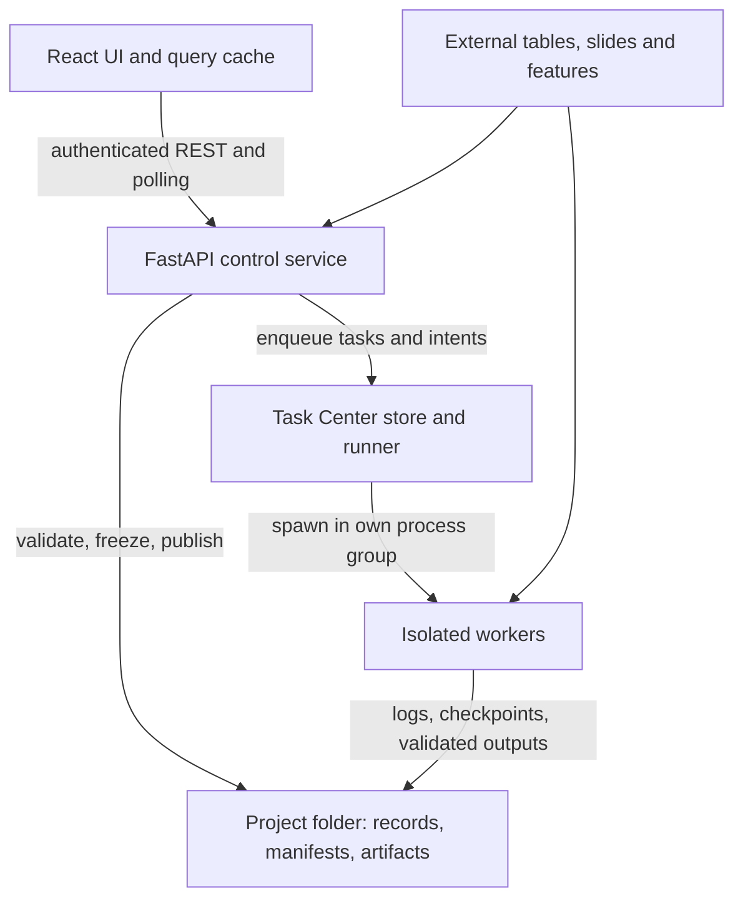

# Architecture

HistoPilot is a single-user, local-first application. This page describes how it runs, where it keeps state, how compute is executed and recovered, and where the code lives. For installation see [deployment](deployment.md); for the queue's rules see [Task Center](task-center.md).

## Runtime and ownership



| Part | Owns |
| --- | --- |
| React UI (`web/`) | Navigation, unsaved editor state and cached server reads |
| Control service (`histopilot/api`, `application`, `storage`) | Commands, validation, scientific records, lifecycle and read models. It never imports Torch or initializes CUDA; checks that need ML packages run in a separate interpreter. |
| Task Center (`histopilot/taskcenter`) | One machine-level queue and runner per OS user: admission, dispatch, cancellation and recovery of all compute |
| Workers (`histopilot/workers`, `training`, `adapters/trident`) | Extraction, validation and packing, fold training and result collection, refits, evaluation, inference and attention |
| External sources | Original tables, slides and features, referenced in place and never copied |

Slide images are read by short-lived isolated reader processes, never inside the service; SDPC files use the configured OpenSDPC interpreter. Access is limited to loopback, with Host, Origin and fetch-metadata checks and a per-process session token; configured data roots bound what the service can browse. None of this is shared-lab authentication.

## Scientific records

Each stage freezes an immutable record that the next stage consumes. Names, tags and notes are mutable labels kept apart from the frozen content and its hashes.

| Stage | Inputs → frozen output | Boundary |
| --- | --- | --- |
| Datasets | CSV/XLSX, identifier mapping, dictionary and slide inventory → dataset | Registering a folder imports nothing. Slide-ID fallback groups stay distinct from verified patients. |
| Targets & splits | Dataset, eligibility, split unit, method, target → `target-split` and its test cohort | Fixed training/testing membership. No dependency on features or training design. A testing set without a target becomes an inference cohort. |
| Slide features | Attached or extracted features → feature binding and verified bundle | Bundles reference sources and optional verified packs; freshness is rechecked before use. |
| Experimental Setup | Dataset, target/split, bundle, folds, recipes, predictor choices → `experiment-setup` | Checks feature coverage of every training slide. Derives folds only from training members. Freezing launches nothing. |
| Experiments | Frozen setup → batches, runs, checkpoints, OOF results and predictors | Current inputs and runtime are rechecked at submission; the setup never changes. |
| Test cohorts | Datasets, conditions and a target (evaluation) or none (inference) → test membership | Independent of models and features |
| Evaluate models / Run inference | Predictors and a test cohort → predictions, metrics or label-free summaries | Review checks target encoding, development overlap, feature and pack coverage and checkpoint hashes, and pins them. |
| Clinical utility | Completed evaluation → report | Descriptive only; no refitting or threshold tuning |
| Model interpretation | Predictor, compatible features and slides → attention artifacts | Attention shows model weighting, not causation. |

Records created by earlier versions stay readable and are never migrated in place. The synthetic BLCA demo is a separate, read-only fixture; its values are never used as fallback results.

## Execution model

Every long-running job is a Task Center task. Producers (experiment submission, extraction, packing, evaluation, interpretation, archives) turn frozen records into tasks with requests, dependencies and commands, and enqueue them in one transaction. The runner admits them in queue order against GPU slots, GPU memory, RAM and CPU threads, and starts each in its own process group through a small wrapper that records its exit.

1. **Review** resolves inputs and evidence. **Freeze** rechecks the reviewed revision and evidence before publishing.
2. **Launch** checks lifecycle state, runtime and request identity, writes a job plan, then enqueues tasks.
3. **Workers** own their process records, logs, progress, checkpoints and a result file. The runner records outcomes from these result files and exit records, never from an exit code alone.
4. **Publication** verifies outputs before anything becomes visible. An exit code of zero does not authenticate an artifact.
5. **Resume** reuses compatible code, inputs and checkpoints. It never changes the scientific design.

A submitted experiment becomes one task per fold, a result-collection task per batch, and one predictor coordinator task. The coordinator waits for each batch's final collection, publishes ensembles and launches every ready refit as its own task. Its plan and state live under `experiment-predictors/<hashed-experiment-id>/` in the project, and every publication and launch has a stable operation identity, so a restarted coordinator resumes where it stopped. A worker that finds its project busy exits with code 75 and is requeued rather than failed.

Stage records keep their own state fields. Stage pages read their tasks' status from the Task Center store through one shared status chip, without taking a project lock.

Records created before the Task Center ran in their own tmux sessions. They stay readable but never run again: a finished one shows its saved status, an unfinished one reads as interrupted, and launching, resuming, retrying or cancelling one is refused with `CREATED_BEFORE_TASK_CENTER` (409). Clone the record, or preview it again, to run the work as tasks. The runner still counts the leases that other checkouts and TRIDENT runs publish in the shared lease registry.

## Pinned compute archives

Code that produces scientific results runs from a verified, archived copy, never from the live checkout.

- **What is archived.** `histopilot/workers/compute_archive.py` copies the package's Python modules into `<job folder>/compute/histopilot/`, with a `snapshot.json` listing every file's hash. A narrower **compute fingerprint** (`workers/training_process.py:compute_snapshot`) hashes the modules that affect results: models, datasets, training, scoring and statistics, the workers and the predictor and refit services. An existing archive is re-verified on every use and never altered.
- **Execution contract.** Each run plan records its code fingerprint and runtime: interpreter, Python and CUDA versions and package versions. No dependency lock file is archived; the contract detects a changed environment instead.
- **Submission.** Submitting an experiment prepares every batch, requires all their contracts to match, and stores that contract with the submission. Each batch then launches from its own archive in `training/<batch-id>/compute/`; fold and collection workers import that copy and refuse to run if its fingerprint differs from the plan.
- **Follow-up work.** A refit launched later, a batch whose launch is retried, and the predictor coordinator run from **the first launched batch's archive** (`application/model_experiments.py:pinned_compute`). They check the submitted contract first and refuse with `EXPERIMENT_RUNTIME_CHANGED` if the code or environment changed; restore the environment or copy the experiment. The coordinator also points its refits at the contract's training interpreter.
- **Other compute.** Evaluations, inference runs and interpretation archive the current checkout's code when they launch, and a resume reuses that archive.
- **Archives from before the Task Center.** A launch checks that the archive can run as a task: the archived compute worker and predictor coordinator declare `TASK_CENTER_PROTOCOL` (read without importing them), and an archived training package has `workers/managed_fold.py`. Archives pinned before the Task Center have neither, so work that would run from one is refused with `CREATED_BEFORE_TASK_CENTER`; copy the experiment to run it again.

Updating HistoPilot therefore never changes the code of work that is already running or submitted. Resuming a batch whose archived code differs from the checkout shows a `TRAINING_PINNED_CODE` notice.

## Persistence

### Project folder

A project lives entirely in the folder chosen when it was created. Moving the whole folder and reopening it from the new path keeps every reference, because generated artifacts are stored relative to it.

```text
<project folder>/
  histopilot-project.json        # Identity, setup and registered source folders
  histopilot-state.sqlite        # Drafts, frozen configurations, labels, receipts (schema 4)
  histopilot-lifecycle.json      # Archive/Trash state, revisions and audit receipts
  .histopilot-write.lock         # Cross-process writer lock
  .histopilot-lifecycle.lock     # Lifecycle lock, taken before the writer lock
  .staging/                      # Incomplete publications
  datasets/<dataset-id>/         # manifest.json, records, dictionary, inventory, sources
  training/<batch-id>/           # plan.json, state.json, compute/, runs/, OOF, results, logs
  compute-jobs/<job-id>/         # Refits, evaluations, inference and attention jobs
  experiment-predictors/<id>/    # Predictor coordinator plan and state
  evaluation-batches/<id>/       # Bulk evaluation and inference receipts
  predictor-builds/<id>/         # Bulk predictor-build receipts
  extractions/<run-id>/          # TRIDENT command, slide list, logs, progress, result
  packing/<run-id>/              # Validation and packing evidence
  interpretation-requests/<id>/  # Attention requests
  slide-reviews/                 # Per-slide review notes
```

Default TRIDENT and pack outputs go to `trident/` and `feature-packs/` inside the project unless you choose another folder. Original slides and features stay where they are.

### Central workspace and machine state

The application workspace (`~/.histopilot/workspace` by default) holds `histopilot.db`, the recent-project list (schema 1), `service.lock` and `portability-jobs/` for study archives. No scientific record depends on it; a fresh workspace can reopen any project folder. The Task Center keeps its queue in a separate machine-level state directory; see [Task Center](task-center.md#state-directory-and-maintenance).

### Publication and integrity

Scientific storage uses content identities, journaled staged publication, guarded transactions and directory syncs. A publication records its intent in a journal, writes staged artifacts and a checksum manifest, syncs files and folders, atomically renames the result into place, and then commits visibility. On reopen, a complete staged publication finishes and an incomplete one is marked interrupted; partial files never become a record. Reads verify hashes. Identical retries of a publication return the original record; reusing an operation ID with different content is refused.

Opening a project with an older scientific store (schema 1–3) adds the missing tables; unknown or inconsistent stores are refused, never reset. Managed paths reject symlinks and unsafe aliases.

Patch features stay in their HDF5 files. Optional verified packs are memory-mapped `features.bin` and `coords.bin` arrays with a Parquet index and JSON provenance and checksums.

## Concurrency

| Lock | Scope |
| --- | --- |
| `service.lock` in the workspace | One service per workspace |
| `.histopilot-lifecycle.lock` | Lifecycle changes, publications, draft edits and launches; always acquired before the writer lock |
| `.histopilot-write.lock` | Serializes scientific writes across threads and processes; a busy project fails fast with `PROJECT_BUSY` |
| `runner.lock` in the state directory | One Task Center runner per user |

Drafts and labels carry revisions, and stale updates are refused. All SQLite databases use WAL. Every connection disables the close-time checkpoint, and connections open and close under one process-wide lock (`storage/sqlite_connections.py`): SQLite 3.51.0 can deadlock when one thread closes the last connection to a WAL database while another opens or closes one. `kill -USR1` on the service or runner writes every thread's stack to a log in the Task Center state directory.

## Filesystem and backups

Storage requires POSIX file locks, directory fsync, same-filesystem atomic rename and SQLite WAL, and fails explicitly when they are missing. Tests run on local POSIX folders; network filesystems are not certified. Power-loss durability ultimately depends on the filesystem and hardware honouring syncs.

For a consistent backup, use **Study backups & sources** to export a verified archive: it refuses while project jobs are active, takes an integrity-checked copy of the database, zips every project file with per-file hashes, verifies the archive and writes it outside the project. External slides and features are recorded as references, not copied, and need their own backup. A restore verifies the archive and publishes it into a new folder only, keeping the project's identity. A manual copy must stop all writers first and include the SQLite sidecar files.

## Browser

TanStack Query owns cached server state, scoped by project and record identity. Mutations are never replayed automatically after a network failure; reviewed retries reuse their operation IDs. Unsaved input in several editors is kept for the browser tab and offered for recovery; see the [user guide](user-guide.md#drafts-and-recovery). Render boundaries keep a way out when one module fails.

## Code map

| Location | Responsibility |
| --- | --- |
| `histopilot/api/` | FastAPI routers and the local security boundary (`security.py`) |
| `histopilot/schemas/` | Pydantic request and record contracts |
| `histopilot/application/` | Services: imports, targets and splits, features, setups and experiments, training, predictors, evaluation, inference, clinical utility, interpretation, lifecycle, operations, the BLCA demo |
| `histopilot/storage/` | Scientific and central stores, locks, lifecycle sidecar, filesystem confinement, packed features, attention packs |
| `histopilot/taskcenter/` | Task store, runner, wrapper, capacity, estimator, launcher, leases and per-kind adapters |
| `histopilot/workers/` | Isolated worker entry points and the compute archive |
| `histopilot/training/` | Lightning fold training, refit, inference and attention |
| `histopilot/models/` | ABMIL, nnMIL, pooling and clinical models, and the model catalog |
| `histopilot/datasets/` | MIL data module and sampling |
| `histopilot/adapters/` | Training runtime discovery (`native/`) and the TRIDENT integration (`trident/`) |
| `histopilot/viewer/` | Isolated slide readers, image cache and attention arrays |
| `histopilot/domain/` | Shared feature-representation helpers |
| `histopilot/resources/` | The synthetic BLCA demo fixture |
| `histopilot/cli.py`, `runner_cli.py`, `archive_cli.py` | `histopilot` commands: `serve`, `doctor`, feature packing, training status, `runner`, study archive recovery |
| `histopilot/cv_summary.py`, `statistics.py`, `scoring.py`, `candidate_selection.py`, `inference_summary.py` | Metrics, intervals, ranking, configuration selection and label-free summaries, importable without Torch |
| `histopilot/config.py`, `service_lock.py`, `web_bundle.py`, `doctor.py`, `diagnostics.py` | Settings, the service lock, UI bundle freshness, package report and stack dumps |
| `web/src/api/` | Typed HTTP clients and response contracts |
| `web/src/lib/` | Workflow helpers: routing, roadmap, drafts, charts, slide tiles |
| `web/src/pages/`, `web/src/components/` | Pages, editors, registries, viewers and shared controls |
| `web/scripts/` | Offline browser checks in headless Chromium |
| `tests/` | Backend tests; `tests/support/` holds shared fixtures |
| `scripts/bundle_web.py`, `serve.sh` | UI bundling and the launcher |

Frontend unit tests sit beside their sources as `*.test.ts(x)`. See [contributing](../CONTRIBUTING.md) for how to run everything.
