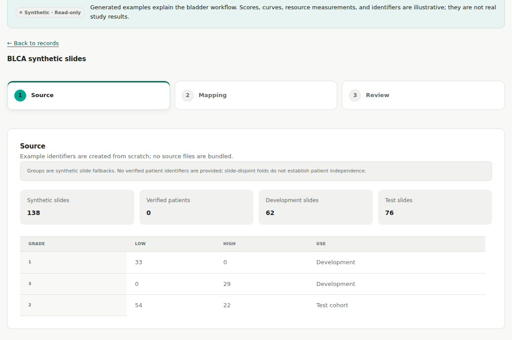
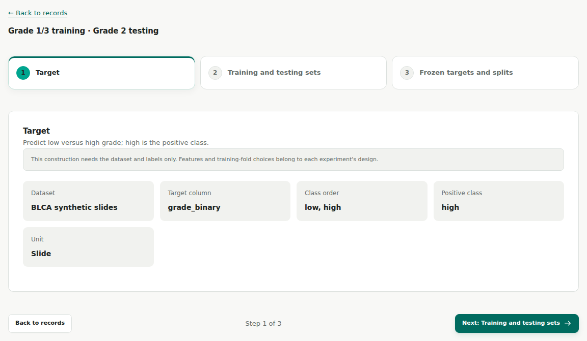
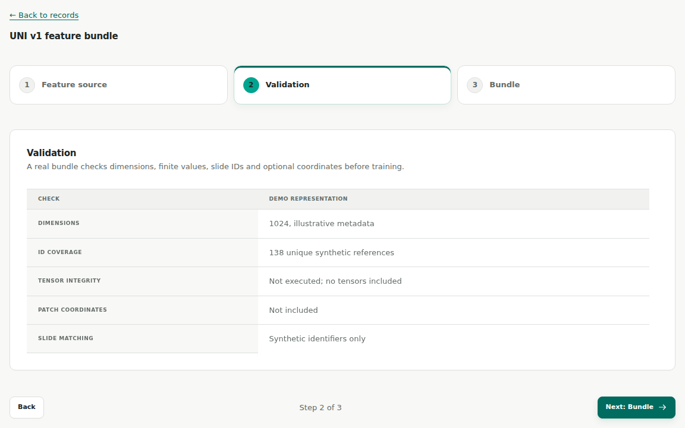
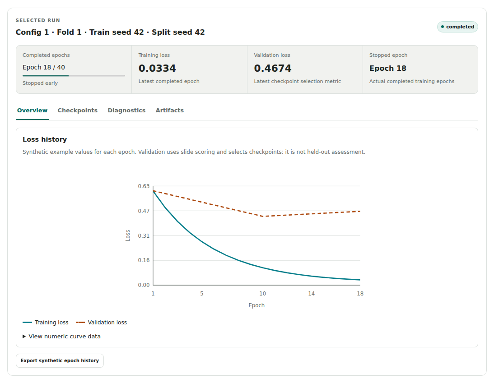
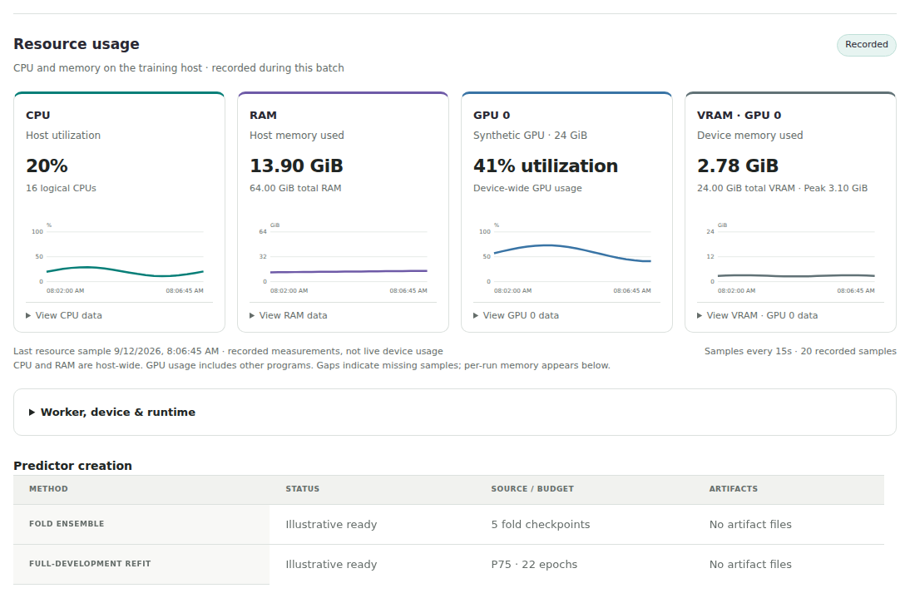
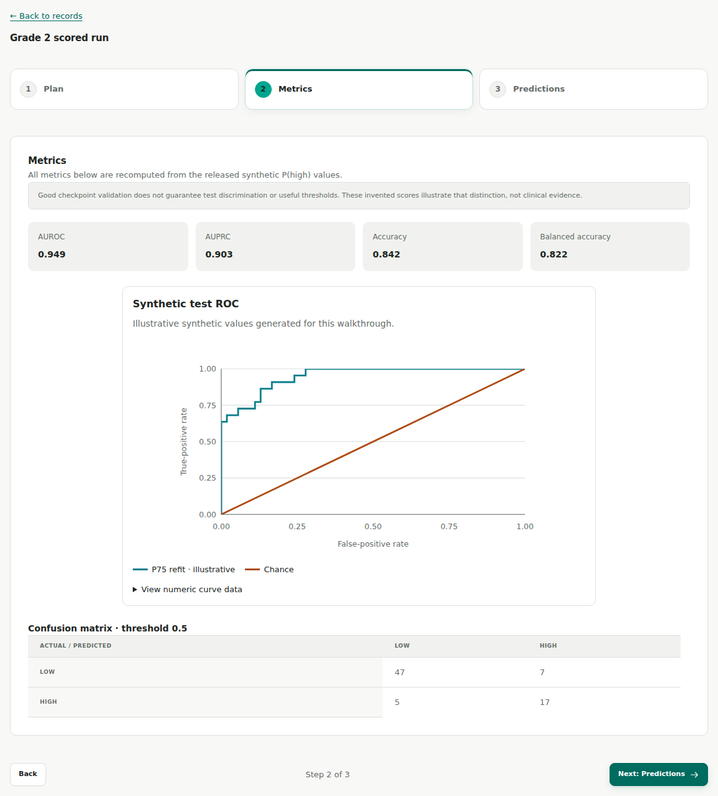
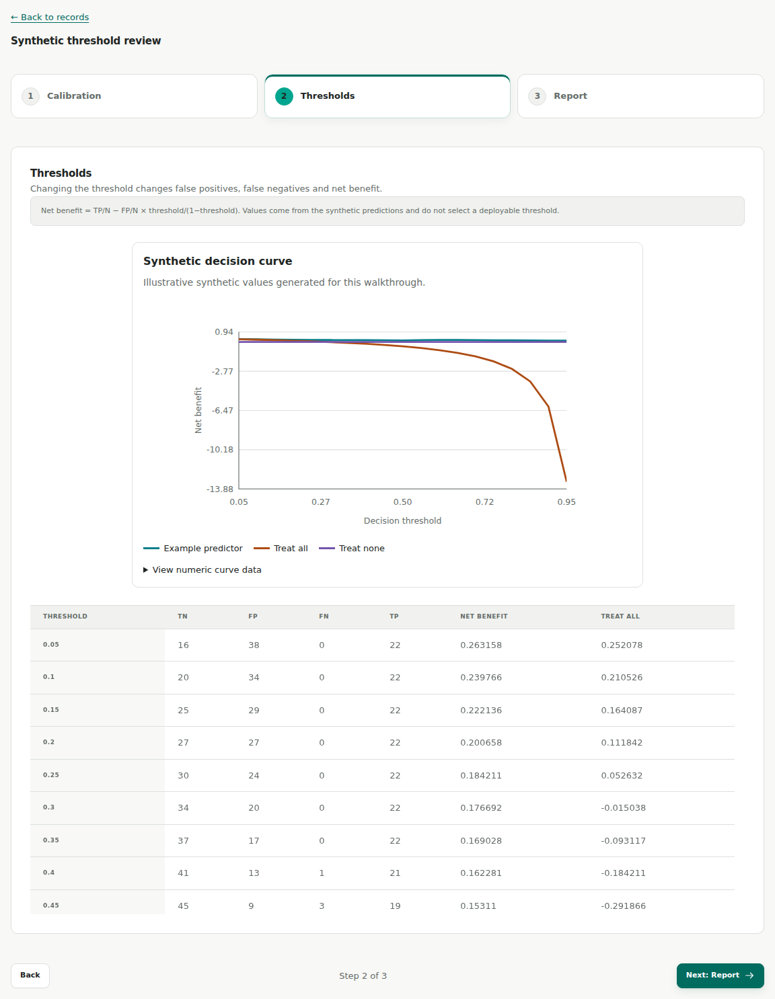

# BLCA demo

The BLCA demo walks through HistoPilot's workflow with a synthetic bladder-cancer grading example. Every record, label, score, curve and resource measurement in it is generated. It contains no real clinical rows, identifiers, slide images, features, model weights or logs.

Open **BLCA demo** from the start page, or visit `http://127.0.0.1:8787/?project=blca-demo-v1#overview` on a running service (use your own port if you changed it). The demo is read-only: it creates no records and launches no compute. It needs no data roots, training environment or GPU.

## What the example contains

| Population | Slides | WHO 2022 low | WHO 2022 high |
| --- | ---: | ---: | ---: |
| Training / development | 62 | 33 | 29 |
| Grade-2 test cohort | 76 | 54 | 22 |
| Total | 138 | 87 | 51 |

The test cohort is selected by **WHO 1973 = 2**, while the prediction target is **WHO 2022 low/high**, with high as the positive class. The two grading fields play different roles: one selects the population, the other is the label.

The example has no verified patient identifiers, so it uses **slide fallback groups** and slide-level evaluation. Its 138 slide records are not 138 independent patients, and slide grouping does not make the development and test sets patient-disjoint. See [split units and grouping](methods.md#split-units-and-grouping).

## Visual tour

These captures come from an earlier version of the interface, before Experimental Setup became its own module; the data and results are the same. The current module order is described [below](#walk-through-the-pipeline). Click an image to enlarge it.

| Project overview | Dataset review |
| :---: | :---: |
| [](assets/blca/overview.png) | [](assets/blca/dataset.png) |
| Follow the project from preparation through evaluation. | Review source records, grade fields and cohort structure. |

| Targets and development membership | Feature validation |
| :---: | :---: |
| [](assets/blca/targets.png) | [](assets/blca/features.png) |
| Check the development population and positive class. | Inspect feature coverage and bundle validation. |

| Training evidence | Resources and predictors |
| :---: | :---: |
| [](assets/blca/training.png) | [](assets/blca/predictors.png) |
| Inspect epochs, losses and checkpoint evidence. | Follow resource history and ensemble/refit creation. |

| Test-cohort evaluation | Clinical utility |
| :---: | :---: |
| [](assets/blca/evaluation.png) | [](assets/blca/clinical-utility.png) |
| Review discrimination and false-positive/false-negative counts. | Explore threshold-dependent net benefit. |

## Walk through the pipeline

The demo has one page per module, in pipeline order. Each opens a library of example records; open one, then use **Back** and **Next** to step through it.

| Module | What to inspect | What it explains |
| --- | --- | --- |
| Datasets | Synthetic slide records, grade fields and identity notes | Importing a source table, reviewing the mapping and freezing a dataset |
| Slide features | UNI v1 metadata with 1,024 feature dimensions and bundle evidence | Attaching or extracting features, validating coverage and freezing a bundle |
| Targets & splits | Binary target, 62 Grade 1/3 training slides and 76 Grade 2 testing slides | Fixing the target and the training/testing membership from dataset records only |
| Experimental Setup | Input compatibility, five training folds, ABMIL recipes and predictor choices | Checking feature coverage, designing training and freezing the setup without starting runs |
| Experiments | Setup submission, run histories and predictor outputs | Starting a frozen design, then following execution and results |
| Evaluate models | The reserved 76-slide cohort with synthetic predictions and metrics for a P75 refit | Checking test inputs and applying a ready predictor |
| Run inference | Probabilities and predicted classes with the labels omitted | Applying a predictor without targets or metrics |
| Clinical utility | Synthetic calibration, operating-point and net-benefit summaries | Looking past discrimination to calibration and threshold trade-offs |
| Model interpretation | An explanatory schematic | Where slide attention fits and what inputs it needs |

### Development and predictors

Targets & splits fixes the training and testing sets before any features are bound. Experimental Setup checks every training slide against the feature bundle and designs folds only within the 62 training slides; the 76 testing slides stay reserved. Freezing a setup starts no runs. Experiments shows the separate submission and execution steps.

The illustrative recipe uses UNI patch features, gated ABMIL, five folds, training and split seed 42, AdamW with learning rate 3e-4, at most 40 epochs, and a training bag of up to 4,096 patches. The demo contains no feature tensors and runs no training.

Select a run to see its synthetic loss history, checkpoint metadata and artifact references. The resource history below the runs illustrates CPU, GPU, RAM and VRAM monitoring; it is generated, not measured on your machine.

Baseline v2 shows a fold ensemble and a P75 refit, and baseline v3 a P50 refit. A fold ensemble averages the saved fold models. A refit trains one model on all development slides for a fixed number of epochs taken from the folds' best epochs: P50 is the median, P75 the 75th percentile. See [predictors](methods.md#predictors).

### Reading the results

The Run inference example reuses the same invented test scores with the labels removed; it adds no slides or model runs.

Out-of-fold development predictions come from held-out folds. They support comparing configurations, but a configuration chosen from them has no independent performance estimate until it is scored on the test cohort. Calibration and clinical-utility plots show how to examine predictions; they do not establish a clinically validated decision rule. See [methods](methods.md).

## Reproduce the fixture

The generator is [`histopilot/application/blca_demo.py`](../histopilot/application/blca_demo.py), seeded with `20260912`. It creates the synthetic rows, split memberships, probabilities, epoch histories and resource samples, and computes every metric from its own synthetic predictions. It reads no research data.

```bash
uv run python -m histopilot.application.blca_demo --check   # packaged fixture matches a fresh generation
uv run python -m histopilot.application.blca_demo --write   # regenerate after changing the generator
```

With no arguments the command prints the generated workspace JSON. The wheel ships the fixture as [`histopilot/resources/blca_demo_workspace.json`](../histopilot/resources/blca_demo_workspace.json).

### Refresh the screenshots

With frontend dependencies and a Playwright Chromium headless shell installed, from the repository root:

```bash
node web/scripts/verify-blca-demo.mjs --readme
```

The [capture script](../web/scripts/verify-blca-demo.mjs) builds an offline fixture from the current React source, checks the walkthrough on desktop and mobile, and with `--readme` replaces the images in `docs/assets/blca/` and their [capture metadata](assets/blca/captures.json). Without `--readme` it writes to a temporary directory. It starts no HistoPilot server. Set `HISTOPILOT_CHROMIUM` to use another Chromium executable.
