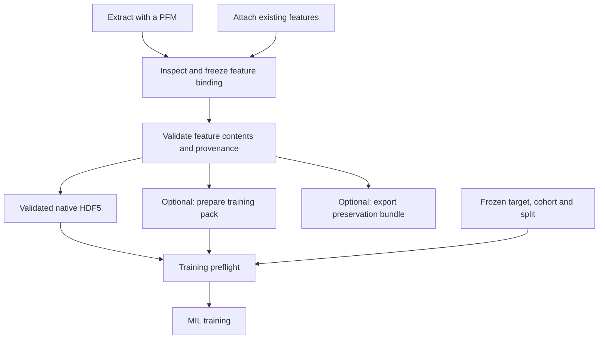

# Feature packing for HistoPilot

**Recommendation: add packing as an optional, independently tracked feature job, presented inside PFM & features after selecting a frozen feature version. Make content validation a required training check. Keep original feature preservation separate from reduced-precision training storage.**

Packing belongs to feature storage and preparation. It should have its own specification, worker, progress, validation receipt and artifact identity. It should not be another TRIDENT stage or a mandatory top-level step between extraction and every experiment. Both imported and newly extracted features should enter the same preparation path.

HistoPilot should adopt OceanPath's streaming and indexed-read patterns, while strengthening its artifact contract. Directly exposing the current OceanPath directory packer would miss HistoPilot-supported inputs and introduce avoidable correctness risks. Implement full validation and source identity first; add one narrowly scoped packing profile alongside the first real training backend. Do not delay a working HDF5 baseline until packing exists.

## Evidence and current repository state

This verdict concerns the local working trees inspected on September 10, 2026, including modified and untracked source files. HistoPilot HEAD was `d26d0a23ad1de9439f52220e3ee5ba070aac419b`; OceanPath-colon-development HEAD was `9cd4b2d03c5cdcba6c18ee0c52ce31287c18b381`. Neither commit alone identifies the inspected implementation. The accompanying [evidence record](evidence/feature-packing-review-2026-09-10.json) records source-file hashes, test results and synthetic probes.

The source code is authoritative where older documentation differs. HistoPilot's original architecture description still calls much of extraction and feature attachment unimplemented, whereas the current tree contains both. Its OceanPath integration plan references an older checkout and module layout, but already proposes optional worker-side mmap materialization after HDF5 attachment. Today's OceanPath implementation lives in `datasets/packed.py` and `workflows/packing.py`.[^1][^2]

| Concern | HistoPilot now | OceanPath now | Consequence |
| --- | --- | --- | --- |
| Scientific ownership | Frozen dataset/protocol/feature configurations | Configured feature stores and training manifests | HistoPilot must retain authority over selected slide identities. |
| Feature generation | Isolated TRIDENT extraction and native output inspection | Extraction plus streaming operational pipelines | Packing must accept existing features without rerunning a PFM. |
| Frozen feature content | JSON binding, paths, headers and filesystem stamps | H5 source inventory and optional packed derivative | Neither generic record alone is a complete portable archive. |
| Bulk storage | External native HDF5; storage adapter still reserved | Indexed raw arrays with mmap and optional resident loading | Reuse the read/write approach behind a HistoPilot storage boundary. |
| Training | Submission remains unavailable | HDF5 and packed loaders; tested CPU training route | Packing alone will not enable HistoPilot training. |
| Strong publication checks | Durable extraction jobs; feature checks remain header-level | Generic pack checks plus stronger study completion scripts | Turn the stronger checks into reusable application rules. |

These observations come from the live feature service, scientific API, extraction service, OceanPath writer and datamodule.[^3][^4][^5][^6]

## What HistoPilot already preserves

HistoPilot's feature freeze publishes a bounded JSON configuration in SQLite. Embedding arrays remain in the external source directory. Its configuration hash covers the manifest, including location-dependent fields; it is not a checksum of every tensor byte. Copying an experiment folder therefore does not necessarily preserve its feature data.[^3][^7]

The current attachment path is useful and should remain fast. It discovers TRIDENT layouts, matches dataset slide IDs, accepts `.h5` or `.hdf5`, supports an explicit filename suffix and recursive discovery, and can read coordinates from a separate `patches/<slide>_patches.h5`. Headers must describe nonempty floating `[N,D]` features and integer `[N,2]` coordinates. Duplicate identities, inconsistent dimensions/dtypes and unsafe HDF5 references are checked.[^3][^8]

Freezing reruns the preview and rejects a stale preview hash. Later binding verification rechecks paths, file stamps, headers and small provenance-file checksums. This protects a local attachment against ordinary source replacement. Nevertheless, the service explicitly reports that full tensor checksums, finite values, coordinate contents and checkpoint provenance remain unverified. Training preflight also explicitly reports `fullFeatureValidationComplete=False` and `executionReady=False`.[^3][^4]

There is a provenance connection to add before packaging: HistoPilot's own extraction job records live under `<project>/extractions/<run-id>/`, while feature attachment discovers sidecars under the native output tree. The job records contain actual command, runtime, selected slides and input stamps, but the feature attachment schema does not link an extraction job ID. Copying only TRIDENT's neighboring configuration files would omit that HistoPilot evidence. Add an explicit source-job reference and capture its immutable specification, runtime evidence and validation report.[^5][^8]

Extraction supports pooled slide encoders as well as patch encoders. Current feature binding supports patch embeddings. A pooled vector cannot be treated as a one-patch bag merely to fit the packed layout: copied patch coordinates may have a different cardinality. Packing v1 should declare `featureKind=patch` and reject slide representations with a clear explanation; a later slide-feature contract can support them correctly.[^9]

## What OceanPath packing actually does

The generic route is `scripts/pack_features.py` → `workflows/packing.py` → `datasets/packed.py`. It is an optional conversion selected through `training.packed_dir`; the workflow reports under the extraction stage rather than defining a distinct packing stage. Its default output is a sibling of the feature directory.[^2]

The schema-v1 directory contains:

```text
meta.json       shape, dtype, slide/patch counts, source path and inventory hash
index.parquet   slide_id, offset, n_patches
features.bin    contiguous float16 or float32 feature rows
coords.bin      optional contiguous int32 coordinates
```

The writer scans shapes first, streams bounded row blocks, retains all feature rows, rejects non-finite source values, validates byte lengths/index offsets, and stages the output before publication. These are worthwhile implementation patterns. The reader slices the selected slide and can gather sampled feature rows before reading a full bag; the current HDF5 training branch reads a full slide and then subsamples.[^6][^10]

The speed argument is therefore specific and credible: reduce per-file work and avoid reading unneeded feature rows for capped bags. It is not evidence that HDF5 inherently requires full reads; h5py supports slicing and chunked I/O. Nor does mmap guarantee a particular speedup or mean that a whole pack is resident in RAM. NumPy documents mapped access to portions of a file without first reading it all into memory. Benchmark the actual loader, storage and sampling strategy.[^11][^12]

OceanPath also has stronger operational scripts. `pack_virchow2_after_encoding.py` waits for a completed queue, checks pinned extraction evidence, publishes full and CLS representations, verifies their relationship and records output hashes. `pack_orion_expanded.py` checks expected counts, queue states and provenance before rebuilding. HistoPilot should generalize these completion checks around a selected immutable inventory; it should not inherit hardcoded cohort counts, paths or encoder-specific column slicing.[^13][^14]

## Gaps that prevent direct reuse

The following findings distinguish the generic writer/reader from OceanPath's stronger study wrappers. Synthetic checks used throwaway data only; they establish edge-case behavior, not corruption of any real cohort.

| Finding | Evidence | Required HistoPilot behavior |
| --- | --- | --- |
| Input selection differs | OceanPath scans flat `*.h5`, normalizes IDs and expects embedded coordinates. HistoPilot supports manifest-selected files, `.hdf5`, suffix mapping and coordinate sidecars. | Consume resolved frozen manifest entries with explicit feature and coordinate paths. Preserve canonical IDs without a second inference pass. |
| Requested missing slides can be skipped | Generic packing warns and omits missing/empty slides. | Fail an exact requested membership build. Partial collections require an explicit frozen subset and recorded exclusions. |
| Inventory hash is not a content hash | Hash input is filename, size and mtime. Modified bytes with restored mtime produced the same hash. | Hash source content and record the selected membership independently. Use stat checks as a fast guard, not the archival identity. |
| Different selections share the inventory hash | Disjoint subset packs made from one directory had identical source inventory hashes. | Include exact slide selection, representation and packing settings in the derivative identity. |
| FP16 conversion changes values | `[1.0001, 70000]` became `[1, 65504]`. Overflow is clipped and logged; clipping counts are not persisted in `PackedMeta`. | Preserve precision by default. Reduced precision is opt-in, with conversion evidence; fail overflow instead of clipping. |
| Coordinates narrow unchecked | Int64 `2147483648` became `-2147483648`; a separate probe showed fractional input truncation. | Require integer XY and validate representability before any cast. Preserve exact coordinate values. |
| Structural checks do not authenticate contents | Same-size edits to `features.bin` passed generic `validate_packed_dir`. | Record hashes of every payload, index and manifest, with an explicit integrity-verification scope. |
| Provenance is incomplete | `PackedMeta` has no encoder/checkpoint/config/geometry record. | Carry source feature identity, extraction provenance and per-slide geometry in a HistoPilot manifest. |
| Destination can overlap source | A temporary `pack_dir == feature_dir, overwrite=True` probe removed source H5s during replacement. | Reject source/destination equality and ancestor/descendant overlap; publish to a fresh immutable destination. |
| Publication is not a full durable registry | Generic staging/rename lacks HistoPilot job registration, writer coordination and explicit file/directory fsync. | Add locking, durable publication, restart reconciliation and a separate registration transaction. |

The input, conversion, metadata and publication behaviors are directly visible in the writer; the synthetic evidence is retained with this report.[^6][^10][^15]

Two qualifications matter. First, OceanPath's normal datamodule checks that a declared training split loads exactly, so the generic packer's omission does not imply that the tested training path silently shrinks a split. Second, source verification is enabled by default for packed training, but it checks the full directory inventory; unrelated newly extracted files can invalidate a pack even when the selected training slides have not changed.[^16]

The standalone packed reader can open a pack without its source H5s, but the training dataset still requires `feature_dir` to exist, and default datamodule verification consults that directory. A relocatable bundle therefore needs an explicit snapshot-reader mode that verifies bundle checksums. Simply turning off source verification is not a complete archive integration.[^16]

There is also a run-identity gap to avoid carrying forward. OceanPath's training identity includes training configuration and source H5 evidence, but no digest of the actual packed payload/metadata. Rebuilding the same configured path with different stored precision can therefore leave those identity inputs unchanged. This is a code-level inference, not a demonstrated stale-resume incident. HistoPilot runs should pin the actual materialization ID and numerical representation, not only the source binding and a directory path.[^17]

## Preservation and training need different guarantees

“Pack for future reference” and “pack for faster training” overlap in provenance but have different success criteria.

| Output | Primary purpose | Numerical policy | Self-contained requirement |
| --- | --- | --- | --- |
| Frozen feature binding | Refer to reviewed external features | Does not rewrite values | May depend on original paths; clearly identify that dependency. |
| Preservation bundle | Reopen the same evidence later | Preserve original HDF5 bytes and coordinate files | Relative paths, checksums, identity mapping, attributes, source specifications and available provenance. |
| Training pack | Efficient repeated feature access | Preserve supported source precision by default; explicit FP16 derivative optional | Payload/index/geometry and enough provenance to identify exact inputs; independently validated artifact. |

A verified preservation bundle should survive relocation and loss of access to the original feature directory. A reference-only manifest must not be described as such a bundle. Keep original WSIs external by default, with their identity and locator recorded; feature-only packaging should not unexpectedly copy hundreds of gigabytes of slides.

An FP16 training pack should never become the only preservation copy of FP32 originals. Re-expanding it to FP32 does not recover discarded precision. Similarly, the Virchow2 CLS-only pack is a representation transformation and needs a derived feature identity; selecting half the embedding columns is more than a storage-layout choice.

Features are reusable across tasks, seeds and folds. Keep labels, cohort definitions and split assignments in separate scientific snapshots. Packing all selected slides into one storage artifact does not itself introduce leakage, provided the trainer respects frozen split membership and packing performs no fitted transformation. PCA, learned normalization, feature selection and other fitted operations belong to a separate, training-partition-scoped transformation contract. Patient grouping remains a training requirement, not a prerequisite for copying an otherwise valid unlabeled feature collection.

## Placement in HistoPilot

**Use a separate optional operation within PFM & features.** The saved-feature-version panel is the natural entry point: its input is an existing feature version, irrespective of whether that version came from TRIDENT or an external directory. Avoid putting packing controls into TRIDENT Advanced Options or giving it a required place in the sidebar sequence.



Feature validation is reusable independently of either output. The packer may perform the full scan as part of its job and issue the same validation report, avoiding an unnecessary second tensor scan. It must not become the only way to validate or train.

Suggested visible actions are **Validate contents**, **Prepare for training**, and eventually **Export feature bundle**. Show selected version, exact coverage, feature dimension, precision, coordinate status, destination, estimated additional space and persisted job progress. “Pack ready” should describe a storage artifact; “Ready to train” additionally requires the scientific and runtime preflight.

Packing failure should affect only that derivative job. The completed extraction and frozen source binding remain usable. A compatible validated HDF5 source remains a valid training option. For reproducibility, resolve any automatic storage choice before submission and record it in the run; fail or require explicit re-resolution when a pinned artifact is missing, rather than silently substituting a different-precision store.

An optional “prepare after extraction” convenience can later queue a dependent job after feature attachment/freezing and validation. It should still create a separate job with separate success/failure state. HistoPilot should gate the selected feature inventory, not wait for unrelated global encoder queues to drain.

## Code boundaries and artifact contract

The following paths are proposed additions, not implemented APIs:

| Boundary | Responsibility |
| --- | --- |
| `domain/features.py` | Separate source binding, validation evidence and `FeatureMaterialization` identity; explicit patch/slide kind. |
| `schemas/feature_packs.py` | Preview/submit request with frozen feature ID, destination and explicit format/precision. |
| `application/feature_validation.py` | Shared validation planning and operation-specific readiness rules. |
| `application/feature_packs.py` | Resolve exact inputs, estimate resources, reject conflicts, create jobs and register completed artifacts. |
| `ports/artifacts.py` | Feature reader/writer and validation contracts independent of TRIDENT/OceanPath. |
| `storage/packed.py` | Bounded array/index reader and writer; no HTTP, protocol generation or model logic. |
| `workers/pack_features.py` | Execute scans/copies, hashes, progress, cancellation and publication outside request handling. |
| `storage/scientific.py` | Small artifact/job registrations and migration; bulk arrays remain on the filesystem. |
| `api/scientific.py` and CLI | Thin commands over the same application contract. |
| `web/src/pages/LocalFeatures.tsx` | Actions on a selected saved feature version; a dedicated component for job details. |

The existing `PFMPort.extract` should remain about feature generation. The current artifact port already reserves feature-store ownership, and the general executor is still a stub while extraction has a concrete tmux implementation. Reuse the durable execution pattern through a small common boundary; do not imply that a general job supervisor already exists.[^18]

Do not store a pack as another `kind=feature` configuration that silently replaces its source URI. `publish_configuration` currently accepts only feature/protocol configurations; adding a materialization registry needs an explicit schema change. Its record should reference the existing frozen feature ID and immutable validation evidence. Renaming a user version tag or moving an archive should not alter tensor-content identity.[^7]

The minimum materialization manifest should contain:

- A schema version, materialization ID, parent feature-binding ID, validated source-content identity and exact selected slide inventory.
- Feature kind, encoder/checkpoint evidence, preprocessing/representation identity, source and output dtypes, numerical conversion policy, array shape/order/endianness, and writer version.
- Per-slide canonical ID, offsets/lengths, original row order, feature and coordinate source identity, coordinate units, patch footprint and scale/MPP evidence. Preserve unknown geometry explicitly.
- Relative payload locations, byte lengths and SHA-256 for feature, coordinate and index files; source-file hashes and captured native attributes/configurations.
- Source extraction job reference when available, immutable job specification/runtime evidence, validation report, and completion receipt. Imported evidence can remain incomplete without being described as authenticated extraction provenance.

Build identity should include selected input content, representation and packing policy. It should exclude labels, folds, output path, timestamps and personal version tags. Final output hashes authenticate the built result. Training identity should additionally pin the actual materialization used, including any precision transformation.

For initial OceanPath interoperability, retain its existing `features.bin`/`coords.bin`/`index.parquet`/`meta.json` payload behind an explicit `oceanpath-packed-v1` profile, with a HistoPilot sidecar carrying the stronger contract. Retain the source dtype for supported float16/float32 inputs by default. Its int32 coordinate requirement is acceptable only after exact integer bounds checks; reject unrepresentable coordinates or unsupported source precision rather than narrowing silently. Preservation bundles retain original coordinate dtype. A future native int64 profile requires a distinct version and reader support.

Define the initial profile as little-endian payloads on little-endian execution hosts, enforced by the adapter. The existing raw payload uses native NumPy dtypes, so extra manifest fields alone do not make the current reader portable across byte orders. A broader portable format would require coordinated reader changes.

Validate compatibility with the current OceanPath reader in a dedicated backend environment. The control service should not import OceanPath, Torch, Lightning or Hydra merely to expose packing. A small format adapter can own the writer; it should not require copying an entire research repository or relying on its hardcoded study scripts.

## Publication, recovery and storage

Use a fresh immutable destination and a same-filesystem staging directory. Resolve allowed roots and reject source/destination overlap before writing. Check estimated free space for the new pack plus validation/index overhead while retaining source data and any earlier valid pack. Use byte-budgeted chunks; a fixed 65,536-row buffer changes substantially with embedding dimension and conversion allocations.

Pin the source inventory, open sources safely, hash and validate in bounded blocks, check for source changes, write output checksums and validate the complete index/payload relation. Coordinate counts alone cannot prove historical alignment: preserve row order and compare coordinate arrays wherever both extraction and embedded coordinate evidence exist. Record the remaining evidentiary limit when no independent alignment evidence exists.

Flush and fsync payloads, index and manifest before publishing; synchronize the destination directory, then register the completed artifact. A crash between filesystem publication and database registration must be recoverable from the receipt. A failed or cancelled job must never become a ready artifact. Existing readers should retain their immutable input rather than observe an in-place replacement.

Production-scale packing should use the workstation's persistent job policy: inspect tmux sessions, launch a named worker with a durable log, and reconcile actual process state after service reconnection. Retrying a non-resumable single pack can rebuild staging; very large stores may justify per-shard checkpoints later. The first implementation need not introduce distributed storage or a generalized sharding system.

Historical archives and live-source freshness need separate meanings. Changing an external H5 may invalidate a cache for that current source selection. It should not invalidate an independently checksummed historical bundle of earlier bytes. Reopening a moved bundle should verify its own content and references without demanding the original inode or mount path.

## Scale and likely payoff

HistoPilot's September 9 Bladder audit records 138 primary UNI slides, 1,191,038 patches, 1,024 float32 dimensions and int64 XY coordinates. It reports roughly 5.01 GB of source HDF5. These are prior header/inventory observations, not a new full-content audit.[^19]

| Derived payload | Approximate decimal GB | Interpretation |
| --- | ---: | --- |
| FP32 embeddings | 4.8785 | Same feature precision as the audited primary store. |
| FP32 embeddings + int64 XY | 4.8975 | Uncompressed numeric payload, excluding metadata. |
| FP16 embeddings + int64 XY | 2.4583 | Reduced-precision derivative; coordinate values retained. |
| OceanPath FP16 + checked int32 XY | 2.4488 | Only about 9.5 MB less than retaining int64 XY. |

These sizes are arithmetic from the recorded row count, dimensions and dtype widths. They are not measured pack sizes or proof of HDF5 compression savings. Packing while preserving HDF5 increases total storage; it does not reclaim source space automatically. For this collection, exact coordinates are inexpensive compared with embeddings.

OceanPath's historical Virchow2 completion receipt records 2,128 slides and 31,725,008 patches. Its full 2,560-dimensional FP16 feature blob is 162.432 GB; the CLS 1,280-dimensional blob is another 81.216 GB. This is real motivation for bounded reading and careful disk estimates, but the August 22 receipt has not been independently rehashed in this review.[^20]

For Bladder, packing is plausible for repeated folds/seeds but not yet an established bottleneck. Measure first-batch latency, steady-state epoch time, storage reads and memory on the chosen storage tier. Compare native HDF5, precision-preserving packing and optional FP16 using the same slide selection and sampling. Report cold and warm cache conditions separately. Use a measured break-even calculation: build time divided by per-epoch time saved, provided the latter is positive. Do not promise a universal speedup or load an entire large pack into RAM/VRAM by default.

## Delivery sequence and acceptance

1. **Implement source validation and identity.** Add a shared bounded content validator, coordinate checks, source hashes, explicit provenance completeness, and the extraction-job link. Preserve quick header attachment and existing frozen IDs. Direct HDF5 training can use this validation.
2. **Deliver the first real training path and a narrow optional pack profile.** Keep the pack worker independent, manifest-driven and patch-only. Use source precision, exact membership, preserved row order, checked coordinate conversion, immutable publication and a materialization ID. Reuse one pack across eligible targets/folds/seeds without refitting anything during packing.
3. **Add preservation export and reduced precision as explicit capabilities.** The export must pass relocation/source-disconnection tests. FP16 needs numerical conversion diagnostics and downstream prediction/metric comparison against the precision-preserving baseline. Packaging unknown provenance must preserve the unknown status.
4. **Optimize based on evidence.** Add sharding, resumable partial work or resident loading only when measured sizes and workload justify them. Avoid a separate top-level packing workspace until artifact management itself needs one.

Before shipping the initial packer, acceptance must demonstrate:

- Exact canonical IDs, slide selection, feature rows and coordinates survive round-trip, including dotted/zero-prefixed IDs, suffix mapping, `.hdf5` and separate coordinates.
- Non-finite values, source mutation, incompatible representations, missing requested slides, coordinate overflow and output/source overlap fail before publication.
- Same-size corruption and truncation are detected; changing precision or selected content changes materialization identity; changing labels/tags does not rewrite the feature pack.
- Cancellation, duplicate submission, restart and failure around publication never expose partial success or destroy sources/previous artifacts.
- Native versus packed loaders return equivalent values under the declared precision and identical scientific memberships; a small pinned training/prediction flow verifies the adapter.
- Full validation is available without packing. Training remains blocked on missing scientific/runtime requirements even when a pack is valid.

The focused source tests run during this review passed: **61 HistoPilot feature/artifact tests, 3 architecture tests, 94 OceanPath packing tests, and 10 OceanPath completion-gate/CPU training tests**. Synthetic interoperability probes confirmed the gaps listed above. A separate HistoPilot API-workflow test attempt did not complete and was interrupted; this review does not certify the complete API suite. No full real-cohort repack, performance benchmark or model-quality experiment was run.

The design decision is therefore firm: **a separate optional packing job and artifact, located in PFM & features; shared mandatory content validation; original-precision preservation; and explicit training provenance.** OceanPath provides useful mechanics and operational lessons, while HistoPilot should own the durable scientific contract.

## Sources

[^1]: HistoPilot, [OceanPath integration plan](oceanpath.md#L5) and [architecture](ARCHITECTURE.md#L146). Older design documents; compared against the current working tree.
[^2]: OceanPath, [packing workflow](/home/yc_liu/projects/OceanPath-colon-development/src/oceanpath/workflows/packing.py:29), [packing configuration](/home/yc_liu/projects/OceanPath-colon-development/configs/pack.yaml:25), current working tree.
[^3]: HistoPilot, [feature inspection and binding service](../histopilot/application/features.py#L262); header-only scope at line 479, freeze at 508, binding verification at 541.
[^4]: HistoPilot, [scientific preflight and unavailable training submission](../histopilot/api/scientific.py#L177).
[^5]: HistoPilot, [persisted extraction job and worker plan](../histopilot/application/extractions.py#L516).
[^6]: OceanPath, [generic packed writer](/home/yc_liu/projects/OceanPath-colon-development/src/oceanpath/datasets/packed.py:553); source scan at 618, copy/conversion at 719, metadata/publication at 784.
[^7]: HistoPilot, [configuration publication contract](../histopilot/storage/scientific.py#L914).
[^8]: HistoPilot, [attachment schema](../histopilot/schemas/features.py#L11) and [provenance discovery](../histopilot/application/features.py#L186).
[^9]: HistoPilot, [pooled-feature inspection](../histopilot/application/extraction_artifacts.py#L118) and [TRIDENT output layout](../histopilot/adapters/trident/config.py#L384).
[^10]: OceanPath, [packed metadata and source inventory identity](/home/yc_liu/projects/OceanPath-colon-development/src/oceanpath/datasets/packed.py:68), [structural validation](/home/yc_liu/projects/OceanPath-colon-development/src/oceanpath/datasets/packed.py:133), and [packed versus HDF5 read paths](/home/yc_liu/projects/OceanPath-colon-development/src/oceanpath/datasets/datamodule.py:808).
[^11]: NumPy Developers, [numpy.memmap](https://numpy.org/doc/stable/reference/generated/numpy.memmap.html), documentation accessed September 10, 2026. Supports the partial-file-access description, not a benchmark claim.
[^12]: h5py Developers, [Datasets](https://docs.h5py.org/en/stable/high/dataset.html), documentation accessed September 10, 2026. Supports slicing, chunking and compression capabilities, not a benchmark claim.
[^13]: OceanPath, [Virchow2 completion gate](/home/yc_liu/projects/OceanPath-colon-development/tools/pack_virchow2_after_encoding.py:1); output checks and completion receipt at lines 726–812.
[^14]: OceanPath, [Orion queue and provenance preflight](/home/yc_liu/projects/OceanPath-colon-development/tools/pack_orion_expanded.py:98).
[^15]: [Review evidence and synthetic-probe results](evidence/feature-packing-review-2026-09-10.json), September 10, 2026; temporary fixture paths and commands recorded for reproducibility.
[^16]: OceanPath, [source-directory requirement](/home/yc_liu/projects/OceanPath-colon-development/src/oceanpath/datasets/datamodule.py:641), [packed source verification](/home/yc_liu/projects/OceanPath-colon-development/src/oceanpath/datasets/datamodule.py:1410) and [exact split coverage check](/home/yc_liu/projects/OceanPath-colon-development/src/oceanpath/datasets/datamodule.py:1573).
[^17]: OceanPath, [training identity payload](/home/yc_liu/projects/OceanPath-colon-development/src/oceanpath/workflows/training.py:182). Pack-identity consequence is an inference from these inputs.
[^18]: HistoPilot, [artifact port](../histopilot/ports/artifacts.py#L8), [PFM port](../histopilot/ports/encoder.py#L8), [general executor stub](../histopilot/workers/supervisor.py#L6) and [tmux extraction executor](../histopilot/workers/extraction_process.py#L10).
[^19]: HistoPilot, [Bladder priority review](bladder-priority-review.md#L58) and [aggregate header evidence](evidence/bladder-audit-2026-09-09.json), observed September 9, 2026. Counts/sizes reused without a fresh real-data scan.
[^20]: OceanPath, [Virchow2 packing completion receipt](/home/yc_liu/projects/OceanPath-colon-development/outputs/virchow2_packing/packing_completion.json:1), recorded August 22, 2026. Historical reported checksums/counts; large payloads were not rehashed during this review.
