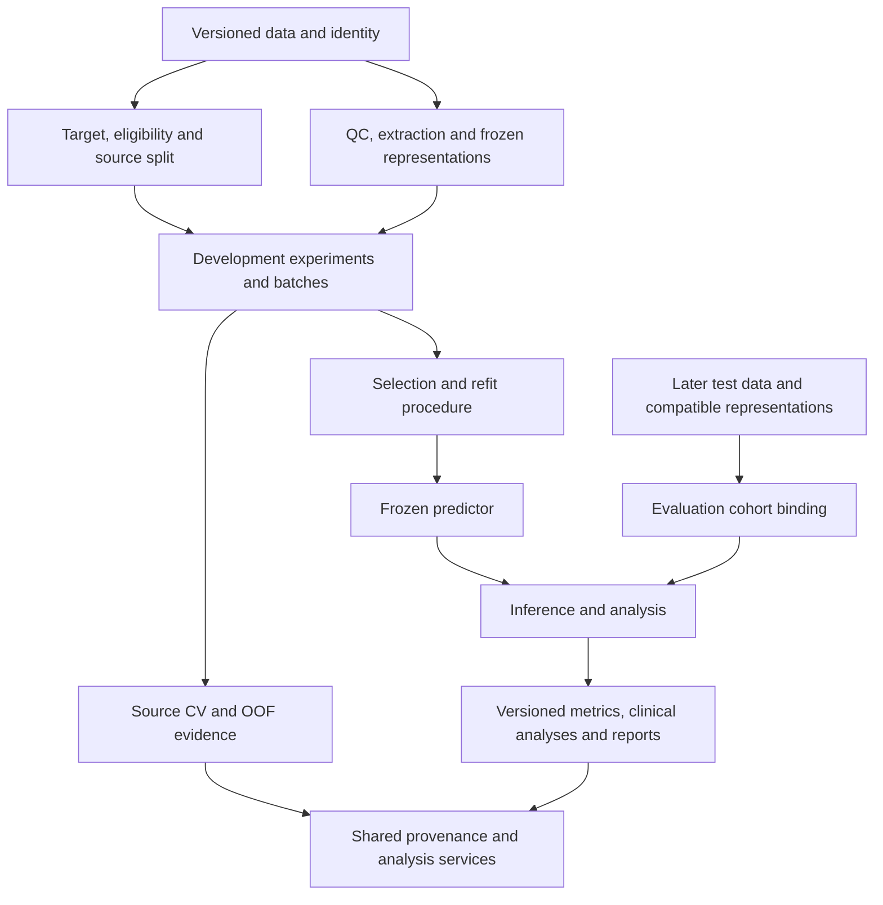
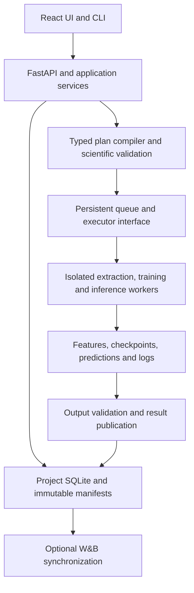

# HistoPilot research platform architecture

## Recommendation

HistoPilot should become a **protocol-driven computational pathology research platform**, with shared data and representation preparation, a model-development workspace, and an independent model-evaluation workspace. Its scientific record should be a versioned graph of inputs, procedures, predictors and evidence. Its engineering foundation should remain a modular Python control service, a React interface, isolated scientific workers, project-owned metadata and file-based artifacts.

This is the best fit for the current research workflows and implementation, rather than a universal claim about every pathology laboratory. The immediate priority is a complete, reliable path from source data to a frozen predictor and later external evaluation. Broader PFM support should follow explicit representation and task interfaces, allowing patch-bag MIL, slide-embedding models and selected future multimodal methods without redesigning experiment management each time.

The current Data, protocol and feature foundations are worth retaining. Multiple targets already fit the saved-protocol model. The major additions are durable development execution, source-CV reporting, predictor finalization, evaluation-only cohort binding, and a shared analysis engine. Target/grouping extensions and typed feature representations are necessary bounded changes. The existing extraction backend and feature storage should not be replaced merely to adopt another package. [^1]

| Decision | Recommendation |
| --- | --- |
| Product structure | Shared preparation → Model development → Frozen predictor → Model evaluation |
| Architecture | One modular control application with isolated workers and explicit backend interfaces |
| Current framework | Keep FastAPI, Pydantic at boundaries, React/TypeScript/Vite and project-owned SQLite/files |
| PFM acquisition | Keep TRIDENT as the first supported acquisition adapter |
| Training | A validated PyTorch/OceanPath path first; additional backends must satisfy the same scientific contracts |
| Search | Explicit/grid/random locally; Optuna adapter for bounded adaptive search |
| Tracking | Local immutable manifests authoritative; optional W&B integration |
| Future scope | Slide-level PFM pipelines, GEJ reader/ordinal tasks, selected multimodal methods, later cluster executor |

## What pathology research requires from the platform

The central research object is a question with a defined population, endpoint, observation unit and assessment procedure. A model name and YAML file do not capture that question. “Predict KRAS mutation” can mean gene-level mutation versus WT, a variant versus other mutants, or a variant versus WT; it can target a primary specimen, a metastatic specimen, or a patient. Different definitions change eligibility, class prevalence, label reliability and interpretation even when feature files are identical.

Pathology data are also hierarchically dependent: several slides can come from one block, specimen, patient or encounter. Reader observations may differ within a Case. Technical variation enters through tissue processing, scanner, resolution, color handling and patch selection. The software must preserve those relationships and distinguish the unit used for sampling, loss weighting, predictions, splitting and uncertainty.

Foundation models do not remove these concerns. In the 19-model benchmark by Neidlinger and colleagues, relative performance and complementarity were evaluated under specific cohorts and downstream procedures. The 2026 benchmark by Bareja and colleagues assessed 32 models and found task-dependent differences and changing rankings across evaluation settings. These results support matched local comparisons rather than a universal encoder default. They do not establish which encoder is best for the CRC, Bladder or GEJ protocols. [^2] [^3]

PathoROB examined technical robustness across 20 FMs and found substantial vulnerabilities and differences. Its implication for HistoPilot is to support explicit robustness and transport analyses. Merely detecting site information in embeddings is insufficient to prove that a predictor relies on a harmful shortcut; output-level behavior and the study design matter. [^4]

### The local projects are architectural acceptance cases

| Project | Observed research problem | Required platform behavior |
| --- | --- | --- |
| CRC KRAS | Multiple gene/variant comparisons, adopted and new fits, source-only refits, primary/metastatic differences, prior target exposure | Explicit target denominators, reusable patient assignments, fit lineage, named predictor ensembles and cohort-specific assessment |
| Bladder | Test-driven search, inconsistent historical metric versions, differing actual splits, unresolved patient linkage | Persistent exposure history, exact memberships, label/identity status, corrected evaluation versions and realistic uncertainty |
| GEJ | Different grading tasks and cohorts; heterogeneous block labels; paired reader-ordinal models | Separate observation/grouping units, reader masks, ordinal task adapters, Case-uniform likelihood and paired analyses |

The historical audits support these requirements; they do not certify every artifact as replayable or every high score as independent validation. Preserve the useful history and its limitations together. [^5]

## Reuse the pathology ecosystem at explicit boundaries

The software landscape already supplies much of the numerical computation and some of the interface experience. HistoPilot should own cross-backend scientific identity, planning, execution history and assessment semantics, while reusing suitable implementations. The [software landscape review](/home/yc_liu/projects/mil-redesign-research/pfm-software-landscape.md) documents the comparison and its limits.

| Software | Relevant capability | Best role in HistoPilot |
| --- | --- | --- |
| TRIDENT | Staged segmentation, coordinates, patch extraction and compatible slide encoding | Keep the implemented acquisition adapter and native output evidence. [^17] |
| STAMP | Structured preprocessing, encoding, training, cross-validation, deployment and statistics | Serious optional backend and workflow reference; enforce the precise split/selection contract. [^18] |
| STAMP Workbench | Browser-based STAMP pipeline configuration, execution and logs | Direct-use alternative for a STAMP-focused workflow; evaluate required runtime guarantees before choosing an extension. [^19] |
| Slideflow | MIL, custom model interfaces, multimodal/multimagnification bags and attention outputs | Optional backend and UI reference; validate the exact supported task/input path. [^20] |
| TIAToolbox | WSI readers, image preprocessing and deep feature extraction | Add selected capabilities through adapters rather than replacing current storage. [^21] |
| PathML | Modular pathology preprocessing, HDF5-backed objects and spatial graph examples | Later spatial/multiplex integration when a real project requires it. [^22] |
| CLAM and torchmil | Reference MIL implementations; torchmil provides model/module interfaces | Model adapters and parity fixtures, with HistoPilot retaining protocol/selection ownership. [^23] |

STAMP Workbench deserves explicit consideration: configuration forms and logs alone would not justify another platform. For a new laboratory whose needs are covered by STAMP, using Workbench directly could be the simpler choice. For the existing CRC, Bladder and GEJ histories, HistoPilot's advantage is a common contract across differing targets, representations, backends and evidence histories. That is the scope that justifies continued development.

There is a concrete scientific integration caveat. In the inspected current STAMP CV implementation, the held-out fold is supplied as validation during training and then predicted. Its training function selects checkpoints using that validation signal. Those outputs therefore involve checkpoint-selection exposure and should be imported as development validation, or produced through a separate inner-validation/outer-assessment adapter. This inference concerns the inspected code path, not every published STAMP study. [^18]

The same conformance requirement applies to OceanPath: familiarity with existing experiments is a reason to start there, not proof that an unchanged script satisfies the new protocol. Pin a tested revision, transfer exact memberships and compare canonical predictions/metrics on small fixtures. Workbench's persistence and resource scheduling were not verified; absence of evidence about them is not evidence that those capabilities are absent.

## Structure the product around shared resources and two research stages

Keep the current project container and navigation positions. Use **Data**, **Target & split**, **PFM & features**, **Model development**, and **Model evaluation** as the main workflow. Overview, slide exploration and provenance remain supporting views. Use “project” for the folder-owned workspace and “experiment” for a research question within it; existing IDs and URLs need not change.

The diagram describes dependencies, not a forced wizard order. A laboratory can prepare features before finalizing every target, develop before a new external cohort exists, or import predictions for retrospective analysis. Every supported route still produces explicit input references and an evidence status.

On the development branch, target/eligibility/splits describes only the source-development population and its internal CV roles. Data and frozen independent features may already cover a broader population. For Bladder, a source protocol can select known WHO1973 grades 1/3 with WHO2022 low/high as its target; a later evaluation cohort selects grade 2 and reuses available compatible features. The evaluation cohort has its own eligibility/label binding and does not need a development split. The [concrete cohort walkthrough](mil-experiments-evaluation-implementation-design.md#concrete-bladder-cohort-flow) details feature reuse, patient overlap and historical exposure.

| Workspace | Main questions and outputs |
| --- | --- |
| Data | What specimens and observations exist, how are they linked, and which annotations are known? Output: frozen dataset and identity/annotation evidence. |
| Target & split | What is predicted, in whom, and which groups are available to each development operation? Output: frozen protocol and exact assignments. |
| PFM & features | How were images transformed into a representation, and is it compatible/current? Output: verified representation bundle and provenance. |
| Model development | Which recipes were tested and selected, and what predictor was finalized? Output: CV evidence, runs, selection decisions and predictors. |
| Model evaluation | How does a fixed predictor behave on a defined cohort? Output: predictions and independently versioned analyses. |

Use a common validation/metrics engine for source-CV and external reports. Their workflow placement and evidence roles differ; balanced accuracy, class ordering and aggregation must have one versioned definition.

### Scientific records and their boundaries

Keep the number of top-level concepts small. Store detailed task and representation variants inside versioned schemas rather than adding a new registry and navigation page for every setting.

| Record | Identity and dependencies |
| --- | --- |
| Dataset version | Source observations, annotations and reviewed identity relationships |
| Protocol version | Dataset, resolved target, eligibility, permitted predictors and exact source-development assignments |
| Representation bundle | Dataset binding, one representation inventory, optional equivalent packs and upstream provenance |
| Experiment / batch | Question metadata plus a frozen version of arms, recipes, search/selection policy and budgets |
| Candidate / run / attempt | Effective recipe; one prescribed fit; physical execution and continuation history |
| Selection decision | Eligible development evidence and the rule that selected the recipe/predictor construction |
| Predictor version | Frozen checkpoint or model set, representation requirements, score/decision pipeline and development lineage |
| Evaluation cohort | Later dataset, reviewed target binding, eligibility, grouping and required representation bindings |
| Prediction / analysis artifacts | Raw scores with exact observation/model keys; independently versioned aggregation, metrics and uncertainty |

Mutable names and notes stay separate from scientific identity. Completed runs never inherit a changed project-level target, newly selected default encoder or latest dataset. Backend-specific settings must resolve into the frozen recipe rather than remain hidden in a worker's current configuration file.

## Data, targets and grouping

### Preserve data versions; strengthen identity and observation semantics

Keep original WSI references and clinical/molecular tables. Preserve typed attributes and crosswalks already supported by the importer. An annotation correction, identity reconciliation or eligibility-affecting source change creates a new dataset version. Clinical attributes used only for reporting remain distinct from predictors permitted during training. Outcome-derived fields must not silently become model inputs.

Represent available patient, specimen, block, slide and reader links explicitly. Do not require every historical dataset to populate a universal clinical ontology. Initially, reviewed specimen/block fields and relationship tables are sufficient; promote an entity to a separate lifecycle only when workflows need it. An acknowledged slide-as-patient fallback remains an exploratory mode and cannot be relabeled as verified independence.

Keep at least five separate declarations: **split group, sampling unit, loss weighting unit, prediction unit, uncertainty cluster**. They often coincide in simple binary patient MIL, but GEJ shows why one `unit` field cannot replace all five. The prediction key can additionally include specimen role or reader without changing the patient dependence cluster.

Audit realized sampling and group contributions as well as the requested configuration. CRC's historical normalized weighting at batch size one illustrates why a sampler/loss name is insufficient. GEJ's Case-uniform objective likewise requires an explicit rule over available blocks and reader observations. [^5]

QC should record missing/duplicate slides, linkage problems, available resolution/MPP, tissue/patch coverage and extraction failures before training. Spatial masks and pathologist ROI annotations are versioned inputs where used. Exclusions based on later model errors remain visible as post hoc changes rather than silently modifying the original cohort. Review a representative image/patch sample as well as machine-readable summaries.

### Keep targets inside frozen protocols for the first release

Existing protocols already embed target mappings, eligibility and splits. Retain them as the immediate execution authority. Add a target-oriented protocol library with readable positive/negative definitions and counts. A reusable target-template registry can be added later, with resolved snapshots retained in each protocol.

For CRC, distinguish KRAS-mutant versus WT, G12D versus other eligible KRAS mutations, G12D versus WT, and G12D versus all eligible non-G12D. Unknown or insufficiently resolved variants are not implicit negatives. Each target has a separate denominator and predictor, even if orchestration and feature bytes are shared.

Add source-only CV without a mandatory external pool in a new split version. Preserve old protocol meanings and hashes. Add derivation from frozen assignments that retains complete plan roles, including early-stop validation and inner tuning. The same split seed alone is insufficient after target or eligibility changes. Infeasible class coverage should be reported, not silently repaired by resampling.

Task extensions should be explicit: binary and multiclass first; GEJ reader/ordinal next; survival, regression and genuine multitask models when needed. A survival task requires time origin, event/censoring definitions and horizon-specific evaluation. A shared multitask model requires a label matrix, missing-label masks, loss weights and compatible grouping. Launching independent target arms is not multitask learning.

## Treat PFM outputs as typed representations

The most consequential long-term change is to stop assuming that every PFM produces the same kind of bag. HistoPilot should preserve its current patch-feature bundle while introducing a versioned representation interface.

| Representation | Required inputs | Appropriate downstream path |
| --- | --- | --- |
| Patch bag | Embeddings, patch identities/coordinates, extraction geometry and optional masks | MeanPool, ABMIL and supported spatial MIL |
| Slide embedding | Frozen slide encoder output and complete upstream representation lineage | Linear probe, MLP or patient aggregation |
| Hierarchical/spatial representation | Patch/region tokens, positions, scales and model-specific structure | Compatible spatial or hierarchical adapter |
| Image–text representation | Aligned encoders, prompt/text processing and score construction | Explicit zero-shot/retrieval or supervised multimodal task |
| Adapted representation | Fitted encoder/transform plus its training evidence and output contract | Fold-scoped training and matching inference |

TITAN's documented slide encoding consumes CONCH v1.5 features, coordinates and patch spacing. GigaPath similarly distinguishes tile and slide encoders and passes coordinates to the slide stage. Neither path can be represented faithfully by treating any same-width matrix as interchangeable. [^6] [^7]

A new `RepresentationSpec` should declare granularity, axes, feature dimension, dtype, coordinate frame, resolution/patch geometry, feature meaning, required masks and upstream artifact references. Record whether the encoder is frozen or fitted within the study. Keep legacy patch bundles readable through an explicit adapter; a slide vector should not masquerade as a one-patch MIL bag merely to pass existing validation.

In particular, record actual MPP in both axes, physical field of view, extraction size/stride, model resize/crop, color handling and output-token/pooling choice. “Virchow2” with CLS-only output is a different representation from another token combination under the same model name. Synthetic spatial arrangements used to combine slides into a patient representation must be labeled as model construction policies, not physical tissue coordinates. Multi-magnification independent bags, aligned scales and cell/tissue graphs require distinct alignment contracts. [^5] [^18] [^20] [^21]

The encoder/model catalog should describe installed capabilities separately from advertised model names. Capture checkpoint identity, code revision, required transforms, supported tasks/representations, runtime availability and available provenance. Retain model access/license metadata as part of reproducibility and packaging; an artifact reference does not imply permission to redistribute weights. Never put credentials in scientific manifests.

### Separate content identity, binding and availability

Feature values and their geometric meaning have an identity. Their association with a dataset version is a separate binding. Native HDF5 and a verified same-dtype pack may represent identical values, while precision conversion is an explicit representation change. A display label or relocated path does not define the scientific content.

Keep the current strict source protocol/bundle dataset equality. Reusing unchanged bytes against corrected annotations requires a new validated binding, not modification of the old bundle. Keep full tensor/coordinate validation distinct from proof of encoder provenance. A valid legacy array may still have an unknown checkpoint or extraction recipe; that limits claims without making the history useless.

Frozen independent extraction is reusable across targets. PCA, learned prototypes, stain templates fitted from a cohort, PFM adaptation and other learned transforms belong within permitted training evidence. They can be reused only where the exact fitting evidence, recipe and artifact remain applicable. Evaluation data must not enter those fits unless the declared task is adaptation, which creates a new development procedure.

Record pretraining exposure separately from local fit and selection exposure. A disjoint downstream split cannot prove absence of foundation-model pretraining overlap, and undisclosed pretraining membership must remain unknown. Benchmarks themselves sometimes document such uncertainty. [^8]

Use three evidence-qualified records: downstream fitting overlap; checkpoint/hyperparameter/researcher selection exposure; and upstream pretraining exposure. Record scope and evidence strength. Same institution is not proof of patient overlap, and label-independent pretraining exposure is not equivalent to supervised outcome leakage. Author-declared exclusion is useful but different from independently matched complete manifests. The application can record observed actions and declarations; it cannot certify that no outside analysis ever occurred.

### Cache dependencies rather than repeating work

Changing LR/WD should rerun training while reusing representations. Changing a target mapping should rebuild eligibility/labels and affected training, while reusing compatible feature bytes. Changing metric code should create a new analysis using unchanged predictions. Changing patch geometry, encoder checkpoint or precision may invalidate the representation and downstream work. Changing only a version label should invalidate none of these.

Cache keys therefore use resolved scientific inputs and code, not output-directory names. A feature cache accelerates computation; it is not the sole provenance record. Content hashes establish identity, but do not recreate deleted bytes: track artifact availability and replayability separately from successful historical validation.

## Model development

An experiment holds a research question and study context. Its frozen batches contain compatible arms, recipes, search spaces, plan selections and budgets. Each candidate is a fully resolved configuration; each run is candidate × training plan × training seed; each attempt records a launch, retry or compatible continuation. Split seeds, training seeds and any stochastic inference seeds remain distinct.

The first development interface should offer explicit combinations, grids and bounded random search. A naive Cartesian product of every target, dataset, PFM, MIL model and optimizer is usually wasteful and can include meaningless combinations. Use typed, conditional axes and show invalid combinations and expected fits before submission. Dataset/target comparisons should be explicit arms rather than silently swapped files.

Start each target family with a simple baseline and a validated ABMIL recipe using a small, justified encoder shortlist. Use matching cases, assignments, evaluation policies and comparable search budgets for controlled comparisons. Preserve existing project baselines; a published PFM ranking does not replace a local reference. Adaptive search becomes useful after stable inputs and the objective are established.

For multiple source cohorts, declare whether the question concerns new patients from the represented source mixture or transfer to an omitted site/cohort. Pooled patient CV and held-site evaluation answer different questions. Source-pooled AUROC includes cross-source case pairs; macro within-source AUROC does not. Show both when useful, and freeze which aggregation drives selection. Do not silently let the largest source determine every objective or impose held-site folds on a study designed for within-system assessment. [^24]

For example, two targets × two encoders × two models × three LR values × three WD values is 72 candidates. With five plans and three training seeds, that is 1,080 fits before refits or evaluation. The interface should expose this cost and permit staged campaigns. If later stages change training budget or bag policy, create a new effective configuration linked to the candidate family rather than falsely treating the fits as identical replicates.

### Selection and source evidence

Preserve three supported modes: fixed-recipe CV, explicitly selected development search, and nested evaluation of the selection procedure. Checkpoint selection uses the permitted validation rows. In existing nested protocols, inner tuning and outer assessment are separate roles; the executor must honor `planId`, phase, pool and partition instead of treating every `test` label as external assessment.

Candidate-level OOF predictions exclude the patient's group from fitting, fitted transforms and checkpoint choice. Choosing a candidate from those OOF results makes its winning result selected development evidence. Nested assessment additionally excludes the outer group from candidate, calibration and policy choices, including encoder, preprocessing, target/cohort restrictions and ensemble construction when those were tuned. This distinction matters more than whether a run is called “CV.” [^9]

Display per-fold scores, per-seed pooled OOF metrics and explicitly constructed OOF seed ensembles separately. Fold mean ± SD is descriptive; folds and seeds are not independent patients. Repeated CV needs declared per-repeat coverage and subject aggregation. Never create a source OOF ensemble from all fold models, because most members trained on each source patient.

A candidate aggregate requires all declared fits, or a prospectively defined partial-budget rule clearly labeled as such. Failures and missing folds cannot disappear from the denominator. Nested search produces separate selection decisions within each outer fold. External scoring is a later dependency, not a candidate-ranking loop.

### Finalization publishes a predictor

Finalization records the selection decision and produces a `PredictorVersion`: one refit or an explicit model set with frozen members, weights and score combination. It also pins target/output semantics, input representation, fitted transforms, inference sampling, observation aggregation, calibration/thresholds, code and development lineage.

For heterogeneous ensembles, store a **member-to-representation mapping**, not one global feature-bundle ID. Same-encoder fold/seed members can share one representation requirement; CONCH and Virchow members need distinct requirements and separate compatible evaluation bundles. Early feature fusion instead creates a declared derived representation with alignment rules; independent multimodal bags do not imply patch correspondence. Preserve a common target/assessment cohort and prospectively define handling of missing modalities or coverage. Do not silently evaluate each member on different patients and then average their reported metrics.

Full-source refits need a source-derived fixed budget or another declared stopping procedure. Existing final plans that retain validation cannot silently become full-source training. A fold ensemble, a refit-seed ensemble and an OOF seed ensemble are distinct constructions. Source CV measures a development procedure; it does not directly measure the exact full-source predictor.

Threshold/calibration fitting belongs to development. Scoring those fitted decisions on the same OOF labels needs an explicit selected-performance label or further held-out/cross-fitted assessment. A calibration procedure learned from one score construction may not transfer unchanged to another refit/ensemble construction; preserve that assumption and assess it externally.

## Model evaluation

Evaluation consumes a frozen predictor and a versioned cohort binding. That binding contains the new dataset, eligibility, target mapping, observation/grouping rules and compatible feature bundle for each required representation. It does not require artificial training partitions. Each test bundle must match its own evaluation dataset and the corresponding predictor-member input requirements; its ID need not match the source bundle. One bundle suffices for the initial same-encoder path, while heterogeneous ensembles retain all member bindings.

The test cohort may be registered after development. A held-out subset of original source data must have been reserved before development, and known patient overlap or previous outcome-driven model selection must remain visible. Legitimate paired specimen/processing studies are supported under their actual purpose, rather than presented as independent-new-patient validation.

Separate **inference**, **aggregation** and **analysis**. Raw prediction artifacts retain model member, slide/observation key, class order and score meaning. Aggregation specifies patient/specimen/reader and ensemble rules. Analysis specifies metrics, exclusions, thresholds, subgroups and uncertainty. Changing a metric can reuse predictions; changing the required model inputs may require new inference.

| Analysis family | Required design |
| --- | --- |
| Discrimination | Target-specific AUROC/PR definitions, class support and missing-class behavior |
| Calibration and operating points | Calibration assessment, fixed threshold provenance, sensitivity/specificity and predictive values with cohort prevalence |
| Ordinal/reader modeling | Ordered classes, reader masks, loss weighting and task-specific comparisons |
| Clinical subgroups | Prespecified variables, denominators, missingness, uncertainty and planned/exploratory status |
| Transport/robustness | Site/specimen/scanner/processing contrasts, overlap structure and an explicit reference |
| Clinical utility | Defined clinical action, threshold range and comparator; outcome associations require their own endpoint/procedure |

TRIPOD+AI provides useful reporting dimensions, while PROBAST+AI distinguishes development quality and evaluation risk of bias. Neither guideline should become a misleading automatic validity badge. HistoPilot should expose evidence needed for assessment rather than claim that a completed checklist proves clinical utility. [^10] [^11]

Patient/Case bootstrap of stored predictions conditions on fitted predictors and their selection. It does not represent full retraining/HPO uncertainty. Paired comparisons need matched observations and shared resampling; partially overlapping or distinct cohorts need an appropriate declared analysis. Mean fold AUROC and pooled OOF AUROC remain separate. Analysis packages should state their estimand in plain language: which population and predictor the reported number describes.

For OOF data, overlapping training sets introduce additional dependence that simple row resampling does not resolve. Label saved-prediction bootstrap summaries as conditional/descriptive and avoid claiming general procedure-level confidence coverage. Source-CV uncertainty and uncertainty for a fixed predictor on an independent cohort are different problems. Rare-target evaluation also needs a precision assessment; merely having both classes does not establish adequate sample size. [^25]

Keep execution status, artifact availability, evidence role and prior exposure as separate fields. An imported run can be complete yet selection-exposed or summary-only. Corrected metrics supersede an analysis version without overwriting original predictions or summaries. If external results motivate tuning, create a new development branch and record that cohort's selection use.

## Technical framework

### Preserve a modular application with isolated workers

The existing separation of domain, schemas, application services, ports, adapters and storage is appropriate. Current architecture tests require domain/ports to import without site packages. Keep pure domain concepts there; Pydantic belongs at schema/API/configuration boundaries, and Torch belongs in scientific environments. Do not introduce a universal framework that reverses these dependencies. [^1]

The plan compiler resolves target, memberships, representations, recipe, code and output expectations before dispatch. It rechecks input freshness at submission. The worker receives a concrete plan and cannot regenerate folds, silently change targets or drop unavailable observations. Both GUI and CLI call these application services.

Use explicit interfaces for extraction, train/predict, task semantics, search proposals, execution and tracking. Backend capability descriptions include supported task/representation pairs, parameter schemas, checkpoint continuation and output contracts. Attention is optional; not every predictor can produce patch attention. Existing MIL/PFM ports are a starting point but should accept canonical plans/artifact references as richer methods arrive.

### Framework choices and boundaries

| Concern | Recommended choice | Boundary and reason |
| --- | --- | --- |
| Browser | Existing React/TypeScript/Vite, project-keyed server-state queries | Retains implemented UI and supports durable records without holding scientific truth in browser state |
| API/configuration | Existing FastAPI and Pydantic; one canonical resolved manifest | Validated inputs shared by GUI/CLI; YAML is an import/export format, not a second source of defaults |
| Scientific runtime | PyTorch in isolated backend environments | Supports custom MIL and reader losses while avoiding dependency/CUDA coupling to the control service |
| First training backend | Narrow, pinned OceanPath adapter with a simple baseline fixture | Reuses project experience but requires effective-config and output conformance before claiming support |
| Metadata/artifacts | Existing project SQLite plus files; Parquet prediction tables | Compact indexed state and portable bulk artifacts; no tensor/checkpoint blobs in configuration JSON |
| Search | Local explicit/grid/random, then Optuna ask/tell | One coordinator owns candidate identity, dependencies and completion; optimizer receives permitted aggregates |
| Tracking | Optional W&B | Cross-run exploration and synchronization; local results remain complete when tracking is unavailable |
| Local execution | Persisted queue, resource admission and tmux-backed long jobs | Builds on existing process boundaries, adding claims, reconciliation and checkpoint semantics |
| Cluster path | Executor adapter for Slurm when needed | Changes placement and resource requests while retaining scientific plans and outputs |

External framework recommendations and their operational caveats are examined in the [framework review](/home/yc_liu/projects/mil-redesign-research/histopilot-framework-review.md). Hydra may be used inside a backend, but its fully composed effective config must be captured before execution. Introducing MLflow alongside W&B as another compulsory registry would duplicate authority. A distributed workflow engine becomes justified when actual multi-host orchestration requirements exceed the local queue; it is not a prerequisite for the first research workflow. [^12]

Keep Lightning optional within an adapter rather than requiring every backend to adopt one training loop. Optuna ask/tell can propose configurations while the HistoPilot coordinator schedules the required fits and returns one permitted development aggregate. If W&B Sweeps owns proposals instead, it uses the same evaluator; do not run two controllers for one search. Persist proposal/feedback order and do not promise that an asynchronous search reproduces its sequence from a seed alone.

W&B synchronization should have its own durable outbox and status. Mirror config identities, selected-checkpoint summaries, candidate aggregates and artifact relationships. A tracking outage must not turn a completed scientific run into a failure, and a retry must preserve attempt history. MLflow is a reasonable alternative tracking adapter if a shared laboratory service is preferred; neither tool replaces the pathology-specific contracts. [^26]

### Durability and scalable storage

Extend the current scientific store additively for batches, candidates, runs, attempts, selections, predictors, cohorts and evaluations. A multi-input batch needs explicit references, not a fake shared dataset ID. Preserve old serialized content, IDs and publication receipts. Use indexed/paginated metadata queries and bounded event/log reads; do not reopen feature arrays or checksum every record on each UI refresh.

Run identity is distinct from attempt identity. Submission must be idempotent, output directories claimed, and state reconciled against process identity and durable receipts. A successful process exit must pass scientific output validation. Workers should atomically publish manifests/checksums after outputs are complete. Interrupted outputs remain private to the attempt until verified.

Reuse extraction/packing lifecycle primitives without routing training through an unchanged TRIDENT-specific runner. Add host GPU admission that sees existing extraction and training jobs. A tmux session name does not reserve resources. Running long jobs survive client/service disconnects; queued dispatch depends on a live or separately supervised coordinator. Reboot recovery needs persistent artifacts and actual checkpoint restore.

True continuation captures model, optimizer, scheduler, scaler, RNG and sampling state as applicable. Reproducibility includes source snapshots/hashes of uncommitted code, environment and deterministic-policy metadata; identical seeds alone do not guarantee identical outputs across software/hardware changes. Numeric equivalence tests should declare tolerances. [^13]

Begin with a declared epoch-boundary resume guarantee if mid-epoch loader replay is unavailable. Include early-stopping and best-checkpoint state in continuation. Loading weights alone is a new initialization/adaptation procedure. A resource failure must not silently change bag size, precision or another scientific setting in order to appear resumed.

Project SQLite/WAL must stay on one host and a supported local filesystem, not a shared NFS database file. A future multi-node design should centralize metadata writes or use a suitable server database. Cluster workers can write claimed artifacts and communicate receipts through the coordinator; large artifact storage can be shared independently of this database decision. [^12]

## Image review, interoperability and publication

Real image inspection is part of pathology research, but HistoPilot need not reproduce a complete annotation workstation. Add a read-only WSI viewer for source QC, prediction/error review and verified overlays. OpenSlide's Deep Zoom support and OpenSeadragon are appropriate building blocks. Keep image I/O bounded and separate from model execution. [^14]

Preserve exact coordinate frame, resolution, patch extent and ordering when displaying heatmaps. OpenSeadragon and OpenSlide level numbering differ; a common “level 0” label is insufficient for conversion. Attention weights should be labeled as model attention rather than tumor probabilities, and absent attention should not be fabricated. [^15]

Use reviewed QuPath GeoJSON imports/exports for ROI interoperability. Preserve the WSI identity and coordinate convention, annotation classification and provenance. This permits pathologists to retain established tools while HistoPilot connects reviewed annotations to extraction and experiments. [^16]

An exportable study package should include frozen input/protocol references, cohort flow, target definitions, resolved configs, model-set identities, prediction/metric manifests, known exposure, environment/code records and artifact availability. Public exports can omit restricted raw data while retaining reproducibility instructions and hashes. A package that references unavailable data should state that limitation rather than imply complete replayability.

## Implementation priorities

The first release should complete one scientifically defensible path rather than expose every model family. Preserve existing working workflows while extending versioned schemas and capabilities. The [implementation design](mil-experiments-evaluation-implementation-design.md) gives the current file/service map.

| Increment | Deliverable | Completion criterion |
| --- | --- | --- |
| 1 | Source-only protocols, canonical training/evaluation bindings, additive persistence | Old records unchanged; two targets share feature bytes; a test dataset is not required to develop |
| 2 | One real baseline/ABMIL path, durable attempts and independent binary evaluation | Validated predictions/checkpoints; disconnect/retry recovery; later compatible cohort evaluated without retraining |
| 3 | Batches, complete-candidate aggregation, source reports, refits and predictor model sets | Exact fit counts; failed folds visible; selection and finalization roles enforced |
| 4 | GEJ task/grouping extension and nested selection | Reader/mask/Case-weighting parity; per-outer selection; appropriate paired uncertainty |
| 5 | Typed slide representations, simple slide-embedding models and genuine image review | Patch/slide incompatibilities rejected; geometry round trips; representation-specific predictors evaluate correctly |
| 6 | Adaptive search, W&B, wider backends and cluster execution as needed | Optional services preserve local scientific results; backend conformance and resource semantics verified |

Design the representation discriminators and extensible task contracts early, but implement their capabilities in this order. Preserve CRC's existing reference and fit adoption; use Bladder to validate metric correction/exposure handling; use GEJ to test that the abstractions survive heterogeneous observations. A larger model catalog should follow those checks.

### Acceptance criteria that distinguish a platform from a launcher

The platform is ready when it can reproduce a declared research procedure, not merely start a Python process. Required cases include cross-target assignment reuse; unknown identities/provenance remaining visible; matching versus incompatible PFM representations; source-only development followed by a later cohort; correct OOF coverage; protected nested selection; refit versus fold-ensemble distinction; corrected metrics without overwritten history; and checkpoint-compatible continuation after interruption.

Also verify atomic migration/publication, duplicate submissions, stale inputs, resource conflicts with extraction, partial outputs, wrong class order, missing/nonfinite predictions, cross-project references and bounded table queries. Use actual small subprocess fixtures for lifecycle checks, numerical fixtures for model/metric parity, and later a small real-data pilot. Static UI rendering and mocked worker success alone cannot establish these properties.

## Evidence scope

Recommendations reflect the current HistoPilot source, the three local experiment audits, primary PFM papers and official software documentation available on September 10, 2026. Documented capability, inspected local behavior and proposed functionality are distinguished throughout. No cross-framework runtime benchmark establishes the fastest or most reliable implementation for this workstation. Model rankings from published studies are conditional on their tasks and procedures.

The architectural recommendation is therefore to preserve the implemented foundation, formalize the scientific contracts, and validate a small complete workflow before expanding backend coverage. Proposed records, interfaces and delivery stages are design specifications rather than claims of existing training/evaluation functionality.

## Sources

[^1]: HistoPilot current source: [README](../README.md), [dependencies](../pyproject.toml), [architecture tests](../tests/test_architecture.py), [MIL inputs](../histopilot/application/mil_inputs.py), [scientific store](../histopilot/storage/scientific.py). Local checkout reviewed September 10, 2026. Detailed [upstream](/home/yc_liu/projects/mil-redesign-research/histopilot-upstream-review.md), [feature/storage](/home/yc_liu/projects/mil-redesign-research/histopilot-features-storage-review.md), and [execution/UI](/home/yc_liu/projects/mil-redesign-research/histopilot-execution-review.md) evidence.
[^2]: Neidlinger, P., El Nahhas, O. S. M., Muti, H. S. et al. [Benchmarking foundation models as feature extractors for weakly supervised computational pathology](https://www.nature.com/articles/s41551-025-01516-3). Nature Biomedical Engineering, published October 1, 2025; volume 10, 1113–1123 (2026).
[^3]: Bareja, R., Carrillo-Perez, F., Zheng, Y. et al. [A benchmark study of vision and pathology foundation models for computational pathology](https://www.nature.com/articles/s41467-026-76004-6). Nature Communications 17, 9012; published July 24, 2026, version of record August 26, 2026. The final abstract reports 32 models.
[^4]: Kömen, J., de Jong, E. D., Hense, J. et al. [Towards robust foundation models for digital pathology](https://www.nature.com/articles/s41467-026-73923-2). Nature Communications 17, 5218, June 11, 2026.
[^5]: Local project evidence: [CRC KRAS audit](/home/yc_liu/projects/mil-redesign-research/crc-audit.md), [Bladder audit](/home/yc_liu/projects/mil-redesign-research/bladder-audit.md), [GEJ audit](/home/yc_liu/projects/mil-redesign-research/gej-audit.md). September 2026; links within each audit identify the underlying scripts, memberships, outputs and analyses.
[^6]: Mahmood Lab. [TITAN official repository and inference documentation](https://github.com/mahmoodlab/TITAN). Living documentation inspected September 10, 2026. Ding, T. et al. [A multimodal whole-slide foundation model for pathology](https://www.nature.com/articles/s41591-025-03982-3), Nature Medicine, 2025.
[^7]: Prov-GigaPath maintainers. [Official model and inference repository](https://github.com/prov-gigapath/prov-gigapath). Living documentation inspected September 10, 2026; associated original paper: Xu, H. et al., A whole-slide foundation model for digital pathology from real-world data, Nature, 2024.
[^8]: Campanella, G., Chen, S., Singh, M. et al. [A clinical benchmark of public self-supervised pathology foundation models](https://www.nature.com/articles/s41467-025-58796-1). Nature Communications 16:3640, April 17, 2025. The study explicitly notes uncertainty about pretraining overlap for some models and clinical datasets.
[^9]: Scikit-learn developers. [Nested versus non-nested cross-validation](https://scikit-learn.org/stable/auto_examples/model_selection/plot_nested_cross_validation_iris.html) and [cross_val_predict](https://scikit-learn.org/stable/modules/generated/sklearn.model_selection.cross_val_predict.html). Living documentation inspected September 10, 2026.
[^10]: Collins, G. S. et al. [TRIPOD+AI statement: updated guidance for reporting clinical prediction models that use regression or machine learning methods](https://pmc.ncbi.nlm.nih.gov/articles/11019967/). BMJ 385:e078378, 2024.
[^11]: Moons, K. G. M. et al. [PROBAST+AI: an updated quality, risk of bias, and applicability assessment tool for prediction models using regression or artificial intelligence methods](https://www.bmj.com/content/388/bmj-2024-082505). BMJ 388:e082505, March 24, 2025. Further primary evidence and methodological recommendations appear in the [computational pathology methodology review](/home/yc_liu/projects/mil-redesign-research/comp-pathology-methodology-review.md).
[^12]: Official living documentation: Optuna, [Ask-and-tell interface](https://optuna.readthedocs.io/en/stable/tutorial/20_recipes/009_ask_and_tell.html) and [storage FAQ](https://optuna.readthedocs.io/en/stable/faq.html); SQLite, [Write-ahead logging](https://www.sqlite.org/wal.html) and [SQLite over a network](https://www.sqlite.org/useovernet.html); SchedMD, [Slurm job arrays](https://slurm.schedmd.com/job_array.html) and [sbatch](https://slurm.schedmd.com/sbatch.html). Inspected September 2026. The [framework review](/home/yc_liu/projects/mil-redesign-research/histopilot-framework-review.md) supplies additional current-code mapping and framework comparisons.
[^13]: PyTorch contributors. [Reproducibility](https://docs.pytorch.org/docs/stable/notes/randomness.html) and [Saving and loading models](https://docs.pytorch.org/tutorials/beginner/saving_loading_models.html). Living documentation inspected September 2026; operational details also covered in the framework review.
[^14]: OpenSlide contributors. [OpenSlide Python: Deep Zoom support](https://openslide.org/api/python/). Living documentation inspected September 10, 2026.
[^15]: OpenSeadragon contributors. [Building a custom TileSource in depth](https://openseadragon.github.io/examples/tilesource-custom-advanced/). Living documentation inspected September 10, 2026; includes the differing pyramid level convention.
[^16]: QuPath contributors. [Exporting annotations](https://qupath.readthedocs.io/en/stable/docs/advanced/exporting_annotations.html). Living documentation inspected September 10, 2026; GeoJSON and full-resolution pixel coordinate conventions.
[^17]: Mahmood Lab. [TRIDENT repository](https://github.com/mahmoodlab/TRIDENT) and [slide/patch encoder compatibility map](https://github.com/mahmoodlab/TRIDENT/blob/main/trident/slide_encoder_models/load.py). Living documentation/source inspected September 2026.
[^18]: Kather Lab. [STAMP repository](https://github.com/KatherLab/STAMP), [getting started and patient encoding](https://github.com/KatherLab/STAMP/blob/main/getting-started.md), [crossval.py](https://github.com/KatherLab/STAMP/blob/main/src/stamp/modeling/crossval.py) and [train.py](https://github.com/KatherLab/STAMP/blob/main/src/stamp/modeling/train.py). Current default-branch source inspected September 10, 2026; separate validation versus assessment conclusion follows the inspected loader/checkpoint data flow.
[^19]: Kather Lab. [STAMP Workbench repository](https://github.com/KatherLab/STAMP-Workbench). README and source tree inspected September 2026; operational guarantees were not runtime-tested.
[^20]: Slideflow contributors. [Multiple-instance learning](https://slideflow.dev/mil/) and [MIL API](https://slideflow.dev/mil_module/). Living documentation inspected September 2026.
[^21]: TIA Lab. [Deep feature extraction](https://tia-toolbox.readthedocs.io/en/latest/_autosummary/tiatoolbox.models.engine.deep_feature_extractor.html) and [WSIReader](https://tia-toolbox.readthedocs.io/en/latest/_autosummary/tiatoolbox.wsicore.wsireader.base.WSIReader.html). Living documentation inspected September 2026.
[^22]: PathML contributors. [Repository](https://github.com/Dana-Farber-AIOS/pathml), [HDF5 format](https://pathml.readthedocs.io/en/latest/h5path.html) and [graph construction](https://pathml.readthedocs.io/en/latest/examples/link_construct_graphs.html). Living documentation inspected September 2026.
[^23]: Mahmood Lab. [CLAM repository](https://github.com/mahmoodlab/CLAM). Castro-Macías, F. M. and torchmil contributors. [torchmil documentation](https://torchmil.readthedocs.io/en/latest/) and [model interfaces](https://torchmil.readthedocs.io/en/stable/api/models/). Living documentation inspected September 2026.
[^24]: Howard, F. M. et al. [The impact of site-specific digital histology signatures on deep learning model accuracy and bias](https://pmc.ncbi.nlm.nih.gov/articles/PMC8292530/). Nature Communications 12:4423, July 20, 2021. Debray, T. P. A. et al. [TRIPOD-Cluster checklist](https://www.bmj.com/content/380/bmj-2022-071018). BMJ 380:e071018, February 7, 2023. Pooled versus within-source metric handling is the design implication proposed here.
[^25]: Bates, S., Hastie, T. and Tibshirani, R. [Cross-Validation: What Does It Estimate and How Well Does It Do It?](https://doi.org/10.1080/01621459.2023.2197686). JASA 119(546):1434–1445, 2024; online 2023. Riley, R. D. et al. [Evaluation of clinical prediction models (part 3): calculating the sample size required for an external validation study](https://www.bmj.com/content/384/bmj-2023-074821). BMJ 384:e074821, January 22, 2024.
[^26]: Weights & Biases. [Run grouping](https://docs.wandb.ai/models/runs/grouping), [summary metrics](https://docs.wandb.ai/models/track/log/log-summary), [artifact lineage](https://docs.wandb.ai/models/artifacts/explore-and-traverse-an-artifact-graph) and [sweep configuration](https://docs.wandb.ai/models/sweeps/sweep-config-keys). MLflow. [Backend stores](https://mlflow.org/docs/latest/self-hosting/architecture/backend-store/) and [artifact stores](https://mlflow.org/docs/latest/self-hosting/architecture/artifact-store/). Living documentation inspected September 2026.
