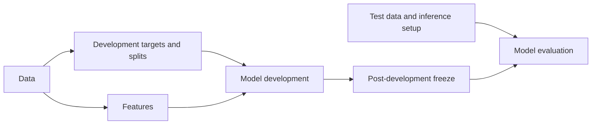

# K-fold training: HistoPilot and OceanPath

Local source comparison and implementation update, 2026-09-11. The reference checkout is `OceanPath-colon-development` (the project referred to as OceanPath-colon-dev). This compares implemented behavior, not results from a new GPU benchmark.

HistoPilot already had the main ABMIL k-fold path: frozen patient-grouped memberships, native or packed feature loading, Lightning fitting, checkpoint selection, held-out predictions, and OOF collection. OceanPath's training engine is broader. This update closes important optimization, worker-lifecycle, resume, and diagnostic gaps while retaining HistoPilot's scientific contracts and existing defaults.

## Training comparison

| Area | OceanPath | HistoPilot after this update |
| --- | --- | --- |
| Fold definition | Multiple holdout, k-fold, OOF and predefined strategies. OOF k-fold carves inner validation out of the remaining development patients. | Native execution supports version 4 development k-fold: fitting, validation for checkpoint selection, and held-out development assessment. Memberships are frozen before training. Broader protocol design does not imply native execution support. |
| Split safety | Patient grouping and manifest/split checks; training fingerprints. | Frozen labels, class order, exact slide/patient membership and verified feature/pack provenance. Training seeds change initialization/sampling, never the saved splits. OOF export verifies exact coverage and prediction identity. |
| Feature loading | H5 and packed mmap; optional CPU/GPU residency, caches, dtype controls, pinning, bucketing and fixed bags. | H5 and verified packs; deterministic sampled training or explicit whole-bag training. Validation/assessment always use whole bags. Now avoids redundant whole-bag copies and reuses singleton-batch storage. Residency, bucketing and comparable throughput controls remain absent. |
| DataModule lifecycle | Configurable workers/prefetch/persistence and fold cleanup. | Now caches exactly one training and one validation loader, with one prefetched batch per worker and explicit teardown on completion/interruption. Assessment loading is deferred until fitting finishes. Separate loader RNG preserves resumed model randomness. |
| ABMIL | Gated attention and configurable aggregation/head dimensions, dropout and checkpointing; broader model infrastructure. | Native configurable ABMIL with gated attention, embedding/attention sizes, fully connected layers, dropout and gradient checkpointing. No import-time dependency on OceanPath. |
| Loss and patient scoring | CE/BCE/focal, class weighting and smoothing; patient scoring averages slide logits. | CE classification, with patient-balanced slide training loss for patient targets. Patient scoring averages slide probabilities. These aggregations are different and remain explicitly recorded. BCE/focal and extra weighting/smoothing controls are missing. |
| Optimization | Warmup, cosine/plateau/step schedules, gradient controls and transfer-learning options. | Adds optional cosine/warmup with relative final LR, gradient clipping and accumulation, FP16/BF16 mixed precision, and inference autocast matching the selected precision. Constant LR and FP32 remain defaults. Plateau/step schedules and differential LR remain missing. |
| Stopping and checkpoints | Validation monitor, patience, minimum stopping epoch and additional small-class policies. | Adds minimum epochs and minimum improvement; rejects undefined AUROC monitoring before fitting. The stopping floor must not suppress selection of the best checkpoint. This review also fixes sticky pre-floor stop decisions and ensures `last.ckpt` advances on every completed validation epoch, including worsening epochs. |
| Metrics | Slide/patient AUROC, AUPRC and additional exports/embeddings. | Adds tie-correct AUPRC to existing AUROC, accuracy, balanced accuracy, macro F1 and loss. Checkpoint validation and held-out assessment remain separate; incomplete OOF groups do not publish complete scores. |
| Parallel execution | In-process fold orchestration in the inspected workflow, plus external experiment launch tooling. | Independent fold processes, persistent batch workers and shared CPU/RAM/GPU-slot reservations. The UI now explains configured and effective concurrency. Reservation limits include both fitting and validation worker pools. |
| Failure evidence | Training logs, callbacks, artifact checks and cleanup. | Adds durable host/GPU/process telemetry, boot and driver provenance, run allocator peaks, and fatal-device-error dispatch shutdown. OOM is distinguished from device loss. These improve diagnosis; they cannot prevent an operating-system or driver crash. |
| Resume identity | Semantic fingerprints and artifact/completion checks. | Adds a hash-verified archive of the full Python worker package. Compatible resume uses the original source and unchanged execution plan even after app changes. Dependency/input changes, changed archives, or relocated execution records block reuse. |
| Final model and external evaluation | Broader best-fold/refit/ensemble and finalization infrastructure. | Model development is connected. Post-development predictor publication and external inference execution remain unconnected; their setup modules must not be mistaken for completed predictions. |

## Defaults are not interchangeable

These are the inspected default files, not necessarily the settings used by every historical OceanPath experiment.

| Setting | OceanPath training defaults | HistoPilot defaults retained |
| --- | --- | --- |
| Learning rate / weight decay | `1e-4` / `5e-3` | `3e-4` / `1e-4` |
| Maximum epochs | 20 | 100 |
| LR schedule | Cosine, final fraction 0.01 | Constant; cosine optional |
| Training bag | Whole bag | Up to 4,096 patches; whole bag explicitly selectable |
| Checkpoint selection | Patient validation AUROC | Validation loss at the target's scoring unit |
| Patience / minimum epochs | 5 / 10 | 15 / 1 |
| Gradient clipping | Norm 1 | Disabled; configurable |
| Determinism | Disabled in the default YAML | Deterministic training enabled |
| Patient aggregation | Mean slide logits, then probability conversion | Mean slide probabilities |

Copying OceanPath's colon-specific defaults would change the experimental protocol. New controls are optional and frozen into each resolved recipe. HistoPilot's cosine schedule reaches the relative floor on the final scheduled training epoch; identical parameter names do not promise an identical epoch-by-epoch LR curve across implementations.

## Clearer experiment setup

The roadmap remains:

- **01 Prepare:** Data maps IDs; Targets selects development rows, target, splits, then review; Features acquires features, checks coverage, then saves a bundle. Targets and Features can proceed independently from the same import. No external test data is assigned in development splits.
- **02 Develop:** Model development is on the left, post-development freeze on the right. Model development uses **Inputs → Batches → Runs → Development results**. Inputs inherit targets/splits and suggest a pair only when exactly one compatible pair exists. One compatibility check continues to batch setup; saving a separate input record is optional.
- **03 Evaluate:** Test data setup and model evaluation are separate parallel modules. Test setup can proceed while models develop. It takes filtered rows from the same source or another import, verifies exact slide/feature/pack coverage, and saves inference parameters without splits. Evaluation requires a published predictor as well as verified test inputs.

Routine controls stay visible. Advanced model, resource, source and mapping controls are collapsed. Blocking findings remain visible; validation opens an advanced section containing an invalid field. Back/Continue keeps entered values. Epoch and patience fields accept normal typing and whole-bag training is labeled explicitly.

Use one batch per experiment family. A grid expands LR × WD × epoch budgets; training seeds and frozen folds multiply the run count. Explicit rows keep selected hyperparameter combinations paired. Freeze the reviewed plan, launch it explicitly, compare complete OOF groups, and clone a batch to change its intent. Configuration comparison uses development evidence; it does not produce an independent final-test estimate. Nested CV remains blocked until per-outer-fold selection is implemented.

## Concurrency and interruption

With one GPU, `maxConcurrentRuns=6` and `runsPerGpu=1` configure only **one** concurrent GPU run. Six simultaneous runs need six GPU slots and sufficient CPU/RAM headroom. GPU slots are not VRAM reservations; whole-bag memory depends on actual bag lengths, dimensions, precision and batch size. A large installed RAM figure alone cannot establish six-run capacity.

The scheduler records its resource plan and checks CPU/RAM reservations across HistoPilot training batches. Per-run CPU budgeting includes the main thread budget plus both persistent loader pools. These are admission reservations, not cgroup limits, and do not control unrelated programs or feature-extraction scheduling.

New executions save an original-code archive, attempt provenance and 15-second resource history alongside normal logs/checkpoints. Allocator peaks are per training process; sampled GPU usage is device-wide. Sampled process-tree RSS can double-count shared pages, and sampling can miss short spikes. Fatal GPU failures stop further dispatch; unfinished work remains resumable. New worker code does not retroactively change an archived execution.

The already interrupted bladder batch has been given a verified archive matching its original compute hash `0c6831dd756bcd4103aa37a1c7eb9f00b46e7404ae2f6d6ca99baefd3e9739a8`. Its plan, run outputs and checkpoints were retained, and no job was resumed. Its original worker behavior remains in force; use a new execution for the improvements described here.

## Remaining work and verification limits

The highest-value remaining training extensions are explicit loss/imbalance policies and configurable sampling, followed by measured loader/VRAM improvements. OceanPath also has augmentation, spatial sampling, length bucketing, resident feature stores, compilation, differential learning rates and additional schedules. These are deliberately listed as gaps rather than exposed as inactive controls. Distributed training within a fold, other native split executors, final refit/ensemble publication, full operating-system resource admission and external inference still need implementation.

Verification uses short synthetic CPU fits, including checkpoint interruption/resume with 0/1/2 workers, mixed BF16 fitting/inference, scheduled/clipped/accumulated training, worker termination, whole-bag preservation, undefined monitors, metric ties, scheduler failure handling and archive integrity. Frontend checks cover guided steps, recipe validation, capacity and execution evidence. Browser verification uses the actual React components in an offline harness with fixture API responses; it does not constitute a live server integration test. No real six-run CUDA workload or new throughput benchmark was launched, and the HistoPilot server was not started.

Final checks passed: **198 focused backend tests** (41 training; 85 data/model/recipe; 72 execution/telemetry/CLI/archive), **210 frontend tests**, TypeScript checking, Ruff lint/format, and production build/bundling. The data worker suite stalled inside the restricted command sandbox; after interrupting that synthetic test process, the same suite passed outside it in 42 seconds. The [browser report and screenshots](verification/2026-09-11-kfold-ui/verification.md) record the interaction checks. The production build still reports a large JavaScript chunk warning; no bundle splitting was attempted in this training-focused update.

## Inspected implementation locations

| Concern | HistoPilot | OceanPath |
| --- | --- | --- |
| Dataset/DataModule | `histopilot/datasets/mil.py`, `datamodule.py` | `src/oceanpath/datasets/datamodule.py` and supporting datasets/samplers |
| Model | `histopilot/models/abmil.py` | `src/oceanpath/models/abmil.py`, `wsi_classifier.py` |
| Lightning/metrics/checkpoints | `histopilot/training/module.py`, `fold.py` | `src/oceanpath/training/lightning.py`, callbacks and fold utilities |
| Frozen recipe and folds | `histopilot/schemas/development.py`, `application/development.py`, `development_splits.py` | `configs/training/default.yaml`, `configs/splits/oof_kfold5.yaml`, `src/oceanpath/training/folds.py` |
| Orchestration/resume | `application/training.py`, `workers/train_batch.py`, `training_process.py`, `compute_archive.py` | `src/oceanpath/workflows/training.py` and finalization utilities |
| Guided UI | `web/src/pages/LocalDataset.tsx`, `LocalProtocol.tsx`, `LocalFeatures.tsx`, `LocalExperiments.tsx`, `components/DevelopmentBatches.tsx` | Configuration-driven workflow in the inspected training path |
