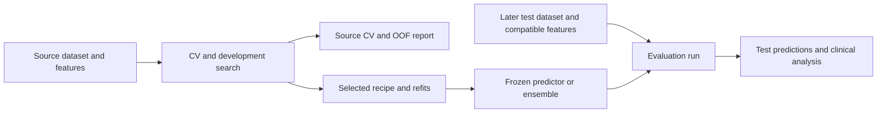
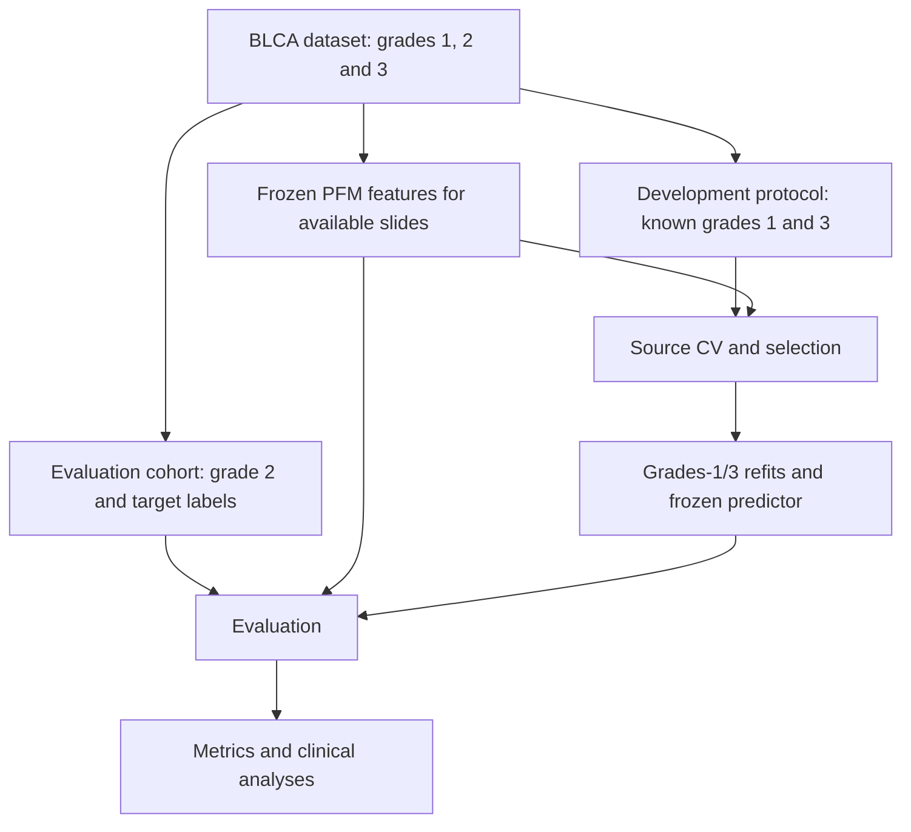
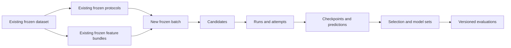

# HistoPilot experiment and evaluation implementation design

The [research platform architecture](histopilot-research-platform-architecture.md) adds the broader PFM/software assessment and long-term representation interfaces. This document remains the detailed implementation map for the current MIL and evaluation work.

HistoPilot does not need an overall application rewrite. Preserve its project folders, local service, sidebar, dataset importer, frozen protocol machinery, feature inventories, extraction workflows, and immutable feature bundles. Implement the missing experiment execution and evaluation layers inside those boundaries. Upstream changes should be narrowly scoped to scientific requirements the current implementation cannot express.

The visible change is concentrated in **MIL experiments** and **Evaluation**, supported by substantial new backend execution and result-management code. **Data** remains substantially unchanged. **Target & split** needs several bounded extensions. **PFM & features** keeps its existing scientific and loading contracts. This is a proposed implementation design based on the current checkout and the CRC, Bladder, and GEJ audits; proposed APIs and records below are not existing capabilities.

## Scope and current evidence

| Area | Current implementation | Decision |
| --- | --- | --- |
| Project and navigation | Folder-owned descriptor; recent-project index; separate real and synthetic UI paths | Preserve; clarify workspace/project wording without changing stored IDs or URLs |
| Data | Versioned imports, typed slide/patient attributes, mapping, exclusions, identity/fallback evidence | Preserve; no dataset duplication per target |
| Target & split | Multiple frozen protocols; each contains target, eligibility, predictors, split specification and exact memberships | Preserve as the first execution input; improve library browsing and add specific missing capabilities |
| PFM & features | Existing-feature attachment, TRIDENT acquisition, full validation, optional packs, immutable bundles | Preserve; select compatible bundles from MIL |
| MIL experiments | Saves protocol/bundle/loading drafts; preview explicitly reports no execution | Expand into experiments, batches, candidates and runs |
| Evaluation | Local route renders an empty state; synthetic results use separate demo components | Implement a real local evaluation page and services |
| Execution | Real extraction/packing process boundaries; generic MIL executor and services are stubs | Implement durable MIL execution, reusing suitable process primitives |
| Persistence | Project scientific SQLite schema 4; immutable publication; configuration kinds limited to protocol/feature/feature-bundle | Add explicit execution/evaluation records and publication support; retain folder ownership |

These findings come from current source, not older roadmap prose. The exact subsystem findings are documented in the [upstream review](/home/yc_liu/projects/mil-redesign-research/histopilot-upstream-review.md), [feature/storage review](/home/yc_liu/projects/mil-redesign-research/histopilot-features-storage-review.md), and [execution/UI review](/home/yc_liu/projects/mil-redesign-research/histopilot-execution-review.md). [^1]

## Data can stay substantially the same

The importer already supports multiple typed slide and patient attributes. Preserve original KRAS status, variant annotations, clinical attributes, source cohort and specimen role in the dataset. Protocols derive different target mappings and eligible populations from that same dataset. Creating G12D versus other KRAS mutations should not copy slides, rewrite the master KRAS column, or create a separate project. [^2]

No new universal clinical ontology or specimen database is required to deliver binary MIL. Preserve specimen/block identity as reviewed attributes when available, and retain known patient linkage independently. A later first-class specimen entity can be introduced if real workflows require its own lifecycle. Do not infer biological independence from unique slide IDs.

Changes to clinical annotations or patient linkage create new dataset versions. Compatible feature bytes can be reused after registering and validating their binding to the new version. Retain the existing source-path, freshness, physical-alias, and source-content checks. Project-level defaults are conveniences for creating drafts; a launched experiment must not inherit a newly changed global target or the latest dataset silently.

A future multi-source dataset builder may improve convenience, but it is not a prerequisite for multiple targets. Initially use an explicitly reviewed combined manifest with source identifiers, or separate frozen scenario inputs where supported. Cross-source joins and identity reconciliation must remain explicit.

## Keep Target & split, and extend its contracts deliberately

### Multiple protocols solve the immediate multiple-target requirement

The existing `ProtocolSpec` contains `datasetId`, a full `TargetSpec`, eligibility, predictors, constraints, a split specification, and optional legacy feature bindings. The page already lists saved protocols and supports copying one into a new draft. Multiple protocols against the same dataset can therefore represent the CRC targets now. [^3]

| Saved protocol | Eligible population | Positive / negative |
| --- | --- | --- |
| KRAS gene-level, source CV | Source patients with known KRAS status | KRAS mutant / KRAS WT |
| G12D versus other KRAS mutations, source CV | KRAS-mutant source patients with sufficient variant annotations | G12D / eligible non-G12D KRAS mutations |
| G12D versus all non-G12D, source CV | Source patients with sufficiently resolved WT/variant status | G12D / WT plus eligible non-G12D KRAS mutations |
| G12D versus WT, source CV | G12D and WT source patients | G12D / WT |

The same feature bundle can support these protocols when its dataset and coverage match. “Others” must be expanded into an explicit negative-class definition; the two G12D-versus-others rows above answer different questions. Unknown variants do not automatically become negatives. Compound variant cases require an explicit reviewed mapping or exclusion rule.

**Do not require a separate TargetVersion database migration before execution.** A named target-template library remains useful later, but the frozen protocol already preserves the scientific target. For now, derive a searchable target description from the protocol and group protocols in the UI. A grouping fingerprint may aid navigation, but it must include the target mapping and eligibility definition and must not replace the authoritative protocol ID.

This refines the earlier conceptual recommendation to introduce first-class targets immediately. The minimal implementation can retain embedded target snapshots. If templates are added later, a protocol must pin a template version and its resolved target snapshot; editing the template must never change an existing protocol.

### Four bounded Target & split changes

| Change | Why it is needed | Compatibility policy |
| --- | --- | --- |
| Protocol library and explicit denominator summary | Distinguish KRAS vs WT from G12D vs other mutants; show counts, exclusions and dependencies | Improve the existing saved-version view and clone flow |
| Optional external-test pool for CV | Current default v3 requires a nonempty test pool even for source-only CV | Introduce a new version with explicit external-test intent; preserve v1–v3 semantics |
| Reuse frozen patient assignments | Same seed does not preserve folds after target/eligibility changes | New optional parent-assignment reference with exact membership derivation and class checks |
| Mixed-label groups and reader/ordinal task support | Current code rejects differing slide labels in a patient group and supports only one binary/multiclass target field | Add explicit task/stratification support; retain current rejection for unsupported combinations |

**Optional external tests.** The v3 explicit-pool code requires a test rule and nonempty test population. Source-only CRC CV should be a valid protocol without inventing a test pool. In a new split version, allow `externalTest: none` for supported CV designs. Still require held-out assessment memberships inside ordinary/nested CV. A final source refit can be a later training artifact without inventing an external evaluation. Existing `held_out` protocols retain their declared test requirements. [^4]

**Shared assignments.** Current folds are generated from the target-dependent patient strata. The same seed is not a master split. Add an optional frozen assignment reference: inherit retained patients' source/external roles and complete applicable plan assignments, including early-stop validation and inner tuning, then validate eligibility, class coverage, group consistency and plan completeness. Filtering to another target must not trigger hidden validation redraws. New patients require an explicit extension/revision policy. Do not silently redraw a rare-target split to improve balance. If a derived target is infeasible, retain that finding and let a deliberately different protocol be created. [^5]

**Mixed labels and readers.** For a patient-level target, conflicting labels continue to require a declared clinical resolution policy. For slide/block-level targets, different labels within a patient can be legitimate; group membership and stratification need to support that distribution instead of replacing it with the first label or majority label. GEJ also requires a task variant preserving both readers' ordered observations, Case grouping, observation masks, and case-uniform likelihood weighting. This is a targeted upstream and adapter extension, not merely a new MIL head. [^6]

Leave feature selection optional in new protocols, as it already is. Prefer choosing a feature bundle in MIL, so one protocol supports encoder comparisons. Preserve older protocols that pin a feature or pack and enforce those pins. Do not strip legacy fields or change their hashes.

## PFM & features should keep its structure

Retain the existing sequence: attach or extract features, validate, optionally pack, freeze a bundle. A bundle currently references one verified feature inventory and zero or more compatible packs. Multiple encoders are multiple bundles; packs within a bundle are storage representations, not additional encoder arms. [^7]

MIL selects an existing protocol/bundle pair, then resolves `auto`, `native`, or `mmap` through `MILInputService`. Keep exact dataset matching, complete required-slide coverage, legacy feature pins, stale-input findings, and explicit precision-change handling. Do not bypass these checks to make a multi-target batch convenient. Training readiness will add capability, shape/granularity, feature/coordinate, resource and role checks on top of the existing preview.

The only near-term feature-page addition needed is usage navigation: show which experiments/runs use a bundle and link to those records. A convenience action for registering unchanged features against a new dataset version can follow. It must produce a validated new binding while reusing physical bytes, not rewrite an older bundle's dataset ID.

Keep train-time bag sampling and evaluation tile policy in the training/inference recipe. They do not mutate the feature inventory. Exact-value packing or verified relocation preserves feature values; converting precision is an explicitly different representation. A slide encoder's single embedding is not interchangeable with a patch bag.

Valid tensors and coordinates do not establish extraction provenance. Imported features with unknown encoder checkpoint, extraction recipe or preprocessing retain that unknown status. A matching encoder name or tensor shape does not certify an encoder comparison or justify cross-version reuse.

Cohort-fitted transforms such as PCA, learned prototypes, normalization statistics, or PFM adaptation belong inside the permitted training partition and have their own fitted artifacts. Frozen, label-independent per-slide extraction can be generally reused across targets. A fitted transform can also be reused when its exact permitted training evidence, fitting recipe and artifact are unchanged; otherwise it must be fitted separately within the applicable training scope. This execution requirement does not need another feature-page workflow for every fold.

## Primary workflow: model development, then model evaluation

The user-facing workflow should explicitly separate **Model development** from **Model evaluation**. Source CV and its reports belong in development. A new test cohort can be registered and evaluated after development is complete, without reopening the training configuration or rerunning CV. Both stages use shared prediction, metric and uncertainty services; separate pages must not create two implementations of balanced accuracy or different undocumented aggregation defaults.



### Stage 1: develop and finalize a predictor

The target/eligibility/split object on the development branch contains the **source-development population only**, including all its internal train, early-stop validation, tuning and CV assessment memberships. It need not contain the later evaluation population. The shared Data workspace and independently extracted feature inventory may already cover both populations; protocol eligibility controls which rows the trainer receives.

1. Select the source dataset, frozen target/CV protocol and matching feature bundle. An external test dataset is optional and may not yet exist.
2. Run fixed recipes or a bounded source-development search with declared checkpoint and candidate selection roles. Keep split assignments independent from training seeds.
3. Produce source CV reports from the actual held-out memberships. Display fold/seed scores, pooled OOF predictions, coverage and model-selection history.
4. Select the final recipe from development evidence and record the decision. Perform any full-source refits under an explicit resolved training and epoch policy.
5. Construct and freeze one or more predictors: a single refit, a refit-seed ensemble, or a declared CV-model ensemble. Designate the primary predictor and any planned comparators before external scoring.

Source reports should label each statistical object precisely:

| Source report | Meaning |
| --- | --- |
| Fold mean ± SD for a specified seed | Descriptive variation of metrics across frozen folds; neither a patient confidence interval nor a set of independent replications |
| Per-seed pooled OOF metric | One held-out prediction per eligible subject for that seed and CV repeat, scored after the declared observation aggregation |
| Across-seed summary | Variation of explicitly named per-seed summaries; do not silently flatten folds and seeds into one sample |
| OOF seed-ensemble metric | First combine only eligible held-out predictions across seeds, then compute the metric; this differs from averaging seed metrics |
| Nested-CV report | Predictions from per-outer selection procedures, with all decisions affecting each prediction excluding its outer group |

Pooled OOF AUROC and mean fold AUROC need not agree; retain both definitions rather than replacing one with the other. The [cross-val-predict documentation](https://scikit-learn.org/stable/modules/generated/sklearn.model_selection.cross_val_predict.html) explicitly distinguishes metrics on pooled predictions from cross-validation score averages. If the same CV evidence chose the winning configuration, its winning score is selected development evidence; nested CV is needed to assess the selection procedure using excluded outer data. [Nested versus non-nested CV](https://scikit-learn.org/stable/auto_examples/model_selection/plot_nested_cross_validation_iris.html)

A refit is a separate fit, not an averaged checkpoint and not the source OOF predictor. For full-source refits, fix epochs or another stopping budget using development evidence, then train on the declared full source membership. If a final holdout is retained for early stopping, name the actual reduced training membership. A fold ensemble and a refit-seed ensemble are different predictors; record members and whether combination uses logits or probabilities. Their external performance must not be inferred directly from the source OOF seed ensemble.

Thresholds and calibrators also belong to development. They may be fitted using suitable held-out/OOF development scores for subsequent external assessment. If their performance is reported on those same development labels, mark it as fitted/selected performance or use an additional held-out/cross-fitted evaluation. The calibration evidence must match, or explicitly justify transfer to, the deployed score construction.

### The handoff: a frozen predictor version

Make the existing proposed selection/model-set artifact the explicit handoff, referred to here as `PredictorVersion`. This is a project-owned manifest, not a requirement for a new top-level model-registry page. It pins:

- Target semantics, class order, positive class and output meaning.
- Model/checkpoint references; ensemble membership, weights and combination rule.
- Expected encoder checkpoint and feature/extraction contract, fitted preprocessing and required ancillary inputs.
- Inference tile policy and slide/specimen/patient score aggregation.
- Any fitted calibrator, decision threshold, and their development evidence.
- Training/refit membership, source protocols, code/environment identity, CV reports, selection decision and known exposure history.

A predictor remains usable for future cohorts without retraining. Multiple targets publish separate predictor versions initially, even when their source data/features are shared. OOF prediction artifacts remain linked to their constituent fit/plan identities; assigning a finalized predictor ID does not turn its source training predictions into OOF predictions.

### Stage 2: bind a cohort, infer, and analyze

The evaluation wizard selects a frozen predictor and an evaluation cohort, then validates inputs and freezes its analysis specification. It runs inference with the frozen scoring policy, stores raw predictions, applies the declared aggregation and computes metrics/clinical analyses. One predictor can have many evaluations across sites, specimen roles or later dataset versions. A new metric/CI report can reuse predictions when its required inputs have not changed.

Add an evaluation-only cohort/input contract rather than forcing every test dataset through a training split:

| Proposed record | Responsibility |
| --- | --- |
| `EvaluationCohortSpec` | Frozen dataset version, eligibility and included IDs, reviewed target binding, grouping/observation unit, feature bundle and declared assessment purpose |
| `EvaluationSpec` | Predictor version, cohort version, scoring references, metrics, subgroup/clinical analysis plan, uncertainty and evidence/exposure status |

The current training invariant remains `sourceProtocol.datasetId == sourceBundle.datasetId`. The new evaluation resolver instead requires `evaluationCohort.datasetId == evaluationBundle.datasetId` and checks that this bundle satisfies the predictor's input contract. The evaluation dataset and bundle need not equal their training counterparts. Matching vector dimension alone is insufficient; checkpoint, feature meaning, preprocessing, granularity and scoring expectations must be compatible. Explicit processing-sensitivity studies may declare deviations as study arms rather than silently treating them as equivalent inputs.

Raw test label columns/codes may differ from source annotations, but their reviewed mapping must preserve the frozen target meaning and class order. A KRAS-vs-WT predictor cannot become a G12D-vs-others predictor through a new test mapping. Use the existing Data and PFM/features workflows to import and prepare the later cohort; add the evaluation binding downstream. Unknown labels permit an inference-only artifact but prevent label-dependent performance metrics until a compatible label version is available.

### Concrete Bladder cohort flow

For the audited Bladder endpoint, **WHO1973 is the cohort-selection attribute; WHO2022 low/high is the prediction target**. The intended development filter is known WHO1973 grades `{1, 3}`, with sufficient WHO2022 labels and available valid features. Prefer this explicit set to a bare `WHO1973 != 2`, which can accidentally retain missing or unsupported values under some filter implementations.

| Object | Membership / purpose |
| --- | --- |
| Frozen BLCA dataset | All reviewed available slides, annotations and known identity links |
| Shared frozen feature bundle | May cover grades 1, 2 and 3 when extraction is independently frozen and label-independent |
| Development protocol | Known grades 1/3; WHO2022 target; exact source-CV assignments within this population |
| Final predictor | Source-selected recipe; refit on the declared grades-1/3 population or its specified training subset; frozen ensemble/decision policy |
| Evaluation cohort | Eligible grade-2 observations; compatible WHO2022 target binding; no development CV assignments required |
| Evaluation report | Frozen-predictor inference on grade 2 and independently versioned metrics/clinical analyses |



When grade-2 slides are already in the same frozen dataset and feature inventory, evaluation can reuse that bundle directly. The loader selects the explicit eligible IDs for each operation; a superset inventory does not authorize training on every row. New slides or annotation corrections require an appropriate new dataset/label version and validated binding, while unchanged feature bytes may be reused. Independent extraction may precede either stage; cohort-fitted transforms and adaptation must still use only their permitted training evidence.

Test labels can already exist in Data or arrive later. Their storage or feature-extraction date is not the boundary: their use in fitting and selection is. A source-held-out subset must be reserved before development. Check patient/group overlap across the grades-1/3 and grade-2 populations, even though the slide-level filters are mutually exclusive.

This design assesses transfer from grade extremes to the grade-2 population. Source-CV performance does not directly estimate grade-2 performance. The already-audited grade-2 cohort was used for historical adaptive selection; retain that exposure if it is evaluated again. The two-stage workflow does not restore an untouched-test claim. [^10]

The clinical report should show cohort counts, label prevalence, exclusions and missingness alongside discrimination, calibration and operating-point metrics. Add prespecified site/specimen/clinical subgroups with denominators and uncertainty, and appropriate paired comparisons. Decision-curve analyses require a defined clinical action and threshold range; additional outcome associations require their own specified endpoints and analyses. Keep planned and exploratory analyses distinguishable. A molecular-target prediction report alone does not establish clinical outcome benefit. These reporting dimensions align with [TRIPOD+AI](https://pmc.ncbi.nlm.nih.gov/articles/11019967/).

### Later test selection and feedback

Registering a genuinely new cohort after training is supported. A test subset drawn from the original source population should be reserved before development. Data already used for fitting, preprocessing adaptation, checkpoint selection or HPO cannot become an independent test by moving it to Stage 2.

Before scoring, freeze cohort eligibility, primary predictor/comparators and analysis choices. Check patient/group overlap against all relevant development evidence, not only the final checkpoint's training rows. Retain earlier study-level exposure. Legitimate paired processing or known-patient specimen studies can be represented with their own purpose, but do not receive independent-new-patient evidence status.

Stage 2 does not tune weights, thresholds, encoder choice, seeds or ensemble membership. If its results motivate a change, create a new development branch and predictor version, recording that cohort's new role in selection. Preserve the original evaluation. A convenient two-page workflow does not itself restore independence to previously exposed CRC or Bladder cohorts.

### UI and implementation consequences

Keep the two existing sidebar positions and routes, with labels **Model development** (current MIL experiments) and **Model evaluation**. Development shows **Design, Batches, Runs, Source CV, Models**. Models contains refits/ensembles and their frozen input/output contracts, with an Evaluate action. Evaluation shows **Cohorts, Runs, Reports, Comparisons**, with report details for metrics, clinical analyses and provenance.

This makes two downstream additions explicit: a frozen predictor handoff and a test-only cohort resolver. It strengthens the need for optional external pools in new source protocols. It does not require replacing Data, feature inventories, project storage or legacy combined train/test protocols. Existing final-test memberships can be imported into a new evaluation binding while retaining their original provenance.

Acceptance cases: complete development before any test dataset exists; attach a compatible later dataset without retraining; reject an identically shaped incompatible encoder; preserve target semantics across different raw label codes; prevent a trained-on subject from being labeled independent-test evidence; reproduce source and external metrics through the same versioned engine; and retain predictor bytes when only the evaluation metric version changes.

## Experiments: a research question with executable batches

An **experiment** is a named question and its recorded study context. It can contain several target-specific or dataset-specific arms. A **batch** is a frozen plan to run concrete configurations for some of those arms. Each arm pins one protocol and one feature bundle; target semantics come from that protocol.

| Record | Responsibility | Mutability |
| --- | --- | --- |
| Experiment | Question, description, organization and links to batches | Metadata/drafts may evolve; completed batch history remains fixed |
| Batch version | Input arms, recipes, search space, plan selection, training seeds, selection policy and execution budget | Frozen before dispatch |
| Candidate | One fully resolved arm/model/hyperparameter configuration | Immutable; distinct effective budgets/configs get distinct identities |
| Run | One candidate × frozen training plan × training seed | Stable identity; lifecycle changes are recorded |
| Attempt | One execution or checkpoint continuation of a run | Append-only history; terminal artifacts retained |
| Selection decision/model set | Development evidence, selected config/checkpoints, refit/ensemble construction and weights | Frozen before the linked final evaluation |
| Evaluation | Predictor + cohort + scoring/metric/decision/uncertainty specification | Immutable versions with separate execution status |

Separate split seeds from training seeds. The current protocol membership records already include `planId`, `phase`, `outerFold`, `innerFold`, and, where applicable, `pool`. Use those fields as authoritative. Do not shrink the run identity to an ambiguous integer `fold`, and do not ask the trainer to regenerate memberships. [^8]



### MIL experiments page

The Model development landing page should list experiments and their progress, with New experiment and Import history. Opening an experiment exposes **Design**, **Batches**, **Runs**, **Source CV**, and **Models** as local views, without adding more sidebar stages. Artifacts are accessible from run/model detail; source reports remain visible in development while using the shared evaluation services.

The design editor should have:

1. **Question and arms.** Name the question. Add rows selecting saved protocols and compatible feature bundles. Show each target's denominator, prediction unit, identity status, and scenario counts.
2. **Training recipe.** Choose a backend-supported model/loss, optimizer, LR/WD, scheduler, epochs, early stopping, weighting, sampling, and train/evaluation bag policy. Loading details remain expandable.
3. **Search and repetitions.** Choose single recipe, explicit list/grid, or bounded random search; later enable TPE/Bayesian search. Select the applicable frozen plans and training seeds. Give each arm its own search space or an explicitly shared one.
4. **Selection and final model.** Declare fixed-recipe assessment, exploratory development search, or nested search. Specify the complete-candidate objective and later refit/ensemble policy. No default selection from external scores.
5. **Review and queue.** Show resolved inputs, effective overrides, planned candidate/fit counts, invalid combinations, resource estimates, and dependencies. Freeze and queue this reviewed version.

Display models and parameter controls from a backend capability schema. The existing demo model catalog is not proof that an installed worker supports a model. Unsupported task/loss/feature combinations remain unavailable. The service should expose granular capabilities rather than treating extraction readiness as MIL readiness. [^9]

Example: two target arms × nine LR/WD pairs × five applicable CV fit plans × three training seeds yields **270 training runs**, assuming both protocols pass class and compatibility checks. Refits, inference, and evaluations are counted separately. A batch spanning targets produces separate target-level candidate rankings, not one global best AUROC.

For nested search, count the actual dependency graph: candidate fits inside each outer fold's inner plans, then selected outer fits, followed by outer scoring. Do not multiply all candidates by all outer final-fit plans. Display total fits and required completion per stage.

The run table should group by target/protocol/arm/candidate and show completed/expected fits. Optional columns include encoder, model, LR, WD, selected epoch, seed, plan, runtime, memory and metric. Run detail shows the complete resolved config, curves, logs, selected checkpoint, provenance, attempts and next action. A missing fold never disappears from the aggregate denominator.

### Use existing split semantics correctly

| Training mode | Permitted selection evidence | Reported assessment |
| --- | --- | --- |
| Fixed-recipe CV | Checkpoint selection on that fit's `val` only | Its excluded CV `test` memberships, conditional on the fixed recipe |
| Development search with later protected external evaluation | Explicitly declared development evidence; any reused assessment population is recorded as selection-exposed | Selected development scores plus separately locked external results |
| Nested search | Inner-plan `tune` after checkpoint selection on inner `val`; separate search/decision per outer fold | Outer-plan `test`, excluded from every choice determining that prediction |

The existing nested splitter already provides separate `train`, `val`, `tune`, and outer `test` roles. The execution engine must honor them. The current explicit-pool final plan is a finalization opportunity, not a job to auto-run for every hyperparameter candidate. [^8]

That existing final plan still has distinct training and validation memberships. A fixed-epoch refit on all eligible development patients needs a separately resolved training plan and a development-derived epoch policy; it must not silently merge the saved final plan's training/validation rows. Preserve its link to the source protocol and selection decision.

A bare `partition == test` check is insufficient. Current protocol memberships use test for both CV assessment within the training pool and final external assessment. Resolve `planId + phase + pool + partition` to its scientific role. Never silently reinterpret an existing protocol's reported assessment role as HPO validation. If a study prospectively uses CV scores for selection, publish an explicit selection-use contract/derived protocol and label the resulting best score as selected development evidence.

Labels can also leak across folds through global hyperparameter selection: selecting one config from all folds and then calling those same folds independent outer tests is invalid. The nested evaluator needs per-outer selection decisions, and the report must retain study-level prior exposure independently of fit-level disjointness.

## Evaluation: an independently addressable result

An evaluation answers: which predictor, which subjects and labels, which score/aggregation, which decision policy, and which metric computation? It can evaluate imported historical predictions, newly generated predictions, a single checkpoint, or a declared model set. It does not require a new training run every time a metric changes.

The page should list evaluation suites grouped by protocol and target, with New evaluation and Compare actions. Creating one selects the predictor/model set and evaluation cohort, then reviews the following contract:

| Contract part | Required fields |
| --- | --- |
| Input identity | Dataset/protocol or explicitly bound external cohort; label version; eligible membership; model/checkpoint hashes |
| Predictions | Observation unit; class order; probability/logit meaning; feature bundle; raw-scoring artifact |
| Aggregation | Slide/specimen/patient grouping; patient × specimen role where needed; model/seed/fold ensemble membership and weights |
| Selection history | Checkpoint and candidate decisions; original role and subsequent use of the cohort |
| Decision/calibration | Threshold or calibrator plus its development-only fitting evidence |
| Metrics | Definitions, averaging convention, direction, implementation version, exclusions and missing-class behavior |
| Uncertainty | Dependence/resampling unit, pairing, bootstrap seed/replicates, CI method and invalid-replicate policy |

Separate raw model scoring from aggregation and metrics. Changing model inputs/checkpoints may require inference; changing aggregation can often reuse stored slide logits; changing metric or CI method usually needs only a new evaluation. Preserve original summaries and issue corrected versions, as required by the Bladder balanced-accuracy finding.

Views should include **Summary**, **Compare**, **Diagnostics**, **Subgroups**, **Cases**, and **Provenance**. Binary tasks show ROC/PR, calibration, confusion and operating points. Ordered grading adds ordinal errors/QWK. Reader modeling shows B−A case-uniform joint NLL, reader-specific diagnostics and paired Case uncertainty. Do not flatten every endpoint into AUROC or use a sign-only “better” label.

Paired model leaderboards require the same target semantics, assessment membership, unit and metric definition. A predeclared transport comparison can instead contrast distinct cohorts, with appropriate unpaired or partially overlapping cluster methods. Pairing a common subset requires an explicitly defined subset and separate treatment of unmatched observations; overlap alone does not justify pairing two full-cohort estimates. Distinct target denominators remain separate even if target names look similar. Feature/model IDs may differ intentionally in a comparison, but coverage and the evaluated cases must be explicit; never silently intersect cases after viewing results.

OOF estimates, mean fold metrics, seed means, and seed ensembles are separate result types. Repeated fold predictions of the same 76 Bladder slides are not 380 independent patients. CRC primary/metastatic observations may share a patient dependence cluster while retaining separate specimen-role predictions. GEJ retains block/reader observations under Case-uniform weighting.

Every candidate-level OOF row must name a model that excluded that patient's group from training, fitted transforms and checkpoint selection. Selecting a candidate using all of those OOF labels leaves its stored predictions useful as selected development evidence; it does not make them independent assessment of the search procedure. For that assessment, the excluded group must also be absent from candidate and other policy selection, as in the declared outer loop. Do not average all CV fold models on development patients: most of those models trained on that patient. For repeated CV, define coverage within each repeat and subsequent subject-level aggregation explicitly. Ordinary bootstrapping of stored predictions estimates uncertainty conditional on the fitted predictor and selection process; it does not capture retraining or HPO uncertainty. Folds and seeds are not independent patient replicates.

The original audits found adaptive test selection, ambiguous prediction units, stale run states and inconsistent metric versions. Add persistent exposure/use events and evidence status alongside execution status. Imported historical runs may be complete but exploratory, unverifiable, superseded, or summary-only. Missing prediction or checkpoint artifacts disable unsupported recalculation/replay; they do not require deleting useful history. [^10]

## Execution, storage and W&B integration

### One canonical execution contract

Keep `MILInputSpec` as the input binding for an arm. Add a versioned training contract that resolves it together with the model, task head, loss, data loader, training policy, selected protocol plan, training seed, code/environment identity and required outputs. Current domain records, the legacy CLI experiment contract, and the new MIL input draft are different shapes; none is a sufficient execution contract by itself. Introduce one canonical contract for new execution, and retain legacy parsing explicitly instead of silently interpreting old drafts as executable jobs. [^9]

A batch preview should return resolved candidate summaries, exact planned fits, dependencies and validation findings. Submission freezes the plan and repeats freshness/compatibility checks. The trainer consumes resolved membership and labels; it must not choose another target, regenerate a split, silently drop missing slides, or overwrite a supplied recipe with backend defaults. Exporting the resolved recipe makes both manual review and CLI reproduction possible.

Use typed axes: categorical lists, bounded integer/uniform/log-uniform ranges, and conditional parameters where the backend supports them. Finite grid search requires explicit values; random search requires a candidate cap and a proposal seed. Validation must catch unsupported models, negative WD, invalid log bounds, incompatible feature dimensions and conflicting policies before dispatch. Record effective settings after backend validation, including any requested override. Resource estimates should state their basis and uncertainty rather than imply a benchmark that has not been run.

The initial batch engine should support explicit rows and grid/random expansion. Adaptive search is a later proposal adapter feeding the same candidate evaluator. The evaluator returns one declared development aggregate only after the required folds/seeds succeed. Incomplete candidates remain incomplete and cannot win by averaging a favorable subset. A retry restores the same run's contract; changes to epochs, training data, bag cap or early stopping create a new effective candidate/configuration.

Hash scientific inputs and resolved code/environment content, not only a Git commit: this workstation may execute an uncommitted tree. Preserve a bounded source snapshot or equivalent file hashes and an environment manifest. Keep display labels and relocated paths to verified identical content outside scientific identity. Record their provenance separately.

### Extend the folder-owned scientific store

The existing project store, publication receipts, version labels and locking are suitable foundations. Add an additive migration from schema 4 to explicit experiment/batch/candidate/run/attempt/selection/evaluation indexes and input-reference tables. The current publisher only accepts protocol, feature and feature-bundle records, with a single `datasetId`; a multi-arm batch needs explicit multi-input references, not a fabricated common dataset ID. [^11]

Use immutable scientific manifests alongside mutable lifecycle records/events. Record submitted, queued, running, validating, succeeded, failed, cancelled and interrupted states; distinguish execution completion from scientific evidence status and W&B synchronization. A zero exit code is not enough to publish a successful scientific result.

Keep compact metadata and indexed queries in SQLite. Keep checkpoints, raw predictions, series and logs as project-owned files with artifact manifests, byte counts and streamed hashes. Current bounded configuration/publication APIs are not large-checkpoint storage. Add filtered, paginated run/evaluation queries; do not scan and checksum every configuration or reopen feature tensors for each table refresh. Hold the project writer lock only for short transactions.

Preserve old dataset/protocol/feature IDs, serialized content, receipts, labels and artifact layouts. A project opened through a fresh recent-project registry must recover its scientific history. The existing project descriptor and URLs remain valid. Project overview defaults such as “latest dataset” must never replace the pinned inputs when reopening an experiment.

### A durable MIL worker, separate from FastAPI

The working extraction and packing paths already demonstrate tmux launch, private plans, persistent logs, process identity, output claims, cancellation markers and reconciliation. Reuse those small primitives, with regression coverage, while adding a MIL-specific worker and output validator. The generic job service, supervisor and MIL adapter are still stubs; there is no production MIL scheduler to switch on. The TRIDENT runner also has hardcoded extraction semantics and is not a complete scheduler. [^12]

The worker should run in the configured training Python environment, receive an explicit argv and environment, load native/mmap features through a narrow verified adapter, and write only to its claimed run/attempt directory. Keep CUDA/model imports and training outside the API process. Training must reuse frozen features; it must not launch extraction once per fold or target.

For substantial training/evaluation jobs, launch through a descriptive tmux session after checking existing sessions and persisted run identity. Write durable logs and expose the session name, command, output path and reconnect command in run detail. Normal previews, unit tests and short operations remain ordinary processes. Record PID plus start identity and boot identity, and reconcile fast completion before claiming a run is live.

Add host GPU admission that accounts for existing extraction jobs. A unique tmux name does not reserve GPU memory. Start with conservative exclusive GPU leases and configured concurrency; cross-project host scheduling is runtime coordination, while scientific records remain project-owned. Pause queue dispatch independently from stopping an active run. Cancellation targets only the claimed process group and must survive service restart.

Persist last and selected checkpoints separately. True continuation must restore model, optimizer, scheduler, scaler where used, RNG and sampling state with compatible code/input checks; each continuation gets an attempt record. If a backend cannot resume the full state, expose restart as a new attempt from initialization, not continuation. Preserve failed/interrupted attempt logs and validate artifacts before reuse.

Be precise about durability: running tmux workers can survive browser, SSH and API disconnects. Queued dispatch resumes when its coordinator returns unless a separately supervised durable dispatcher is implemented. Neither tmux nor a saved queue guarantees survival through reboot or hardware failure; checkpoint restore and persistent storage address those cases.

The MIL validator must check expected prediction keys, unique coverage, labels and class order, finite probabilities/scores, checkpoint/model identity, and metric artifacts. An evaluation validator additionally checks predictor eligibility for each assessment row, ensemble membership, aggregation and uncertainty metadata. Do not declare success from a file's existence or the trainer's logged summary alone.

### W&B as tracking and optional search integration

Adopt W&B's run grouping and its separation of configuration, history and summary. HistoPilot should expose the same useful comparison patterns—filterable config columns, training curves and selected result summaries—while retaining its own immutable input and evidence contracts. Group physical fits by candidate/batch and tag their job type. [Run grouping](https://docs.wandb.ai/models/runs/grouping)

W&B supports grid, random and Bayesian proposal methods and parameter distributions. Translate a typed HistoPilot range deliberately: for instance, `log_uniform_values` takes the actual positive bounds, while `log_uniform` uses log-space bounds. Implement local grid/random first, then optional search adapters. [Sweep configuration](https://docs.wandb.ai/models/sweeps/sweep-config-keys)

If W&B proposes candidates, one sweep trial should call HistoPilot's complete-candidate evaluator, with child runs for physical fits. W&B grouping alone does not compute the objective over folds/seeds. One controller owns proposal/dispatch; two controllers must not retry the same run independently. For local search, mirror ordinary run/aggregate records without creating a second sweep controller.

Publish the selected-checkpoint metric and final candidate aggregate explicitly. W&B's default summary behavior uses the last logged value, which is not necessarily the selected result. [Summary metrics](https://docs.wandb.ai/models/track/log/log-summary) Register input/output artifact relationships rather than treating a logged path string as lineage. [Artifact lineage](https://docs.wandb.ai/models/artifacts/explore-and-traverse-an-artifact-graph)

Local execution must work without W&B. Optional synchronization initially sends configuration, aggregate metrics and manifest identities; patient tables, WSIs and feature payloads stay local by default. Sync status is separate from run completion. No W&B account, project restructuring or cloud database migration is a prerequisite for this implementation.

## Concrete application changes

Retain the sidebar positions and routes, using **Data → Target & split → PFM & features → Model development → Model evaluation** as user-facing labels. The last two correspond to the current MIL experiments and Evaluation sections. Scientifically, target preparation and frozen feature preparation are parallel branches from the dataset, joined at MIL input validation. A later evaluation cohort uses the existing Data/features workflows and a separate evaluation binding. This does not require a new navigation hierarchy.

| Area / current files | Proposed change |
| --- | --- |
| `schemas/protocols.py`, `application/protocols.py`, `application/explicit_pools.py`, `application/modern_splits.py`, `web/src/pages/LocalProtocol.tsx` | New-version optional external pool and assignment derivation; target/protocol library; later explicit mixed-label/reader task support |
| `schemas/mil.py`, current domain/legacy experiment contracts | Canonical versioned batch, candidate and training contracts, preserving `MILInputSpec` and explicit legacy readers |
| `application/mil_inputs.py` | Reuse current resolver; add training capability and plan readiness validation without weakening upstream checks |
| `application/experiments.py`, `application/jobs.py`; new selection/evaluation services | Implement pure expansion, freeze/submit, lifecycle orchestration, evidence rules, prediction scoring and result publication |
| `storage/scientific.py`, `storage/project_lock.py` | Additive schema, supported manifest publication, input references, short transactions, indexed lists and attempt/event history |
| `workers/supervisor.py`, new MIL worker/process modules | Durable execution, GPU admission, reconciliation, cancel/retry/resume and output validation |
| `adapters/oceanpath/`, `storage/packed.py` | Narrow backend/loader adapter, installed capability schema, explicit effective config and canonical outputs |
| `api/mil.py`, `api/app.py`, `api/scientific.py`, `cli.py` | Shared project-scoped preview/submit/list/detail/cancel/retry/evaluate operations; granular capabilities |
| `web/src/pages/LocalExperiments.tsx`, new `LocalEvaluation.tsx`, `web/src/App.tsx` | Real batch builder, run detail and independently addressable evaluation views |
| `web/src/components/JobTray.tsx`, `web/src/pages/LocalWorkspace.tsx`, API hooks | Project-aware status queries, pagination and real project summary counts |

Do not build on the unused local-workspace experiments branch or the synthetic Results page's simplified DTO. `App.tsx` already routes real local experiments to `LocalExperiments`; give real evaluation its own route/page in the same pattern. Likewise, the existing global empty jobs query is not a project-aware queue. Preserve demo behavior while adding the real local path. [^9]

These are proposed boundaries, not a demand for one file per record. Keep schemas and pure planning separate from durable orchestration and backend-specific training. A monorepo rewrite, microservices, a new database server, React router replacement, and wholesale TRIDENT refactor are outside the required scope.

## Delivery sequence and acceptance criteria

| Stage | Deliverable | Gate before expanding scope |
| --- | --- | --- |
| 1. Preserve and plan | Canonical inputs, immutable batch expansion, additive storage; optional source-only CV and explicit assignment reuse | Old project IDs and memberships unchanged; two target protocols share one bundle; exact candidate/fit counts; stale/incompatible inputs blocked |
| 2. One real training path | CPU fixture followed by one supported MeanPool/ABMIL path; tmux worker, status, cancel and restore | Real process lifecycle and validated outputs survive API restart; duplicate submit cannot create duplicate fits; effective config matches preview |
| 3. Independent evaluation | Binary prediction artifacts, versioned aggregation/metrics/uncertainty and historical import | Known fixture metrics reproduce; Bladder historical metric corrections coexist with originals; OOF/ensemble membership validated |
| 4. Batch execution and selection | Grid/random search, concurrency, completed-candidate summaries, frozen selection/refit/model sets | Missing folds cannot win; checkpoint validation and HPO roles remain separate; external final plans are not run per candidate |
| 5. Nested execution and GEJ | Per-outer selection graph; mixed-label grouped stratification; reader/ordinal task and paired Case evaluation | No outer labels influence the predictor evaluated on them; GEJ masks, weighting, reader order and paired seeds reproduce audited definitions |
| 6. Convenience and scale | W&B sync, adaptive search, richer comparisons/templates and optional feature rebinding UI | Local runs work offline; mirrored summaries agree; pagination and bounded status queries work on imported history |

Stage 1 is an implementation increment, not a reason to postpone stage 2 until every future task schema exists. Reader modeling remains explicitly unavailable until its contract and adapter pass stage 5. A target-template registry, multitask shared-head training, feature fusion and a multi-source import wizard are later extensions driven by actual need.

Multiple-target orchestration initially launches separate models for KRAS vs WT and G12D comparisons. This does not imply a shared multitask network. If a shared-head model is later introduced, its complete label matrix, missing-label masks, shared splits, loss weights, hierarchy constraints where applicable, and head-specific evaluations become a distinct recipe/task contract.

### Project-specific first use

| Project | Recommended first HistoPilot workflow |
| --- | --- |
| CRC KRAS | Import/adopt verified source reference fits with lineage; freeze named gene-level and variant protocols; reuse reviewed patient assignments and existing bundles; test a bounded source-development LR/WD batch; retain prior external exposure and specimen-role evaluation |
| Bladder | Import historical sweep/fit summaries and available predictions with actual split membership; issue corrected metric versions; distinguish unresolved patient linkage and grade-2 test exposure; establish representative development and new held-out evidence before treating a new sweep winner as final validation |
| GEJ | Import the completed A/B reader comparison; preserve Case/block/reader structure and paired fold/seed evidence; implement its bounded task extension before attempting an equivalent HistoPilot fit |

The general engine should absorb these concrete controls, rather than copying each project's scripts wholesale or forcing all three projects into binary patient-level AUROC.

### Meaningful implementation tests

- **Migration and immutable inputs:** schema-1–4 fixtures migrate atomically; interrupted publication exposes no partial run; original bytes/IDs remain unchanged; changing project defaults does not change a queued manifest.
- **Multiple targets and assignments:** KRAS and variant protocols bind to the same feature bytes; changing target labels without assignment reuse can change folds; explicit derivation retains each retained patient's role/fold; rare-class infeasibility is reported; no duplicate extraction occurs.
- **Roles and selection:** nested inner training/validation/tuning excludes the outer cohort; selection is separately recorded per outer fold; protected external inference is a finalization dependency; candidate aggregation refuses missing required fits; fitting a threshold/calibrator on final labels is rejected.
- **Runtime boundary:** actual harmless subprocess fixtures exercise duplicate submission, fast exit, failed validation, stale PID/boot identity, service restart, cancel and resumable versus nonresumable checkpoints. GPU admission sees active extraction and other-project training.
- **Data and output validity:** change a feature file after preview, omit/duplicate prediction rows, swap class order, or supply NaNs; completion fails. Same-dtype native/packed fixture predictions agree. Precision-changing representations remain explicit.
- **Evaluation dependence:** exact OOF membership and seed aggregation are checked; case-paired bootstrap retains all within-case observations; recalculated balanced accuracy has its own version; external-versus-development exposure persists through import and re-evaluation.
- **Frontend/API behavior:** real local page routes, project-keyed queries, loading/error/empty states, resolved batch preview, queue/cancel/retry and evaluation drill-down are exercised against the same service contract used by CLI. Static markup alone is insufficient for these flows.

## Review verification and limits

This review inspected current schemas, application services, routes, frontend pages, persistence and real worker boundaries. Three independent subsystem reviews support the design. No production code was changed and no model training, feature extraction or large evaluation was launched.

The focused existing Python checks completed successfully: **251 passed, 2 deselected** using:

```bash
timeout 90 .venv/bin/python -m pytest tests/test_protocols.py tests/test_cv_strategies.py tests/test_explicit_split_pools.py tests/test_mil_inputs.py -k 'not api' -q -o faulthandler_timeout=25
```

An earlier broader run including API/storage tests was interrupted after it stopped producing progress; it is not counted as passing. The cause was not established. The focused result verifies current protocol and input behavior, not the proposed execution engine.

The targeted frontend command failed at test-runner startup: the active Node 18 runtime lacks `node:util.styleText`; `web/package.json` requires Node >=22.12.0. No frontend tests ran, and no browser interaction was verified in this design review. Dependencies/runtime were left unchanged.

```bash
npm test -- src/pages/LocalExperiments.test.tsx src/api/mil.test.ts src/pages/LocalFeatures.test.tsx src/lib/protocol.test.ts src/lib/split.test.ts
```

## Source notes

[^1]: Current source reviewed September 10, 2026: [project ownership](../histopilot/application/project_workspace.py#L325), [local routing](../web/src/App.tsx#L37), [MIL preview](../histopilot/api/mil.py#L11), [scientific schema](../histopilot/storage/scientific.py#L34).
[^2]: [Import schemas](../histopilot/schemas/imports.py), [workspace defaults and dataset resolution](../histopilot/application/project_workspace.py#L355).
[^3]: [ProtocolSpec](../histopilot/schemas/protocols.py#L277), [TargetSpec](../histopilot/schemas/protocols.py#L55), [saved protocols and clone flow](../web/src/pages/LocalProtocol.tsx#L295).
[^4]: [Required explicit external pool](../histopilot/application/explicit_pools.py#L16), [empty-pool validation](../histopilot/application/explicit_pools.py#L64).
[^5]: [Target-dependent strata](../histopilot/application/modern_splits.py#L30), [assignment generation](../histopilot/application/modern_splits.py#L64), [detailed upstream review](/home/yc_liu/projects/mil-redesign-research/histopilot-upstream-review.md).
[^6]: [Mixed-group-label rejection](../histopilot/application/protocols.py#L833), [current single-field task schema](../histopilot/schemas/protocols.py#L55), [GEJ task evidence](/home/yc_liu/projects/mil-redesign-research/gej-audit.md).
[^7]: [FeatureSpec](../histopilot/schemas/features.py#L11), [bundle schema](../histopilot/schemas/feature_bundles.py), [bundle validation](../histopilot/application/feature_bundles.py#L90), [MIL input resolution](../histopilot/application/mil_inputs.py#L50).
[^8]: [Nested plan construction](../histopilot/application/modern_splits.py#L310), [explicit-pool planning](../histopilot/application/explicit_pools.py#L172), [pool-aware memberships](../histopilot/application/protocols.py#L1106).
[^9]: [MIL input schema](../histopilot/schemas/mil.py), [legacy experiment contract](../histopilot/contracts/experiment.py), [legacy CLI](../histopilot/cli.py#L133), [local MIL page](../web/src/pages/LocalExperiments.tsx#L36), [real/synthetic route distinction](../web/src/App.tsx#L37), [Evaluation empty state](../web/src/pages/LocalWorkspace.tsx#L625), [execution/UI review](/home/yc_liu/projects/mil-redesign-research/histopilot-execution-review.md).
[^10]: [CRC audit](/home/yc_liu/projects/mil-redesign-research/crc-audit.md), [Bladder audit](/home/yc_liu/projects/mil-redesign-research/bladder-audit.md), [GEJ audit](/home/yc_liu/projects/mil-redesign-research/gej-audit.md), [earlier combined scientific and W&B design](/home/yc_liu/projects/mil-redesign-research/mil-experiments-and-evaluation-redesign.md).
[^11]: [Scientific store bounds and schema](../histopilot/storage/scientific.py#L34), [migration pattern](../histopilot/storage/scientific.py#L429), [current listing](../histopilot/storage/scientific.py#L901), [publication kinds](../histopilot/storage/scientific.py#L931).
[^12]: [Extraction submission](../histopilot/application/extractions.py#L456), [extraction reconciliation](../histopilot/application/extractions.py#L597), [TRIDENT process runner](../histopilot/adapters/trident/runner.py#L31), [packing process primitives](../histopilot/workers/packing_process.py#L45), [packing worker](../histopilot/workers/pack_features.py#L37), [generic supervisor stub](../histopilot/workers/supervisor.py#L6), [feature/storage review](/home/yc_liu/projects/mil-redesign-research/histopilot-features-storage-review.md).
