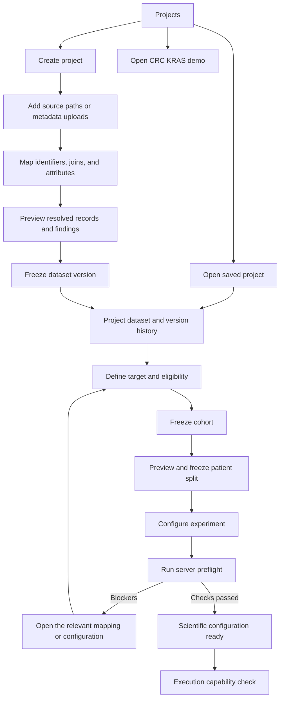
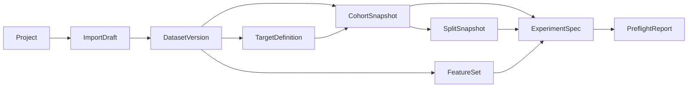

# P0 design: projects, dataset import, targets, splits, and preflight

Status: initial experiment start/create/load implemented, 2026-09-09; the scientific import, target, split, and preflight P0s below remain proposed.

**Current delivery baseline:** the [Bladder priority review](bladder-priority-review.md) supersedes this earlier proposal's implementation order, central scientific-storage authority, patient-only prediction assumption, and CRC-specific release requirements. All upcoming product designs use Bladder. The user confirmed `De ID` identifies slide/case, so it cannot establish patient grouping; a separate verified mapping is required. The review contains actual local-data findings; the repository references below are earlier design evidence. Treat remaining CRC-specific contracts/examples as future background, not requirements for the next Bladder release.

**Implemented entry flow:** the root URL offers **Start a new experiment** and **Load an existing experiment**, plus an explicit CRC KRAS synthetic demo. Creation requires a name and an exact empty/new server storage folder with an existing permitted parent; data/slide/feature paths and primary configuration are optional. `histopilot-project.json` owns saved setup, with SQLite schema 1 indexing recent experiments. Loading opens Overview and the existing workspace navigation; `?experiment=<id>#overview` restores registered context on refresh, and the sidebar experiment button returns to start. Configuration can be edited later in MIL experiments. See the current [API](api.md) and [workspace layout](workspace.md).

This entry flow supersedes the original **Projects** screen, registered-project-only opening, and hash-routing proposal in §2. The UI calls the overall workspace an **experiment**; the current API uses `/projects`, separately from `/experiments` model-run drafts. The remaining screens and contracts in this document are proposed extensions: source-table upload and mapping, frozen datasets, versioned targets/cohorts/patient splits, and mandatory scientific preflight. Saving a source path or initial configuration performs no import or training.

The two release gates are:

| P0 | Required user outcome |
| --- | --- |
| A — Generic Project + Dataset Import API/UI | **Create Bladder → add sources → preview mapping → freeze → reload**, retaining the same entities, source/mapping provenance, and dataset identity. Switch to CRC KRAS and back without mixing project state. |
| B — Generic target, split, and preflight | Configure a categorical target from imported columns, freeze an eligible cohort, create or import reproducible patient assignments, and obtain actionable preflight findings. Leakage and invalid labels prevent execution through every entry point. |

## 1. Evidence and scope

### What the current code actually supports

The existing [project and dataset domain](../histopilot/domain/dataset.py) provides a useful boundary, but [dataset ingestion](../histopilot/application/datasets.py) and [audits](../histopilot/application/audits.py) raise `NotImplementedError`. [ProjectWorkspace](../histopilot/application/project_workspace.py) and the [start page](../web/src/pages/Start.tsx) now create/reopen folder-backed setup and isolate empty local experiments from the explicit demo. [LocalWorkspace](../histopilot/application/local_workspace.py) still owns the synthetic records and KRAS cohort behavior. Source pickers register read-only directories without importing them; generic scientific dataset, cohort, and split workflows remain unimplemented.

The current [experiment schema](../histopilot/contracts/experiment.py) defaults to binary classification and `Mutant`, permits an independent fold count, and validates shape only. [SQLite schema 1](../histopilot/storage/database.py) stores small JSON records; it has no migration framework or project ownership column. These P0s require backend, persistence, and UI work together.

### Reference projects and resulting requirements

These are observations from the local repositories, not claims that real source data were inspected or validated. Repository links point to the sibling checkouts used for this design.

| Reference | Observed convention | HistoPilot requirement |
| --- | --- | --- |
| [Bladder data configuration](../../OceanPath-main/configs/data/blca.yaml), [reference README](../../OceanPath-main/examples/blca/README.md), [synthetic manifest](../../OceanPath-main/examples/blca/manifest.example.csv) | `De ID` supplies the configured patient identifier and slide filename; `Binary WHO 2022` encodes `0=low_grade`, `1=high_grade`. `WHO 1973` is another attribute. | Preserve column names containing spaces. Suggest the mapping, but require review of the patient identifier's meaning. Disease name and label vocabulary are project settings. |
| [Bladder custom CV](../../OceanPath-main/configs/splits/blca_custom.yaml), [custom holdout](../../OceanPath-main/configs/splits/blca_heldout.yaml) | Reserve `WHO 1973 == 2` for testing. Both custom configurations set `group_column: null`. | Support an explicit held-out predicate with whole-patient membership. Never inherit the ungrouped fallback. |
| [CRC/KRAS demo](../examples/crc_kras/README.md) | 24 fictional patients, 28 slides; separate clinical, labels, and slide tables. `MSI`, `BRAF`, `KRAS`; fixed illustrative partitions. | Support joins and multiple slides per patient. Keep the demo clearly marked and non-executable. |
| [KRAS master](../../OceanPath-colon-development/configs/data/colon_kras_master.yaml), [task manifests](../../OceanPath-colon-development/configs/data/colon_kras_exp.yaml) | `patient_id`, `slide_id`, `target_label`; precomputed features; separate master and task populations. | Support features without available WSIs, explicit target definitions, and task cohorts derived from a master population. |
| [CRC manifest identity mapping](../../OceanPath-colon/tools/build_crc_ras_dev_manifest.py), [slide-ID normalizer](../../OceanPath-colon/src/oceanpath/contracts/slide_ids.py) | Some canonical slide IDs match HDF5 stems containing a TCGA barcode plus a dotted UUID; source `slide_uid` and `patient_uid` need explicit crosswalks. This older builder's **RAS** label means KRAS OR NRAS. | Preserve arbitrary dots and use declared source-to-file mappings; stripping at the first dot is unsafe. Reuse identity lessons without confusing RAS and KRAS targets. |
| [KRAS label rules](../../OceanPath-colon-development/src/oceanpath/kras/labels.py), [task registry](../../OceanPath-colon-development/src/oceanpath/kras/registry.py) | Mutant versus wild-type differs from an allele versus other-mutant task. Alleles use semicolon token membership. Unknown status and absent variants have task-specific exclusions. B2 has four ordered classes. | Preserve raw labels and exclusion reasons. Accept precomputed categorical task labels with provenance; binary and multiclass share the same contract. No implicit “everything else is negative.” |
| [KRAS shared split](../../OceanPath-colon-development/configs/splits/kras_shared_oofk5.yaml), [study code](../../OceanPath-colon-development/src/oceanpath/kras/study.py) | Shared 5-fold OOF assignments for seeds 42/43/44; inner validation is 15% of remaining patients. Strata are cohort × six-class KRAS category, distinct from the training label. SR386/TCGA development and SR1482/RIH external groups are separate. | Separate split strata from targets, split seeds from training seeds, and development from external evaluation. Derive task subsets from frozen master assignments. |

### P0 boundary

Include multiple saved projects; resumable import drafts; server paths for slides, tables, and existing features; browser upload of CSV/Parquet metadata and JSON manifests; mapping previews; immutable dataset versions; binary/multiclass target definitions; generic cohort predicates; generated/imported patient splits; shared assignment subsets; and a mandatory execution gate.

P0 prediction/evaluation unit is **patient**, with slide feature bags linked to that patient. Labels can originate on patient, specimen, or slide rows, but must resolve to one consistent label per eligible patient. Separate slide/specimen prediction tasks, survival/regression/multilabel targets, nested CV, arbitrary transformation code, bulk WSI/feature browser transfer, cross-workspace project-package import, and GPU execution belong to later milestones. Binary/multiclass configuration readiness does not imply a capable training backend exists.

## 2. Product flow and screens



### Projects and opening an existing project

```text
HistoPilot / Projects                              [Create project]

Project          Latest dataset   Patients / Slides   Last opened
Bladder          v1 · Frozen      <actual counts>      <timestamp> [Open]
CRC KRAS         v3 · Frozen      <actual counts>      <timestamp> [Open]

[Open CRC KRAS synthetic demo]
```

Create requires a name; description and optional mapping preset are editable. Offer **Blank**, **Bladder / WHO grade**, and **CRC / KRAS** presets. Presets suggest fields and class names; they contain no patient data, mounted paths, or implied scientific validation. Project creation never requires a target, encoder, or slide directory.

“Open” loads a project registered in this service's workspace. It does not execute files from an arbitrary folder. Existing OceanPath studies enter through the importer using their manifests, directories, and optional split tables. Opening a different HistoPilot workspace remains a service-launch setting in P0; importing a portable project package is separate future work.

The current project display becomes a keyboard-accessible switcher containing recent projects, **All projects**, and **Create project**. URLs include identity, for example `#/projects/<id>/datasets/<versionId>` and `#/projects/<id>/imports/<importId>`. Refresh restores that context; an unavailable project produces an explicit error rather than opening another project's data. The root URL shows Projects.

New projects show a source-import empty state. Dataset-dependent pages guide the user to the next missing object. Demo metrics, feature records, and attention illustrations appear only inside the explicit demo project.

### Add data: paths and uploads have different meanings

Yes, users need to supply slide and feature directories. On a remote workstation, those should usually be **server directory references**. A path selected on a laptop does not grant the Python host access to that laptop's files.

| Control | P0 behavior |
| --- | --- |
| **Browse server** / **Paste server path** | Reference an existing allowed directory or metadata file on the Python host. WSIs and features stay in place and are read-only. Show the host name and resolved path. |
| **Upload metadata** | Transfer CSV/Parquet tables or a JSON feature/split manifest from the browser into project staging. Show upload progress, size limit, original filename, and checksum. |
| **Add another source** | Allow several slide roots, table files, and feature roots, each with a role, display name, and identity namespace. |

P0 explicitly excludes browser folder transfer of WSI pixels and feature arrays. If files only exist on the user's laptop, explain that they must be transferred/mounted on the host before referencing them. The UI must not label a saved path “uploaded” or “imported.” Metadata upload is a deliberate copy; originals on the host are never silently copied.

Source roles: `slides`, `table`, `features`, `split_assignments`. A source can serve several mapped table roles. Slides are optional for a features-only dataset; labels can be added later by creating a new dataset version. A slides-only import can freeze without being ready for training.

Directory scans use explicit recursion, extension filters, and include/exclude rules. Show discovered, matched, unmatched, unreadable, and duplicate counts. An incomplete or truncated scan cannot freeze. Preserve the existing allowed-root and symlink boundary for every discovered/read file, not just the chosen parent directory. Support `.sdpc` discovery for bladder even if the installed slide reader cannot open it; report that limitation at the operation that needs pixels.

### Import wizard

Steps: **Sources → Mapping → Review → Freeze**. Save the import draft on the service after each successful step. Reload resumes it; unresolved edits remain distinguishable from a saved revision.

```text
Bladder / Import dataset                         Sources > Mapping > Review

Input: bladder.csv                  Entity / field          Source column
                                    Patient ID             [De ID        v]
Join slides using [filename stem v]  Slide ID               [De ID        v]
                                    Specimen ID            [Not supplied v]
                                    Attribute              [Binary WHO 2022]
                                    Attribute              [WHO 1973]

Patient identity: [review required]  “De ID identifies the same person
                                    across all included slides/specimens.”

Resolved preview (illustrative rows, not clinical data)
Patient          Specimen              Slide             WHO 2022  WHO 1973
BLCA_EXAMPLE_001  unspecified:<slide>   BLCA_EXAMPLE_001   0         1
BLCA_EXAMPLE_002  unspecified:<slide>   BLCA_EXAMPLE_002   1         3

Join counts: <matched> / <unmatched> / <ambiguous>
Findings: <blockers> / <warnings>       [Edit mapping] [Validate all rows]
```

Mapping controls cover patient, specimen, optional block, slide, WSI URI/path, site/cohort, specimen type, and arbitrary attributes. Users select table join keys and expected cardinality. Multi-table CRC joins patient-level clinical/labels to the slide table; optional features join by slide ID. Bladder can use one table plus filename-stem discovery. A preset's candidate join must never resolve an ambiguity by choosing the first matching file.

Filename normalization removes only a declared recognized file extension and preserves the rest, including UUID suffixes and dots. An explicit crosswalk can map a source slide identifier to a different WSI or feature filename. Show the raw source ID, canonical slide ID, WSI match, and feature match together in preview. Independent slide and feature roots are normal; project ownership does not imply a common physical data directory.

Identifiers are strings; preserve leading zeroes and case. Store raw values alongside any explicit normalization. An optional source namespace disambiguates unrelated IDs, while an explicit identity crosswalk merges known aliases across sources. Namespace by identity authority, not by train/test role or specimen type: primary/metastatic samples from one person must remain one patient. If `De ID` is a slide or specimen code, require a patient crosswalk before scientific readiness.

If specimen IDs are missing, an explicitly accepted per-slide `unspecified` specimen record satisfies the hierarchy without claiming two slides came from the same specimen. Record `identity_status: inferred` and the generating rule. Never infer the patient by making one up for each slide.

Review shows the full scan's entity counts, unmatched rows/files, mapping/normalization decisions, source fingerprints, feature coverage, and structured findings. Preview pages are bounded samples; their totals and findings come from validation of the entire selected inventory. Source and row locators lead users back to the input. Unresolved identity ambiguity, conflicting joins, and duplicate slide identities block freezing. Raw missing/unmapped labels can be retained as data and reported; the chosen target and eligible population determine the later execution block.

**Freeze dataset v1** is enabled only for a current, complete preview without import blockers. Explain that source tables and resolved metadata are snapshotted while large artifacts stay referenced. After freezing, open the dataset detail with version ID, hash, counts, mapping, sources, and **Define target**. Corrections start **New version from this dataset**; they never edit a frozen version.

### Target, cohort, split, and preflight UI

Rename Cohort builder to **Target & cohort**. Use dataset schema fields for filters and labels; there are no built-in MSI/BRAF controls on a blank project. Retain them as preset predicates for CRC.

```text
Bladder / Target & cohort
Dataset [v1]                 Target [WHO 2022 grade]
Label source [bladder.csv]   Label column [Binary WHO 2022]
Task [Binary classification] Prediction unit [Patient]

Raw value     Class ID     Display name        Positive
0             0            low_grade           ( )
1             1            high_grade          (x)

Missing values [Block / Explicitly exclude patients]
Conflicting patient labels [Block]
Eligibility [Add condition]

<included patients> / <included slides> / <excluded patients by reason>
[Preview target & cohort]                       [Freeze target & cohort]
```

The following **Split** screen shows strategy, locked `Group by: Patient`, stratification fields, split seed(s), validation proportions, and optional test/external policies. Show patient and slide counts by partition × class × site, plus exact overlap counts. Preview does not change an existing split. **Freeze split** pins the reviewed assignments.

In Experiments, select frozen target/cohort/split/features; display the split's fold count and split seeds read-only. Training seeds remain separate. The preflight panel groups **Blockers**, **Warnings**, and **Passed** checks, with count, affected entities, and an **Open mapping / target / split / features** action. A disabled Run button names the current reason. “Scientific checks passed” and “Execution unavailable” can both be true in these P0s.

## 3. Scientific objects and persistence



| Object | Essential stored content | Mutability |
| --- | --- | --- |
| Project | ID, name, description, mode (`real`/`synthetic-demo`), timestamps | Name/description editable; ID stable. |
| SourceReference | Project, role, path or staged-upload ID, format, identity namespace, access status | A location binding can be checked/replaced; frozen scientific inputs cannot be changed through it. |
| ImportDraft / Preview | Source revisions, mapping, join cardinalities, exclusions, inventory, findings, parser version, preview hash, progress | Editable with revision check; changes invalidate preview. |
| DatasetVersion | Project, parent version, canonical tables, source-table bytes/hashes, mapping, inventory, content hash | Immutable after atomic publication. |
| TargetDefinition | Dataset version, source column/unit, class mapping/order, positive class, missing/conflict policy, derivation provenance | Immutable; changes create a new ID. |
| CohortSnapshot | Dataset/target IDs, typed predicates, exact patient/slide IDs, resolved patient labels, exclusion ledger | Immutable. |
| SplitSnapshot | Cohort, algorithm/version, seed(s), strata, holdout/external rules, exact assignments, optional parent split | Immutable. |
| FeatureSet | Dataset, slide coverage, feature kind, encoder/checkpoint identity, preprocessing, artifact fingerprints, verification status | Versioned independently; registering features later does not rewrite dataset metadata. |
| PreflightReport | Resolved input hashes, spec revision, check versions, findings, checked time, readiness | Historical report is immutable; a new check creates a new report. |

Every record and lookup has a project boundary. Project IDs come from the route and resolved parents; a client cannot attach a CRC split or feature set to a Bladder experiment by supplying its ID. The browser sends intent, never authoritative patient memberships, labels, readiness, or generated assignments. Uploaded predefined assignments are untrusted input until normalized and audited by the service.

Use SQLite for ownership, revisions, metadata, and publication state. Store bulk canonical tables and assignments in Parquet, with JSON manifests. Add a lightweight table reader/writer dependency at implementation; no Torch/CUDA import is needed. Large scans and hashing run outside request handlers in restart-aware CPU processes with persisted progress; this small import-operation facility is distinct from the later GPU scheduler.

```text
workspace/projects/<project_id>/
  project.json                         # generated descriptor; SQLite is authoritative
  imports/<import_id>/                  # staged metadata, scan checkpoint, preview
  datasets/<dataset_id>/
    manifest.json
    sources/                           # exact imported metadata table snapshots
    tables/                            # patients/specimens/slides/attributes.parquet
    inventory.parquet                  # read-only external artifacts + fingerprints
  targets/<target_id>/definition.json
  cohorts/<cohort_id>/                  # members, resolved labels, exclusions
  splits/<split_id>/                    # manifest + assignments.parquet
  features/<feature_set_id>/            # manifests; external arrays remain referenced
  preflights/<report_id>.json
```

### Freeze, repeat import, and reload semantics

1. Validation captures a complete inventory plus source/mapping revision. Hash metadata bytes; hash canonical records in stable field/row order separately from Parquet container bytes. For external slides/features, capture path, size, mtime, and file identity plus SHA-256 when verified. Size/mtime alone is not content identity.
2. A preview fingerprint covers source hashes, inventory, mapping, explicit exclusions, schema/parser versions, and draft revision. Full artifact hashing may remain pending while the dataset freezes, with visible `content_verification: pending`; readiness must not treat that as verified.
3. Freeze accepts the preview ID/hash and expected revision. Recheck sources and inventory; return `409 SOURCE_CHANGED` or `PREVIEW_STALE` on changes. Write artifacts into a temporary sibling directory, flush and publish atomically, then commit the visible database record. Reconcile uncommitted published directories after interruption; never expose a half-written dataset.
4. Retry of the same freeze request is idempotent. Reimporting identical inputs/mapping/parser settings in the same project resolves to the existing dataset version. Mapping, source contents, or accepted inclusion changes produce a child version. Dataset hashes exclude timestamps and random IDs.
5. Reload reads frozen metadata and assignments; it never silently rescans, regenerates a split, or reparses current external labels. Missing external sources are shown as unavailable while the project and its frozen records still open.
6. Full content verification is an immutable artifact-attestation record linked to the frozen inventory. It cannot replace a fingerprint inside the dataset. A changed file requires a new version; a relocated file can use an audited path binding only when its content identity is verified unchanged. Metadata snapshot identity and verified artifact identity both enter the experiment's resolved-input fingerprint.

## 4. Importing existing features

The source picker should accept either the precise feature directory or a job root and then show discovered candidate stores. The bladder and CRC configurations distinguish patch `features_<encoder>` from `slide_features_<encoder>` beneath a coordinates directory. Do not recursively pool these into one feature set or infer scientific compatibility from the folder name.

P0 inspectable feature format is HDF5 with an explicit mapping to the feature dataset and optional coordinates dataset. A feature manifest states slide IDs, patch-versus-slide representation, encoder/checkpoint identity, dimension, dtype, preprocessing/extraction identity, per-file path/hash, and geometry availability. A manifest can be imported or assembled through the UI and reviewed. Paths referenced by uploaded manifests are resolved only inside an explicitly selected allowed source root.

Validate file readability, actual shape/dtype, nonempty finite arrays, duplicate slide mappings, consistent dimensions, and coverage of the selected cohort. For patch arrays with coordinates, row counts must align. Record coordinate origin/units and available slide geometry. Unknown provenance is `unverified`; a typed encoder name alone does not prove which weights generated an artifact.

Feature-only training may be scientifically ready if the selected backend's versioned compatibility declaration accepts the representation and every selected slide has a verified feature artifact and patient link. Compatibility can be checked against that declaration independently of whether an executor is installed; an unknown declaration is a blocker. Lack of pixels then blocks extraction and slide viewing, not dataset browsing or a compatible training plan. Missing coordinates block spatial attention overlays; they block training only if that backend requires coordinates. Slide embeddings cannot enter a patch-MIL backend without an explicitly compatible adapter.

Incomplete feature coverage cannot silently shrink an experiment. Users must select a covered cohort or create an explicit feature-availability eligibility snapshot; record that decision before freezing splits. For shared CRC splits, derive the covered subset without redrawing master assignments and rerun class/support checks.

## 5. Generic target and cohort contract

Example proposed JSON contract for the bladder preset:

```json
{
  "name": "WHO 2022 grade",
  "datasetId": "dataset_blca_v1",
  "task": "binary_classification",
  "source": {"tableId": "table_blca", "column": "Binary WHO 2022", "unit": "slide"},
  "predictionUnit": "patient",
  "classes": [
    {"id": 0, "name": "low_grade", "rawValues": ["0"]},
    {"id": 1, "name": "high_grade", "rawValues": ["1"]}
  ],
  "positiveClassId": 1,
  "missingPolicy": {"action": "block", "rawValues": ["", "NA"]},
  "conflictPolicy": "block",
  "patientLabelResolution": "require_agreement"
}
```

Canonical label IDs are contiguous integers `0..K-1`. Binary requires two classes and an explicit positive class; multiclass requires at least three classes, ordered names, and no positive-class field. Raw matching preserves declared source types/normalization and cannot map one raw value to multiple classes. Blank, unknown, NaN, infinity, out-of-range codes, and unexpected strings never silently become a negative label.

Missing/unknown values default to blocking the selected analysis. An explicit exclusion policy can exclude the **whole patient**, with counts and reasons frozen in the cohort. Malformed values and conflicts remain blockers until corrected or addressed by a separately recorded, explicit patient exclusion. Do not drop a discordant slide and pretend the remaining label establishes patient ground truth. Never “fix” disagreement by assigning a second patient ID to the same person. `require_agreement` is P0's only automatic resolution of repeated labels; all-equal repeated labels are allowed and retain every source locator.

For the CRC demo, map `KRAS` values `WT`/`Mutant` explicitly. For real CRC B1, map precomputed `target_label` 0/1 with the saved B1 definition; for P1, 0/1 means other-mutant/G12D, so it needs a different target ID and eligibility population. For B2, preserve the four-class order G12D/G12V/G13D/other. Upstream derived-label tables must record their raw source reference, rule identifier/version, and available code hash. HistoPilot P0 imports these outputs; it does not execute uploaded label scripts or reproduce the entire KRAS study registry. Missing derivation evidence is reported as unverified rather than invented.

Cohort predicates form a bounded typed tree (`all`, `any`, `eq`, `in`, `is_null`, numeric comparisons) over server-advertised fields. No browser-supplied Python, SQL, or pandas query strings. Predicate scope is explicit: patient conditions select patients; specimen/slide conditions select qualifying slides before the service resolves eligible patients and records exclusions. Preview reports each stage's counts so, for example, “Primary” does not accidentally include a metastatic slide from the same patient. Identity and ground-truth conflicts are still audited against the relevant mapped source evidence.

Target definition, filter definition, membership, resolved labels, and exclusions all participate in the cohort fingerprint. A frozen dataset can support multiple independent targets/cohorts. Prediction aggregation belongs to the experiment and uses an explicit named rule; it does not repair label disagreement or alter split grouping.

## 6. Patient-grouped split design

### Supported protocols

| Protocol | Assignment semantics | Reference use |
| --- | --- | --- |
| Patient holdout | One train/validation/test assignment; positive ratios sum to 1. Optional fixed test rule overrides random test allocation, with explicit train/validation proportions on the remainder. | Simple bladder start. |
| Development K-fold, optional fixed test | Development patients rotate through validation once, with all other development patients in train. If a fixed test rule is supplied, those patients remain test in every fold. Without it, there is no independent test partition; validation scores used for model selection are not held-out test estimates. | Bladder default K-fold or optional grade-2 holdout plus CV. |
| OOF K-fold + inner validation | Fold `i` is internal test; partition remaining patients into train/early-stopping validation. Every development patient is internal test exactly once per split seed. | CRC master, K=5 and inner validation 0.15. |
| Imported predefined | Normalize a patient assignment table or an explicitly mapped legacy wide split table; validate the same invariants as generated assignments. | Existing OceanPath studies. |

External evaluation membership is a separate named arm, never a rotating CV fold. Store a role (`development`/`external`) plus `evaluationArm` and a partition. External arms use `partition=test`, remain fixed across relevant runs, and never enter fitting, feature selection fitted on study data, early stopping, threshold selection, or tuning. Development membership and each external arm are frozen before experiments.

Canonical assignment rows contain `patientId`, `splitSeed`, `fold`, `partition` (`train`, `validation`, `test`), `role`, and nullable `evaluationArm`. The manifest distinguishes internal test, fixed test, and external test semantics. Slide assignments are derived through frozen patient membership. A patient cannot appear in two partitions in the same run. Shared primary/metastatic external subsets may contain the same held-out patient if explicitly declared; report their dependence and do not claim independent or disjoint evaluation samples. Development–external overlap always blocks.

### Determinism and feasibility

Define and version `patient_stratified_hash_v1`; do not promise byte-identical legacy OceanPath splits when generating a new protocol. Exact legacy assignments require predefined import.

1. Resolve the frozen eligible patients and immutable identity crosswalk. Check labels and duplicate identities before assignment. No null group IDs and no slide-level fallback.
2. Apply explicit external membership and fixed-test predicates at patient scope. For the bladder predicate, reserve a patient if **any eligible slide** has `WHO 1973 == 2`; show all extra slides/patients held out by this rule. This `any` lift is saved in the split definition. Conflicting fixed roles block. A label-related test predicate generates a distribution-shift warning with its definition retained.
3. Resolve one stratum tuple per patient from configured fields (target class by default; cohort × KRAS category for the CRC master). Multiple values for a patient require an explicit upstream patient-level stratifier or a corrected mapping; do not pick the first row. Report missing strata and reject impossible requested stratification.
4. Sort strata and patient IDs by canonical UTF-8 byte order. Within each stratum, rank patients by SHA-256 of a versioned canonical JSON array containing split seed, phase, fold (if relevant), stratum tuple, and patient ID; tie-break by patient ID. Do not use Python's process-randomized `hash()` or directory/CSV order.
5. For holdout, allocate per-stratum counts by largest remainder of the requested proportions, with a fixed partition tie order: train, validation, test. For K-fold, allocate evenly within each stratum, giving remainders to the currently smallest total folds, tie-break by fold index. Assign ranked patients to these quotas. For OOF inner validation, rerank the non-test patients with a distinct `inner_validation` phase and fold ID, then apply train/validation quotas. Use exact decimal/rational ratios for allocation; record algorithm version and policy.
6. Check the resulting assignments against requested class support, complete membership, group disjointness, and per-protocol test frequency. If support fails, block with counts and a remedy (fewer folds, different explicit strata/proportions, or revised cohort). Do not silently drop strata, reduce K, resample until a favorable split appears, or change seeds. Proportions are targets; show their actual integer realization.
7. Persist the assignments, their canonical hash, source cohort hash, split definition, algorithm version, and environment implementation version. Reload uses the saved table. Repeating the same inputs/settings yields identical semantic assignments across input ordering and service restarts; changing a seed may, but need not, produce a different assignment for a tiny cohort.

For categorical training, every train partition must contain every target class. Validation/test support requirements depend on the declared metric/early-stopping policy; a partition missing a class needed for requested AUROC blocks that evaluation/training plan. Tiny external arms may be retained with unsupported metrics explicitly omitted; never return a fabricated score. Per-class patient counts and rare-stratum warnings are always visible.

Pin minimum per-class patient support as part of the experiment's metric/early-stopping policy. The [KRAS training reference](../../OceanPath-colon-development/configs/training/kras.yaml) requires at least eight positive validation patients for early stopping; smaller partitions use a recorded fixed epoch budget. Expose this as an explicit reviewed policy, with the budget and its development-only provenance required before execution. Missing budget/support yields a blocker; the service cannot invent a budget or silently disable early stopping. This study-specific threshold is a preset setting, not a global rule for every target.

### Shared CRC assignments and experimental comparability

Create/import one master split, then derive a task split by intersecting each assignment with the task's frozen eligible patient/slide population. Preserve seed, fold, role, and partition exactly; persist `parentSplitId`, master membership hash, and the subset rule. Derived patients must be a subset of the master and use the same identity mapping. Task target classes can differ from the master stratification label. Check label consistency and class/feature support again after subsetting; never redraw an infeasible subset silently.

Split seeds determine the partition plan. Training seeds determine initialization/sampling within a pinned partition. An experiment pins a split and an explicit list of `(splitSeed, trainingSeed)` pairs; its expanded run matrix lists `(splitSeed, fold, trainingSeed)`. The UI may help construct paired or Cartesian selections but saves the actual pairs. The CRC reference pairs `(42,42)`, `(43,43)`, `(44,44)` across five folds for **15 runs**, whereas their Cartesian product would yield 45 and requires a different reviewed plan. A changed target, cohort, or feature-driven eligibility requires a new compatible split or an explicit audited derivation and invalidates prior preflight. A new model alone can reuse the split.

## 7. Preflight and the execution barrier

Separate three checks: import validation (can freeze these records), scientific preflight (can this experiment use these inputs), and runtime capability (can this host execute the requested operation). Preserve all findings; one unavailable backend should not hide leakage or label errors.

| Check / example finding code | Required behavior |
| --- | --- |
| `PROJECT_REFERENCE_MISMATCH`, `INPUT_NOT_FROZEN`, `DEMO_INPUT` | Block cross-project, mutable, unresolved, or demo inputs from execution. |
| `PATIENT_ID_UNRESOLVED`, `PATIENT_PARTITION_OVERLAP`, `DEVELOPMENT_EXTERNAL_OVERLAP` | Block unknown grouping, any within-run patient leakage, and any development/external overlap. Check aliases through the crosswalk. |
| `DUPLICATE_SLIDE`, `DUPLICATE_CONTENT_ACROSS_PATIENTS` | Audit repeated IDs, normalized paths, symlinks/hardlinks, and verified content hashes. Block ambiguous mappings and duplicate content under different patients; a copied slide with a new name cannot evade the gate. |
| `LABEL_MISSING`, `LABEL_UNMAPPED`, `LABEL_CONFLICT`, `CLASS_MAPPING_INVALID` | Block invalid labels in the eligible population, contradictory patient labels, overlapping raw-value mappings, or inconsistent class conventions. Explicit approved exclusions appear in the cohort ledger. |
| `SPLIT_MEMBERSHIP_MISMATCH`, `SPLIT_PROTOCOL_INVALID`, `CLASS_SUPPORT_INSUFFICIENT` | Block extra/missing assignments, unsupported folds, broken inherited assignments, and insufficient support for requested metrics. |
| `SOURCE_UNAVAILABLE`, `SOURCE_CHANGED`, `CONTENT_UNVERIFIED` | Check artifacts required for this operation. Full-file hash verification is required before scientific readiness for files consumed by the plan; pending scans/hash jobs cannot report pass. |
| `FEATURE_COVERAGE_MISSING`, `FEATURE_SHAPE_INVALID`, `FEATURE_PROVENANCE_UNVERIFIED`, `FEATURE_INCOMPATIBLE` | Block missing bags, invalid/nonfinite arrays, unverified identity, incompatible encoder/preprocessing/representation, or row/coordinate mismatches relevant to the operation. |
| `STRATUM_RARE`, `SITE_IMBALANCE`, `TARGET_RELATED_HOLDOUT` | Warn with actual patient counts, proportions, and the saved policy; do not promise exact balance or representative test sampling. |
| `BACKEND_UNAVAILABLE`, `CHECKPOINT_UNAVAILABLE`, `RESOURCE_UNAVAILABLE` | Block executable plan creation for unavailable capabilities/resources; report independently of scientific validity. |

Full hashes detect exact duplicate files; they cannot establish that differently encoded images depict the same tissue or that undisclosed identifiers belong to the same person. Record the checked identity evidence and duplicate-detection scope. Features-only imports verify feature-file duplicates and supplied source-slide provenance; they cannot claim pixel-level WSI comparison without pixels. Known duplicates/conflicts always block; the report must not claim an impossible guarantee about unknown biological identity.

Findings have a stable code, severity, message, count, bounded example entity IDs, source/table/row locators, remediation route, and check version. An example:

```json
{
  "code": "PATIENT_PARTITION_OVERLAP",
  "severity": "error",
  "message": "1 patient is assigned to training and test in fold 0.",
  "count": 1,
  "entityIds": ["fixture_patient_001"],
  "context": {"splitSeed": 42, "fold": 0, "partitions": ["train", "test"]},
  "remediation": {"page": "split", "action": "review_assignments"}
}
```

The report returns `scientificReady`, `executionReady`, and `findings`, with a fingerprint of the exact resolved inputs, target/cohort/split/feature hashes, experiment revision, and audit version. Browser state or an old report ID is never execution authority.

The shared `prepare_execution` application boundary resolves and revalidates inputs when called by API or CLI, then validates required live paths/resources before constructing any executable plan or creating a runnable job. Reject stale spec/report revisions with 409 and scientific blockers with 422; return findings. No error bypass flag in P0. Warnings are reviewable but cannot downgrade an error. Full-content verification must be current for external mutable artifacts; an immutable/versioned store can use a verified binding. Recheck file identity at worker start, fail on drift, and keep integrity checks outside the FastAPI event loop.

Until worker execution exists, valid requests still report execution unavailable (501); invalid requests return their scientific findings before reaching that capability result. Prove this barrier with a fake executor that records invocations, not with a fake successful training run.

## 8. Proposed API and shared contracts

All routes below are **proposed**, under `/api/v1`, and retain the existing local session token, Host/Origin validation, bounded inputs, and allowed-root rules. Request bodies forbid unknown fields. REST bodies use camelCase as the current UI does; canonical scientific manifests retain snake_case and explicit schema versions.

Update the development CORS allowlist in `api/security.py` for the proposed PATCH method and `Idempotency-Key` header, with the same explicit allowed origins. Upload requests retain the local-session check. Use one revision mechanism consistently (`expectedRevision` in command bodies; metadata PATCH also carries its expected revision).

Let `P = /projects/{projectId}` for the table below. Every nested resource is verified against `P`.

| Method / route | Command or response |
| --- | --- |
| `GET /projects`, `POST /projects` | List saved project summaries; create `{name, description?, preset?}` and return 201 with server ID. |
| `GET P`, `PATCH P` | Load project overview/version summaries; edit name/description using revision checks. |
| `GET /filesystem/roots`, `GET /filesystem/list` | Reuse restricted browsing; extend selection to metadata files without exposing arbitrary file-content reads. |
| `POST P/sources`, `GET P/sources` | Register/list typed references `{role, path?, uploadId?, namespace?, format?}` with exactly one of `path` or `uploadId`. Validate file/directory kind, permission, and upload ownership/completion. |
| `POST P/uploads` | Stream bounded multipart metadata into server-named staging; return upload ID, size, type, checksum. A configurable default 50 MiB limit returns 413 when exceeded; large tables use server paths. |
| `POST P/imports`, `GET P/imports/{id}`, `PATCH P/imports/{id}` | Create/load/revise a resumable import definition. Changes require the current revision and invalidate prior previews. |
| `POST P/imports/{id}/preview` | Validate the saved draft revision and start a full scan/join operation; return 202 with operation ID. |
| `GET P/operations/{id}`, `POST P/operations/{id}/cancel` | Persisted scan/hash/validation progress, logs summary, results, failure/interruption state. |
| `GET P/imports/{id}/previews/{previewId}` | Counts, paginated resolved rows, mappings, complete findings summary, preview hash/revision. |
| `POST P/imports/{id}/freeze` | `{previewId, previewHash, expectedRevision}`; publish reviewed dataset, returning dataset ID/hash, or 202 if publication checks require an operation. Support `Idempotency-Key`. |
| `GET P/datasets`, `GET P/datasets/{id}` | List/load immutable versions, provenance, inventory verification, and source availability. |
| `GET P/datasets/{id}/schema`, `GET P/datasets/{id}/rows` | Advertise typed fields and bounded paginated entity/attribute rows. |
| `POST P/feature-sets`, `GET P/feature-sets/{id}` | Register a manifest against a frozen dataset and inspect verification status; array/coverage checks run as an operation. |
| `POST P/targets/preview`, `POST P/targets`, `GET P/targets/{id}` | Preview a definition against a dataset; freeze/load class mapping and policies. |
| `POST P/cohorts/preview`, `POST P/cohorts`, `GET P/cohorts/{id}` | Resolve typed predicates and target; freeze/load canonical membership, labels, and exclusions. |
| `POST P/splits/preview`, `POST P/splits`, `GET P/splits/{id}` | Generate or normalize predefined assignments; freeze the reviewed preview ID/hash; load/export stored assignments. |
| `POST P/splits/{id}/derive` | Create a reviewed task-subset preview for another compatible cohort, preserving parent assignments. Freeze through `POST P/splits`. |
| `POST P/experiments`, `GET P/experiments/{id}/manifest` | Save validated draft references and return canonical versioned ExperimentSpec. |
| `POST P/experiments/{id}/preflight`, `GET P/preflights/{id}` | Run/load a server-produced report; return 202 for long checks. Scientific blockers are report data, not a transport failure. |
| `POST P/jobs` | Resolve experiment/revision, rerun required checks, reject blockers/staleness, then check executor availability. P0 never fabricates a runnable training job. |

Also provide paginated `GET P/targets`, `GET P/cohorts`, `GET P/splits`, `GET P/feature-sets`, and `GET P/experiments` summary collections, filterable by their owning dataset/cohort where applicable. Selectors and reload use these stored collections instead of reconstructing scientific objects from browser state.

Persist previews for target/cohort/split with ID, input fingerprint, revision, and findings. Freeze accepts the reviewed preview ID/hash and resolves all referenced inputs again; previews cannot be edited by the client. Known invalid commands return 422; out-of-root paths return 403; missing/project-inaccessible resources return 404; stale revisions/fingerprints return 409. Async operations distinguish `queued`, `running`, `succeeded`, `failed`, `cancelled`, and `interrupted`; interrupted work resumes from a verified checkpoint or is explicitly retried. Upload names never determine destination paths, and JSON manifests are parsed as data only.

### Example P0-A command sequence

```text
POST /projects                               {name: "Bladder", preset: "bladder-who-grade"}
POST P/sources                               {role: "slides", path: "/mnt/pathology/blca"}
POST P/sources                               {role: "table", path: "/mnt/metadata/blca.csv"}
POST P/imports                               {sourceIds: [...], mapping: <reviewed mapping>}
POST P/imports/<id>/preview                   {expectedRevision: 1}
GET  P/operations/<operationId>               -> completed preview ID
GET  P/imports/<id>/previews/<previewId>       -> all-row findings + sample + hash
POST P/imports/<id>/freeze                    {previewId, previewHash, expectedRevision: 1}
GET  P/datasets/<returnedDatasetId>           -> same frozen records after service restart
```

Paths and IDs above are illustrative. Source roots must already be permitted by service configuration. Merely creating a project or pasting a path never broadens those permissions.

### ExperimentSpec v2 and CLI parity

Add `project_id`, `target_id`, explicit `task`/class convention resolved from that target, and pinned dataset/cohort/split/feature IDs. Replace ambiguous `seeds` with `seed_pairs: [{split_seed, training_seed}]`; derive permitted folds and split seeds from `split_id`. Remove the independent editable `folds` source of truth and the implicit `Mutant` default. Pin the prediction aggregation rule and report metrics/early-stopping intent, minimum support, and any fixed epoch budget so preflight can assess class support. Reject mismatches between duplicated descriptive fields and their immutable source objects.

Keep v1 manifests readable/shape-validatable for the synthetic example, with an explicit legacy/non-executable result. Conversion to executable v2 requires resolving real target and split objects. Update GUI/CLI manifests and the exported JSON Schema together. `histopilot run --validate-only` continues to mean shape validation; add `--preflight` for shared scientific/resource resolution and structured findings, with a nonzero exit on blockers. A direct CLI run invokes the same execution preparation boundary as `POST P/jobs`.

## 9. Implementation order and migration

| Slice | Code boundary | Reviewable result |
| --- | --- | --- |
| A1 — Project ownership | Add project contracts/service; migrate `storage/database.py`; extend `api/app.py`, client types/queries, and App routing. | Empty Projects screen, create/open/switch projects, isolation and restart persistence. |
| A2 — Sources and mapping | Extend `storage/filesystem.py`; add table readers, source/upload/import contracts, mapping service, persisted CPU operations; generalize FolderPicker and add ImportWizard. | Bladder and three-table CRC previews, generic fields, actionable join findings, saved draft resume. |
| A3 — Freeze/reload | Implement `application/datasets.py`, artifact publication, dataset rows/schema endpoints, dataset detail/version UI. | P0-A end-to-end flow, deterministic repeat import, stale-source rejection, interrupted publication recovery. |
| B1 — Target/cohort | Add `domain/target.py`, generic contracts/services; replace KRAS predicates and fixed frontend fields. | WHO grade, CRC B1/P1, and ordered B2 label configuration; exact memberships/exclusions. |
| B2 — Split | Implement split preview/freeze/import/derive service plus Split page; update domain grouping contract. | Stable patient assignments, fixed bladder test, CRC master/subset semantics, infeasibility findings. |
| B3 — Features/preflight/spec | Add HDF5 manifest inspection, implement `application/audits.py`, v2 experiment resolution, shared execution gate; update Experiments and CLI. | Both entry points reject leakage/invalid labels; readiness accurately distinguishes scientific checks from missing execution. |

Implement a schema-1 → schema-2 migration before generic writes: back up the database consistently, run under the service workspace lock, introduce project ownership plus indexes/uniqueness, and associate existing demo records with an explicit synthetic project. Preserve cohort/draft IDs and saved references. Legacy untyped sources remain `not-imported` under that project until the user intentionally imports them elsewhere. The migration is transactional, repeatable, and tested; never replace existing records with a fresh seed. Adding schema-2 tables must not depend on the old initializer rejecting schema 1 first.

Keep one workspace SQLite database in P0. Browser query keys include `projectId` and relevant version IDs. Reset or namespace selected cohort/slide/result/encoder and draft form state on project changes; discard late responses for a previous project. Replace whole-workspace scientific payloads with summary/schema/paginated queries. Existing unscoped synthetic routes can remain temporarily as explicit demo compatibility endpoints; they never choose a “current project” implicitly or accept generic real records.

Do not start the GPU scheduler, add disease branches to backend logic, or rebuild the existing results/viewer for these P0s. Existing downstream pages must render real empty/unavailable states in real projects. Use current React/Radix styling and table patterns; new fields, counts, and findings come from the service. Update README, API/workspace docs, example schema, and synthetic fixtures when implementation ships.

## 10. Acceptance tests and release gates

Use tiny synthetic fixtures under temporary allowed roots; never run these tests on the workstation's clinical data. The existing two-row bladder example is a mapping example, too small to prove 5-fold class support. Add a synthetic bladder fixture with 30 patients and 36 slides: balanced WHO 2022 labels, 10 fixed-test grade-2 patients (five per class), and 20 development patients (ten per class), including multiple slides for six patients. Add a separate conflicting-label variant. CRC tests reuse the 24-patient/28-slide demo for joins but create independently labeled real-mode test fixtures with tiny valid HDF5 files for readiness; `demo://` is never promoted to executable input.

| Test | Required assertion |
| --- | --- |
| Create → map → freeze → reload | Through browser and API, create **Bladder**, add table/slide paths, review mapping, freeze, restart service and refresh. IDs, counts, values, mappings, hashes, and current URL agree. |
| Project isolation | Open CRC, create a cohort, switch back to Bladder; no fields/results/selections leak. API rejects cross-project target/cohort/split/features even when IDs are known. |
| Server paths and uploads | Browse/paste a permitted root; upload a metadata table; files stay where promised. Outside-root paths, escaping symlinks/manifest paths, oversized uploads, and incomplete scans cannot freeze. |
| Draft recovery and freeze retry | Reload an unfinished import; same revision resumes. Two freeze retries yield one dataset. Source change or stale browser revision returns 409. Failure during publication exposes no partial version. |
| Identity and joins | Leading-zero IDs survive. Same slide stem in two directories is ambiguous. Many-to-many joins and conflicting patient links block. Patient crosswalk keeps multiple specimens/slides together. |
| Frozen history | Modify external metadata and reimport: a child version is created; old cohort/target/split remain byte/semantically unchanged. Missing source paths do not prevent opening frozen metadata. |
| Generic labels | WHO 2022 0/1, KRAS WT/Mutant, task-specific 0/1, and B2 0..3 preserve explicit class semantics. Unknown/blank/NaN/unmapped values and patient conflicts block eligibility/preflight until resolved or explicitly excluded. |
| Repeatability | Same frozen inputs/settings after row-order, directory-order, process hash-seed, and service changes give identical assignment hash. Reload reads the stored assignment. Add a golden semantic-assignment fixture for algorithm v1. |
| Group leakage | Multiple slides and primary/metastatic specimens of one patient always share the relevant partition. A predefined table with that patient in train/test blocks freeze and execution. Null patient IDs never fall back to slide grouping. |
| Bladder fixed test | `WHO 1973 == 2` reserves the whole patient, including any other selected slides; all fixed test patients remain out of training/validation in every fold. |
| CRC shared split | Task subsets inherit master `(seed, fold, partition)` exactly. OOF test membership occurs once per patient per split seed; inner validation remains disjoint; external patients never enter development. |
| Seed pairing and small-class policy | Paired CRC seeds expand to 15 runs, not 45. A below-threshold validation group requires the declared fixed epoch budget/provenance or blocks execution; no automatic policy substitution. |
| Feasibility and support | Too many folds, rare strata causing invalid support, missing required classes, incomplete assignments, or a task subset with insufficient support returns concrete blockers without redrawing. |
| Duplicate files and drift | A byte-identical slide copied under a new filename/patient is caught by hash checks. Symlink/hardlink aliases and changed artifacts cannot produce a clean relevant preflight. |
| Features-only / operation scope | Valid tiny features plus labels can pass scientific training checks without WSI pixels; viewing/extraction reports unavailable pixels. Missing bags, incompatible dimensions, invalid arrays, mixed patch/slide stores, or required coordinate mismatch block. |
| No bypass | API and CLI tests submit a leaking or invalid-label spec while a fake executor records calls: **zero executor invocations and zero runnable jobs**. A previously passed report becomes unusable after spec/input drift. |
| Honest readiness | A clean scientific fixture reports `scientificReady=true` and `executionReady=false` while no backend exists. The synthetic demo always remains non-executable. |
| Migration | A populated schema-1 workspace migrates once without losing saved data; a simulated failure rolls back; reopening schema 2 is idempotent. |

P0-A is complete when the first flow works with an independently created Bladder project and survives restart. P0-B is complete when both Bladder and CRC configurations use the same contracts/services, patient assignments pass the invariants, and the execution barrier demonstrably rejects leakage and invalid labels. Actual extraction/training success remains the later worker/feature/MIL milestone.
